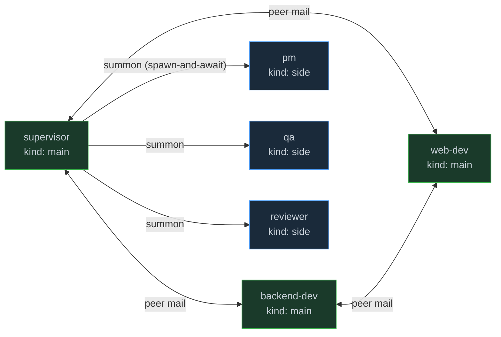
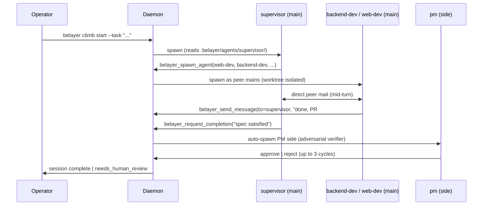

# belayer

Climb-local agent control plane for Nightshift.

Belayer coordinates a supervisor + specialist agents inside a single worker
climb. One session, one daemon, one request at a time. Agents communicate through a
message broker, register artifacts, and fire events. The Hermes bridge spawns
and manages each agent as a subprocess.

## The agent model: mains and sides

Every agent is one of two kinds. The distinction is whether the agent has a
mailbox.

- **Main** — long-lived party member. Has inbox + outbox. Polls mail before
  every turn. Accepts broadcasts. Participates in peer-to-peer dialogue.
  Examples: `supervisor`, `backend-dev`, `web-dev`.
- **Side** — short-lived worker with a single scoped task. No mailbox. Takes
  its task in the initial spawn message, produces output via `final_response`
  and registered artifacts, and exits. Examples: `pm`, `qa`, `reviewer`.



Mains talk to each other directly — no supervisor hop required. Sides are
spawned for a task, do it, exit. See `docs/AGENT_ARCHITECTURE.md` for the
full coordination model.

## Requirements

| Dependency | Version | Notes |
|------------|---------|-------|
| Go         | 1.22+   | Build toolchain for the daemon binary. |
| Python     | 3.10+   | Runs the per-agent bridge subprocess. |
| Hermes     | 0.12+   | LLM driver. Belayer ships a Hermes plugin (`plugins/belayer/`) that is auto-installed into `$HERMES_HOME/plugins/belayer/` on first daemon start. Older Hermes versions lacked the current session persistence and plugin surface and are no longer supported. |
| Linux kernel | 5.19+ (optional) | Required for Landlock v2 write-confinement (see `docs/DEPLOYMENT.md`). |

The daemon resolves Hermes from `$HERMES_HOME` (or `~/.hermes` by default).
The Python bridge imports Hermes modules from `$HERMES_HOME/hermes-agent/` and
the Hermes venv at `$HERMES_HOME/hermes-agent/venv/`. Override with
`HERMES_AGENT_PATH` to point at a development checkout.

On daemon start, Belayer:

1. Extracts its embedded plugin tree into `$HERMES_HOME/plugins/belayer/` (idempotent; SHA-matched).
2. Adds `belayer` to `plugins.enabled` in `$HERMES_HOME/config.yaml` if missing.

Set `BELAYER_REQUIRE_HERMES_PLUGIN=1` to make plugin install failures abort
the daemon (default is to log a warning and continue).

## Quick start

```bash
go build ./cmd/belayer

# In your project repo:
belayer init                     # scaffold .belayer/ (config, agents)
belayer daemon                   # start the daemon (also installs the Hermes plugin)

# Launch a climb (creates session, spawns supervisor via Hermes bridge)
belayer climb start --task "Add rate limiting to /api/v1/cards" --workdir /path/to/repo

# Monitor
belayer status
belayer logs <session-id> -f
belayer roster --session <session-id>

# Agents coordinate through the daemon
belayer message send --to supervisor --content "API tests passing"
belayer artifact create --kind spec --path docs/spec.md

# Supervisor signals done, PM verifies
belayer finish "All spec items implemented"
```

## Climbs And Crags

Use **climbs** when you want agent-powered workflows inside one repo:

```bash
belayer init
belayer daemon
belayer climb start --task "Implement the issue and open a PR"
```

That path only needs repo-local `.belayer/` state. It is the smallest useful
Belayer setup: a supervisor, optional specialist agents, artifacts, gates, and
mail inside one project.

Use **crags** when you want a durable operating context that can learn across
projects or modes:

```bash
belayer crag init software-company --kind development
belayer crag link software-company
belayer team add development
belayer climb start --task "Pick up this backlog item end to end"
```

A crag stores reusable teams, playbooks, gates, evaluations, promotions, and
generated team metadata under `~/.belayer/crags/<name>/`. Story worlds use the
same shape with `--kind story`, story teams, continuity gates, and world state.

## How a climb flows



## The default team

`belayer init` scaffolds `.belayer/` and copies the shipped starter team into
`.belayer/agents/`. The default roster:

| Identity       | Kind  | Role                                                |
|----------------|-------|-----------------------------------------------------|
| `supervisor`   | main  | Party lead. Spawns, coordinates, calls `finish`.    |
| `backend-dev`  | main  | Backend/API implementer. Worktree-isolated.         |
| `web-dev`      | main  | Frontend/web implementer. Worktree-isolated.        |
| `pm`           | side  | Adversarial spec-vs-reality verifier (completion gate). |
| `qa`           | side  | Outside-in validation: browser/CLI/real APIs.       |
| `reviewer`     | side  | Diff / plan reviewer with structured verdicts.      |

None of these names are baked into belayer. The framework contract is
`.belayer/agents/<name>/{agent.yaml, system-prompt.md, agents.md}` — the names
themselves are yours.

## Customizing your team

`.belayer/agents/` is project-owned. Edit, rename, delete, or replace
identities. `belayer init --force` refreshes the shipped defaults without
touching `config.yaml`.

### Example: add a `data-eng` main

```bash
mkdir -p .belayer/agents/data-eng
cat > .belayer/agents/data-eng/agent.yaml <<'YAML'
schema_version: "1"
description: "Data engineer — main implementer for ETL pipelines"
kind: main
vendor: codex
model: gpt-5.4
max_turns: 100
max_duration: "2h"
ephemeral: false
workspace: inherit
belayer_tools: []
YAML
# system-prompt.md + agents.md follow the same pattern as backend-dev/
```

After that, your supervisor can `belayer_spawn_agent(identity="data-eng", ...)`
and the new peer joins the party with a mailbox.

### Example: swap in a stricter reviewer

```bash
# Option A: edit in place
$EDITOR .belayer/agents/reviewer/system-prompt.md

# Option B: replace entirely
rm -r .belayer/agents/reviewer
cp -r ~/my-templates/strict-reviewer .belayer/agents/reviewer
```

The daemon reads `.belayer/agents/<name>/` first, falls back to the shipped
copy only if your project-local tree does not define the name. That means you
can slim the team (delete `qa/` if your project has no UI) or add your own
(`docs-writer/`, `sre/`, `release-manager/`) without touching belayer source.

### `agent.yaml` fields

| Field             | Purpose                                                   |
|-------------------|-----------------------------------------------------------|
| `kind`            | `main` or `side`. Controls mailbox + tool surface.        |
| `vendor` / `model`| LLM vendor + model ID (Hermes resolves).                  |
| `max_turns`       | Budget cap; bridge emits `bridge:budget_exhausted` at limit. |
| `max_duration`    | Wallclock cap.                                            |
| `ephemeral`       | `true` for sides (exit on completion), `false` for mains. |
| `workspace`       | `inherit` (shared cwd), `none`, or a named sub-workspace. |
| `belayer_tools`   | Opt-in role-specific tools (see below).                   |

Baseline tools are registered automatically per kind. Add to `belayer_tools`
only when an identity needs a role-specific capability.

| Tool                           | Who gets it                     |
|--------------------------------|---------------------------------|
| `belayer_report_status`        | everyone (baseline)             |
| `belayer_create_artifact`      | everyone (baseline)             |
| `belayer_send_message`         | mains (baseline)                |
| `belayer_broadcast`            | mains (baseline)                |
| `belayer_check_mail`           | mains (baseline)                |
| `belayer_spawn_agent`          | supervisor (opt-in)             |
| `belayer_request_completion`   | supervisor (opt-in)             |
| `belayer_escalate_to_human`    | supervisor (opt-in)             |
| `belayer_approve_completion`   | pm (opt-in)                     |
| `belayer_reject_completion`    | pm (opt-in)                     |

See `examples/templates/` for alternative starter teams (pilot + sprites +
per-repo implementers) and `docs/AGENT_ARCHITECTURE.md` for the full spawn,
mail, and completion-gate contracts.

## Architecture

Three layers:

1. **Session bus** — Go daemon on a Unix socket, SQLite store. Sessions,
   roster, messages, events, artifacts.
2. **Hermes driver** — Bridge subprocess wraps Hermes `AIAgent`. Identity
   injected via `ephemeral_system_prompt`, coordination tools registered at
   spawn.
3. **Bridge transport** — Python subprocess lifecycle: heartbeats, exit
   detection, event streaming over stdout.

## CLI

```bash
belayer init                Scaffold .belayer/ in the current project
belayer daemon              Start the daemon
belayer climb start         Create a climb + spawn supervisor (`run` is an alias)
belayer spawn               Spawn an agent mid-session
belayer finish              Signal work complete (triggers PM gate)
belayer roster              List active agents
belayer message             Send/broadcast/list messages
belayer request-completion  Explicit PM gate trigger
belayer artifact            Create/list climb artifacts
belayer team                List/add/remove local team identities
belayer crag                Manage local Belayer crags (`space` and `org` aliases)
belayer session list|stop   Session lifecycle
belayer logs                Event stream
belayer status              Running sessions overview
belayer recall              Full-text event search
```

## Web UI

Belayer ships two web interfaces — no build step, dark theme, vanilla JS.

### Per-daemon UI

When the daemon binds a TCP listener, it serves an embedded dashboard at `/ui/`:

```bash
belayer daemon --tcp-addr 0.0.0.0:7523
# open http://localhost:7523/ui/ in your browser
```

- **Live SSE stream** of session events, messages, and agent activity
- **Three-panel layout**: sessions list, event timeline, agent roster
- **Color-coded agents** by identity
- No npm, no bundler — assets are embedded in the Go binary

### Multi-daemon dashboard

Aggregate multiple daemons into a single UI:

```bash
# 1. Write a config file
cat > dashboard.yaml <<'YAML'
daemons:
  - name: extend-api
    url: http://localhost:7523
    token: <auth-token>
  - name: relay-ide
    url: http://localhost:7524
    token: <auth-token>
YAML

# 2. Start the dashboard
belayer dashboard --config dashboard.yaml --port 7525
# open http://localhost:7525/ui/
```

The dashboard is a thin reverse-proxy + static-file server. It holds no state — all session data is fetched live from the configured daemons.

## Docs

- `docs/README.md` — current docs map and historical-design warning
- `docs/AGENT_ARCHITECTURE.md` — agent toolbox, main/side model, mail, PM gate
- `docs/CRAG_MODE.md` — team catalogs, gate contracts, crag events, proof climbs
- `docs/CRAG_FILESYSTEM.md` — repo, user catalog, and user crag directory contracts
- `docs/ARTIFACT_SCHEMAS.md` — artifact content schemas for crag-mode proofs
- `docs/DEPLOYMENT.md` — topologies, trust model, credentials, sockets
- `docs/PHILOSOPHY.md` — the six runtime interfaces
- `docs/LOG_FORMAT.md` — event schema, SSE, archive format
- `docs/OBSERVABILITY.md` — operator guide
- `docs/design-docs/` — detailed design decisions (see `index.md`)
- `agents/README.md` — shipped starter team overview
- `examples/templates/` — alternative team templates

## Development

```bash
go build ./cmd/belayer
go test ./...
```
