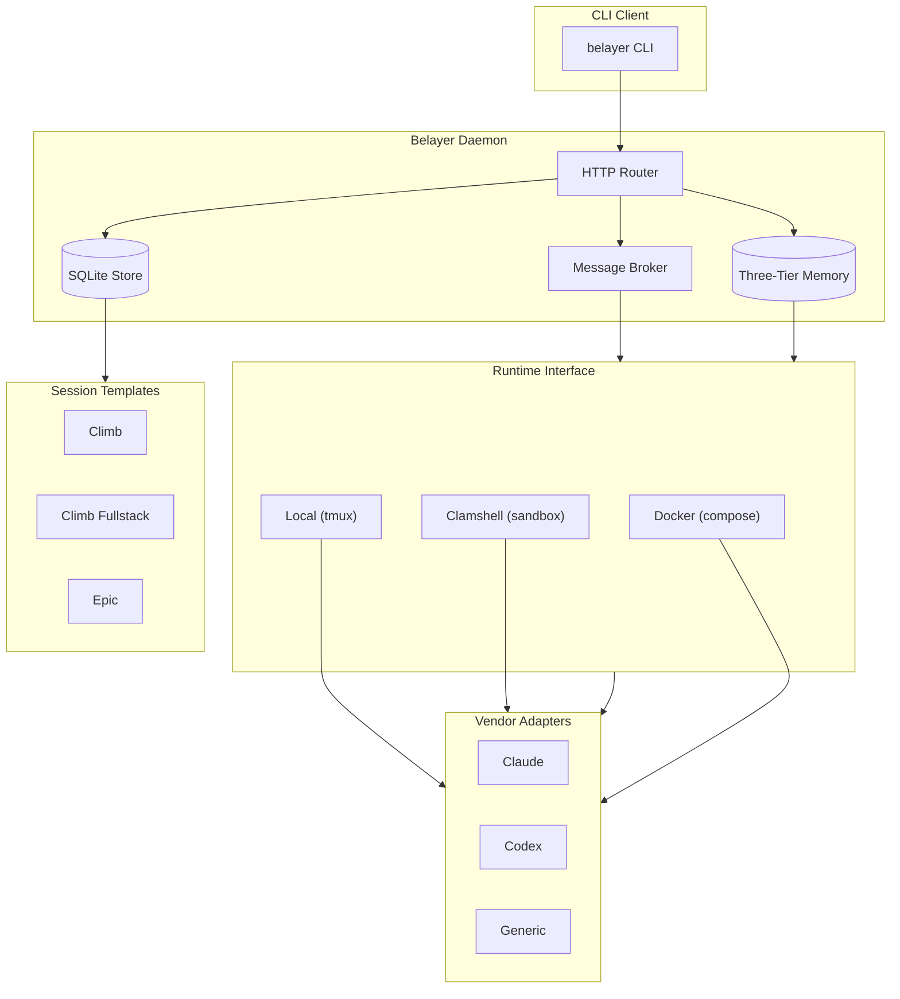
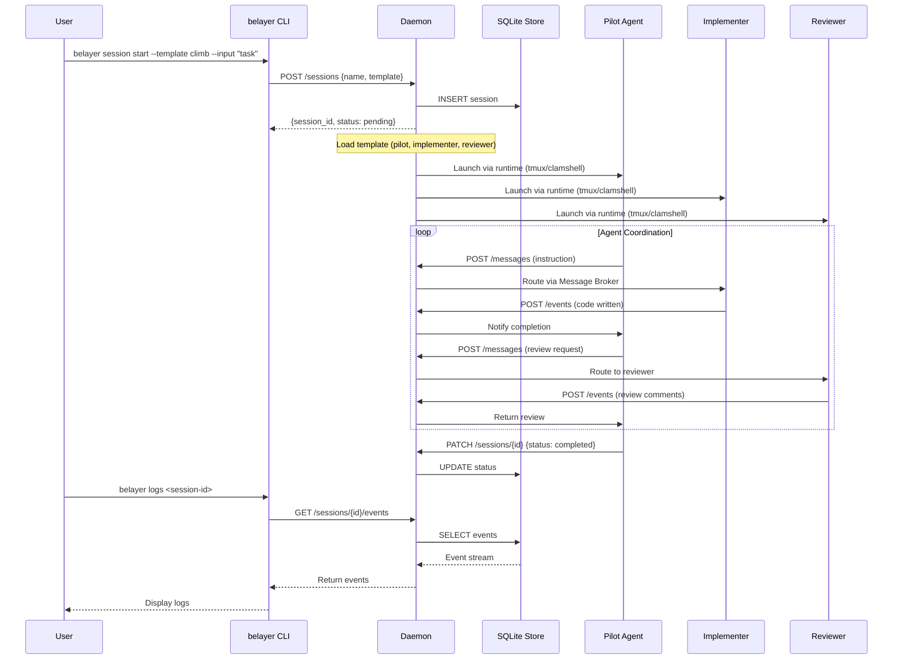

# belayer

Session runtime for autonomous coding agents. Many robots, bring your own pilots.

## What It Does

Belayer provides the infrastructure for multi-agent coding sessions: a daemon that manages sessions, messaging, memory, and execution environments. You bring the AI agents (Claude, Codex, or any terminal program); belayer provides the coordination layer. Agent sandboxes are powered by [clamshell](https://github.com/anthropics/clamshell) for deny-by-default network isolation, host-owned credential management, and per-binary egress policy.

## Quick Start

```bash
# Build and install
go install ./cmd/belayer

# Bootstrap a workspace
belayer setup

# Start the daemon
belayer daemon

# Launch an implementation session (local tmux)
belayer session start --template climb --input "Add rate limiting to /api/v1/cards"

# Launch with clamshell sandboxing
belayer session start --template climb --clamshell --environment extend-fullstack --input "Add rate limiting"

# Launch an epic orchestration session (pilot only)
belayer session start --template epic --environment extend-fullstack --input "JIRA-1234"

# Attach to an agent
belayer attach <session-name> --agent pilot

# Monitor
belayer status
belayer logs <session-id> -f
belayer debug <session-id>
```

## Session Templates

| Template | Agents | Purpose |
|----------|--------|---------|
| **climb** | 3 (pilot, implementer, reviewer) | Single-repo implementation with review loop |
| **climb-fullstack** | 4 (pilot, api-impl, app-impl, reviewer) | Multi-repo implementation (e.g. API + frontend) |
| **epic** | 1 (pilot) | Workspace orchestration — decomposes epics, creates parallel sessions |

## How Agents Work Together

The pilot (opus) orchestrates. Implementers (sonnet) write code. The reviewer (codex) provides fresh-eyes feedback. All communication flows through the daemon's message broker — agents never talk directly.

### The Review Loop

```
Pilot decomposes spec → messages implementer with task
  → Implementer writes code, runs tests, creates PR
  → Pilot routes PR to reviewer with spec context
  → Reviewer provides structured pass/fail feedback
  → On FAIL: pilot sends feedback to implementer → fix → re-review
  → On PASS: session complete (or next phase for fullstack)
```

Review loops evolve via agent memory and reflection, not hardcoded rules. The pilot adapts based on accumulated coordination knowledge.

### Multi-Repo (Fullstack)

Both implementers work in parallel on separate repos. The pilot watches events from both, detects semantic drift (e.g., API changed a response shape but the frontend still expects the old one), and intervenes proactively. After both PRs pass review, the pilot provisions a workbench and runs E2E validation.

### Three-Tier Memory

All agents get personal memory that persists across sessions, backed by a three-tier system:

- **Core** — session-scoped key-value pairs, always in the prompt (e.g., current task, review status)
- **Archival** — long-term learnings with full-text search via FTS5 (e.g., "SpiceDB permission patterns")
- **Recall** — combines core + archival search results on demand (`belayer recall "query"`)

Markdown files on disk are authoritative; SQLite is a derived index. The pilot learns coordination patterns. Implementers learn codebase conventions. The reviewer's checklist evolves from experience. Post-session reflection consolidates both personal agent memory and shared institutional learnings.

See [docs/ARCHITECTURE.md](docs/ARCHITECTURE.md) for the full collaboration model, message flow, memory structure, and observability details.

## Architecture



### Component Overview

| Layer | Component | Purpose |
|-------|-----------|---------|
| **Client** | `belayer` CLI | User interface for session management |
| **Daemon** | HTTP server on Unix socket | Central coordinator, singleton per workspace |
| | SQLite + FTS5 | Persistent session/event storage with full-text search |
| | Message Broker | Agent-to-agent communication with debouncing |
| | Memory System | Three-tier memory: core (hot), archival (searchable), recall (combined) |
| **Sessions** | Templates (climb/climb-fullstack/epic) | Multi-phase agent orchestration |
| **Runtime** | Local (tmux) | Agent execution via tmux sessions — no isolation |
| | Clamshell (sandbox) | Deny-by-default sandboxes with credential isolation |
| | Docker (compose) | Containerized agents with network isolation (legacy) |
| **Vendors** | Claude, Codex, Generic adapters | Pluggable AI agent backends |

### Session Lifecycle (Climb)



## Isolation Model

Belayer supports three runtime backends via a pluggable `Runtime` interface:

### Clamshell Sandboxes (recommended)

Clamshell is the primary isolation backend. Each agent runs in its own clamshell sandbox with:

| Concern | How clamshell solves it |
|---------|----------------------|
| **Network isolation** | Deny-by-default iptables. Sandbox processes can only reach the managed proxy on loopback. |
| **Credential isolation** | Host-owned secrets, never mounted into sandbox. `inference.local` routing injects credentials at the proxy boundary. Agent sees no real API keys. |
| **Egress control** | Per-binary policy — `claude` can reach `api.anthropic.com`; a Python script the agent wrote cannot. |
| **Filesystem isolation** | Writable `/workspace`, read-only root. Host control plane state never visible inside sandbox. |
| **Audit** | Deny event logs with binary identity, target, reason. `clamshell doctor` for health. |
| **Interactive access** | tmux-backed sessions. `belayer attach` wraps `clamshell sandbox connect`. |

```bash
# Launch with clamshell (uses environment policy)
belayer session start --template climb --clamshell --environment extend-fullstack --input "task"

# Attach to an agent's sandbox
belayer attach <session> --agent implementer
```

### Local Mode (tmux)

Agents run as tmux sessions on the host. No network or filesystem isolation.

| Aspect | Detail |
|--------|--------|
| Process | Separate tmux session (`belayer-{session}-{agent}`) |
| Filesystem | Full host access (runs in CWD or worktree) |
| Network | Full host network access |
| Use case | Trusted environments, development, no Docker/clamshell overhead |

### Docker Mode (legacy)

Containerized agents with compose-based network isolation. Superceded by clamshell for new deployments.

### Security Boundaries

```
┌─────────────────────────────────────────────────────────────────────────────┐
│                          ISOLATION BOUNDARIES                               │
└─────────────────────────────────────────────────────────────────────────────┘

  Belayer Daemon (trusted control plane)
  ├── Pure Go binary, never runs LLM-generated code
  ├── Manages session lifecycle, messaging, events
  └── HTTP API on Unix socket (chmod 0600)

  Clamshell Gateway (trusted, host-side)
  ├── Holds real credentials (API keys, tokens)
  ├── Managed proxy with policy enforcement
  ├── inference.local routing (credential injection at proxy boundary)
  └── Audit logging of all egress

  Agent Sandboxes (untrusted, clamshell-managed)
  ├── Vendor CLI + git + belayer CLI
  ├── Worktree mounted at /workspace
  ├── NO real credentials (inference.local handles auth)
  ├── Deny-by-default network (only proxy on loopback)
  └── Per-binary egress policy

  Key Principle: Agents cannot escape their session boundary. Credentials
  never enter the sandbox. The host proxy is the only network exit.
```

## Planned

The following capabilities are defined in the [sandbox runtime design doc](docs/design-docs/2026-04-09-sandbox-runtime-architecture-design.md) and tracked as open issues:

- **Workbench provisioning** ([#43](https://github.com/donovan-yohan/belayer/issues/43), [#52](https://github.com/donovan-yohan/belayer/issues/52)) — On-demand test infrastructure (`belayer workbench up/down`) with health checks
- **Tool execution routing** ([#44](https://github.com/donovan-yohan/belayer/issues/44)) — Daemon routes `belayer tool run` to workbench/infra/host targets
- **Tiered agents** ([#49](https://github.com/donovan-yohan/belayer/issues/49)) — Main character / peripheral / ephemeral agent lifecycle
- **Pilot orchestration** ([#50](https://github.com/donovan-yohan/belayer/issues/50)) — Cross-session epic decomposition and monitoring
- **Event-driven monitoring** ([#53](https://github.com/donovan-yohan/belayer/issues/53)) — SSE/long-poll replacing polling for multi-session pilots

## Development

```bash
go build ./cmd/belayer
go test ./...
```

Tracked in [Epic #21](https://github.com/donovan-yohan/belayer/issues/21).
