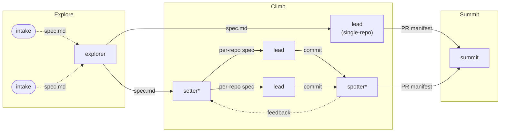

# belayer

An agent-agnostic orchestration standard for autonomous coding agents. Describe your workflow in a pipeline YAML, point it at one or many repos, and walk away. Belayer handles the sequencing, retries, validation, and PR lifecycle.

## Three Phases: Explore. Climb. Summit.


<sub>*setter and spotter are multi-repo only</sub>

| Phase | Command | What it does |
|-------|---------|-------------|
| **Explore** | `belayer explore` | Intake — produce a spec.md from any source (interactive, Jira, GitHub Issues) |
| **Climb** | `belayer climb` | Implementation — per-repo pipeline (plan → implement → review → PR) produces a PR manifest |
| **Summit** | `belayer summit` | Output — risk-gated auto-merge, observability, monitoring *(not yet implemented)* |

**Multi-repo is additive.** The per-repo pipeline runs identically whether you have one repo or ten. Multi-repo adds two coordination layers:
- **Setter** — decomposes spec.md into per-repo specs (fan-out)
- **Spotter** — validates cross-repo alignment after all repos complete (fan-in)

Neither changes how work happens inside a repo.

## Why Belayer

| belayer | alternatives |
|---------|-------------|
| **Agent-agnostic** — use Claude Code, Codex, OpenCode, or anything | Model-locked to one provider |
| **Orchestration standard** — belayer routes artifacts, nodes are black boxes | Agents that happen to orchestrate |
| **Pipeline-as-YAML** — fully customizable node sequences | Hardcoded workflows |
| **Multi-repo as additive layer** — same per-repo pipeline, coordination on top | Multi-repo as an agent feature |
| **You own your nodes** — bring your own implementations | Platform owns your agents |

## FAQ

<details>
<summary><b>Why does belayer create PRs before cross-repo validation?</b></summary>

Belayer follows the **additive workflow principle**: the per-repo flow (including PR creation and review) runs identically whether you're working on one repo or ten. Multi-repo coordination (setter/spotter) layers on top without changing how individual repos work.

If you only automated one repo, you'd follow the full flow to completion including PR. Multi-repo adds validation *after* — and if the spotter finds issues, the retry loop handles revisions. The setter provides branch/PR context in feedback so leads pick up existing work rather than starting from scratch.

**Belayer optimizes for autonomy, not efficiency.** Redundant work is acceptable if it means the system can self-correct without human intervention.
</details>

<details>
<summary><b>Why are setter and spotter opinionated rather than generic fan-out/fan-in?</b></summary>

Belayer solves a specific problem: coordinating autonomous agents across multiple repos. Setter (decompose and distribute) and spotter (cross-repo validation) are the two coordination patterns that emerge from this problem.

Building a generic fan-out primitive would be over-engineering for a problem with one use case. Belayer is plumbing — it provides the contracts and orchestration, not the implementations. But the plumbing itself has opinions about how multi-repo coordination should work.
</details>

<details>
<summary><b>What's belayer's responsibility vs the node's responsibility?</b></summary>

Belayer connects known-working agents at the right time. If a node implementation is inflexible, can't handle retries, or produces poor output — that's a node implementation problem, not an orchestration problem.

Belayer provides observability (loop counts, feedback content, scores) so humans can identify and improve underperforming nodes. The goal is continuous improvement through measurement, not architectural constraints that force correctness.
</details>

<details>
<summary><b>Why doesn't belayer implement setter/spotter for you?</b></summary>

Belayer provides contracts: setter expects spec.md in and produces per-repo spec.md out. Spotter expects N commit hashes in and produces a gate score + feedback out. How you implement these is up to you — your decomposition logic, your validation criteria, your tools.

This keeps belayer agent-agnostic. Your nodes could be Claude Code sessions, Codex, OpenCode, custom scripts, or anything else that fulfills the contract.
</details>

## Claude Code Marketplace and Codex Skills

This repo now follows the same broad cross-agent pattern used by Superpowers: keep the workflow content in one authored tree, then expose thin runtime-specific install layers.

- `plugins/` is the authored source of truth for Belayer workflows
- `skills/` is the generated native Codex skill pack derived from those same plugin files
- `go run ./cmd/gencodexskills` refreshes the tracked Codex pack after plugin edits

Belayer currently ships three shared workflow packs:

- **harness** (`plugins/harness/`) — 3-tier documentation system with living execution plans: brainstorm, bug, refactor, plan, orchestrate, complete, and the strangler-fig refactoring skill
- **pr** (`plugins/pr/`) — Pull request lifecycle management: authoring, reviewing, resolving, and updating PRs
- **explorer** (`plugins/explorer/`) — Submit a spec into the belayer pipeline from an interactive agent session

### Claude Code

This repository is a valid [Claude Code marketplace](https://github.com/anthropics/claude-code-plugins) plugin repository. The vendored plugins under `plugins/` are picked up automatically when you work in this repo.

If you want to use them in other projects, install them from the marketplace:

```bash
claude plugin add donovan-yohan/belayer --path plugins/harness
claude plugin add donovan-yohan/belayer --path plugins/pr
claude plugin add donovan-yohan/belayer --path plugins/explorer
```

### Codex

Codex uses native skill discovery from `~/.agents/skills/`. Belayer supports that in two ways:

For contributors working from this checkout:

```bash
go run ./cmd/gencodexskills
mkdir -p ~/.agents/skills
ln -s /absolute/path/to/belayer/skills ~/.agents/skills/belayer
```

Then restart Codex.

If you are using the installed Belayer CLI instead of a repo checkout, run:

```bash
belayer init
```

When `codex` is on your `PATH`, `belayer init` writes a versioned pack under `~/.belayer/agent-assets/codex/<pack-version>/skills/` and mounts it at `~/.agents/skills/belayer`.

Codex installation, repair steps, and troubleshooting live in [`.codex/INSTALL.md`](.codex/INSTALL.md).

## Prerequisites

- **Go 1.24+**
- **tmux** — process management for agent sessions (`brew install tmux`)
- **Agent CLI** (at least one):
  - **Claude Code** — the `claude` binary on your PATH ([install guide](https://docs.anthropic.com/en/docs/claude-code))
  - **Codex CLI** — the `codex` binary on your PATH ([install guide](https://github.com/openai/codex))
- **SQLite** — bundled via `modernc.org/sqlite` (no C dependency)

## Install

```bash
go install github.com/donovan-yohan/belayer/cmd/belayer@latest
```

Or build from source:

```bash
git clone https://github.com/donovan-yohan/belayer.git
cd belayer
go build -o belayer ./cmd/belayer
```

## Quickstart

### 1. Initialize belayer

```bash
belayer init
```

Creates `~/.belayer/config.json`.

### 2. Create a crag

A crag is a long-lived workspace tied to one or more repos.

```bash
belayer crag create my-project \
  --repos https://github.com/you/frontend.git \
  --repos https://github.com/you/backend.git
```

This bare-clones the repos into `~/.belayer/crags/my-project/repos/`.

For local repos, opt in explicitly:

```bash
belayer crag create my-project \
  --repos ./frontend \
  --repos ./backend \
  --local-paths
```

GitHub tracker integration still requires a remote repository URL in the crag config for `owner/repo` resolution.

### 3. Research, brainstorm, and create a problem

Launch an interactive Claude session that knows your crag's repos and supports discovery before problem creation:

```bash
belayer setter -c my-project
```

Inside the setter session, use the shared research workflow when the request is still fuzzy:

- `/blr-research` to explore the space and append to `research-notes.md`
- `/blr-research-url <url>` to analyze a source and append it to the same notes
- `/blr-research-summarize` to compile `research.md`

Once the scope is clear, continue with `/blr-problem-brainstorm` and `belayer problem create`.

Or create a problem directly from a spec and climbs file:

```bash
belayer problem create -c my-project --spec spec.md --climbs climbs.json
```

<details>
<summary>Example climbs.json</summary>

```json
{
  "climbs": [
    {
      "id": "setup",
      "repo": "frontend",
      "description": "Initialize project scaffolding with Vite + React",
      "depends_on": []
    },
    {
      "id": "api-layer",
      "repo": "backend",
      "description": "Create REST API endpoints for user management",
      "depends_on": []
    },
    {
      "id": "integration",
      "repo": "frontend",
      "description": "Connect frontend to backend API",
      "depends_on": ["setup", "api-layer"]
    }
  ]
}
```

</details>

### 4. Start the belayer daemon

The belayer daemon picks up pending problems and runs them:

```bash
belayer belayer start -i my-project --max-leads 4
```

This will:
- Build a DAG from the climbs
- Create isolated git worktrees per climb
- Spawn agent sessions (Claude Code or Codex) in tmux windows
- Monitor for completion (via mail messages)
- Run per-repo spotter validation when all climbs for a repo finish
- Create correction climbs if the spotter finds issues, and re-validate
- Run cross-repo anchor review for multi-repo problems
- Create PRs on approval, capture learnings for future problems

### 5. Monitor progress

```bash
# Quick status
belayer status -c my-project

# View lead session logs
belayer logs -c my-project
```

## CLI Reference

| Command | Description |
|---------|-------------|
| `belayer init` | Initialize global config |
| `belayer crag create` | Create a new crag from remote URLs or local repo paths |
| `belayer crag list` | List all crags |
| `belayer crag delete` | Delete a crag |
| `belayer explorer` | Interactive agent session for pre-crag research, decomposition, and scaffold planning |
| `belayer setter` | Interactive agent session for research, planning, and problem creation |
| `belayer problem create` | Create a problem from spec + climbs files |
| `belayer problem list` | List problems for a crag |
| `belayer belayer start` | Start the daemon that executes problems |
| `belayer status` | Show problem and climb status |
| `belayer message <addr>` | Send a typed mail message to an agent |
| `belayer mail read` | Read unread messages and mark as read |
| `belayer mail inbox` | List unread messages without marking read |
| `belayer mail ack <id>` | Mark a specific message as read |
| `belayer logs` | View and manage lead session logs |
| `belayer learnings list` | List persistent learnings for a crag |
| `belayer learnings show <id>` | Show detail view of a learning |
| `belayer learnings add` | Add a manual learning |
| `belayer learnings compact` | Consolidate and deduplicate learnings |

## Agent Provider

Belayer defaults to Claude Code for all roles. You can switch the default or mix providers per role in your crag's `belayer.toml`:

```toml
[agents]
provider = "claude"              # default for all roles
lead_provider = "codex"          # override: leads use Codex
# spotter_provider = ""          # empty = use default (claude)
# anchor_provider = ""           # empty = use default (claude)
```

Config files live at `~/.belayer/crags/<crag-name>/belayer.toml` (per-crag) or `~/.belayer/belayer.toml` (global).

## Architecture

See [docs/ARCHITECTURE.md](docs/ARCHITECTURE.md) for the full code map and data flow.

**Key design decisions:**
- **Stripe-style blueprint** — deterministic Go code handles orchestration; ephemeral agent sessions handle judgment calls (decomposition, sufficiency checks, alignment reviews)
- **Bare repos + worktrees** — each climb gets an isolated git worktree so agents can work in parallel without conflicts
- **SQLite as single source of truth** — all state (problems, climbs, verdicts, events) lives in one database per crag
- **DAG execution** — climbs declare dependencies; the belayer daemon only spawns a climb when all its dependencies are complete
- **Crash recovery** — the belayer daemon resumes in-progress problems on restart by scanning SQLite and checking for `TOP.json` files
- **Inter-agent mail** — filesystem-backed messaging system (`belayer message` / `belayer mail read`) with typed messages and tmux send-keys delivery

## Development

```bash
# Run all tests
go test ./...

# Build
go build -o belayer ./cmd/belayer
```

## License

MIT
