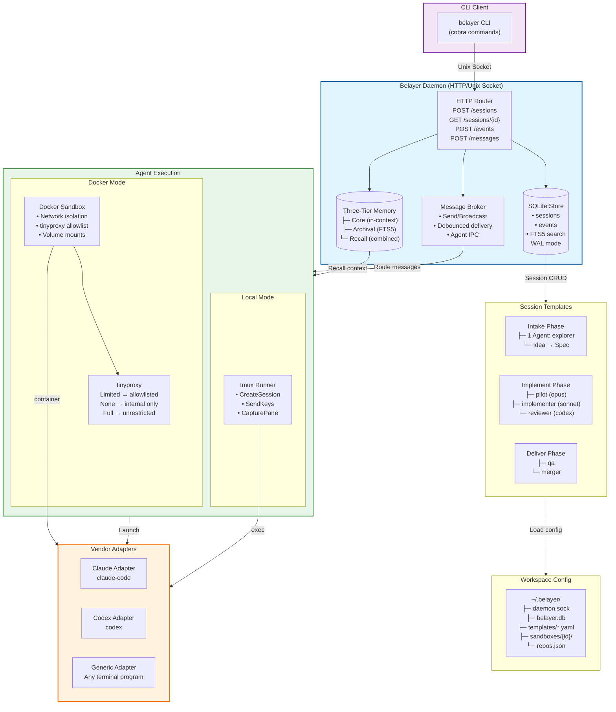
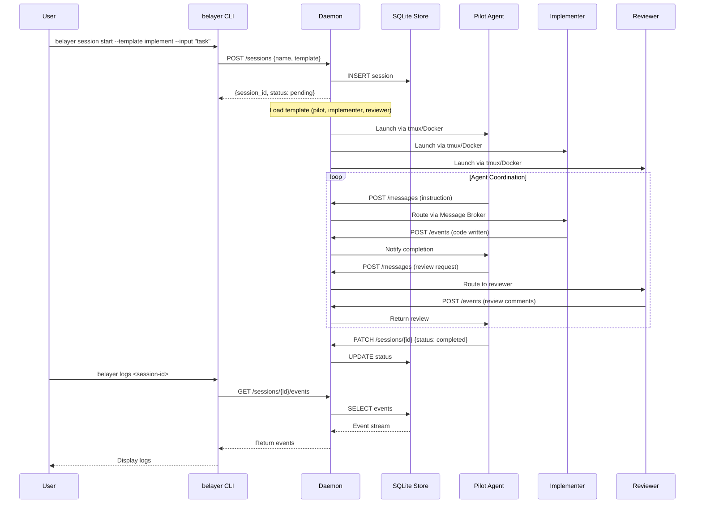

# belayer

Session runtime for autonomous coding agents. Many robots, bring your own pilots.

## What It Does

Belayer provides the infrastructure for multi-agent coding sessions: a daemon that manages sessions, messaging, memory, and execution environments. You bring the AI agents (Claude, Codex, or any terminal program); belayer provides the coordination layer.

## Quick Start

```bash
# Build and install
go install ./cmd/belayer

# Bootstrap a workspace
belayer setup

# Start the daemon
belayer daemon

# Launch an implementation session
belayer session start --template implement --input "Add rate limiting to /api/v1/cards"

# Or with Docker sandboxing
belayer session start --template implement --docker --environment extend-fullstack --input "Add rate limiting"

# Attach to the pilot agent
belayer attach <session-name> --agent pilot

# Monitor
belayer status
belayer logs <session-id> -f
belayer debug <session-id>
```

## Three Phases

| Phase | Command | Agents | Purpose |
|---|---|---|---|
| **Intake** | `belayer intake` | 1 (explorer) | Idea to spec |
| **Implement** | `belayer implement` | 3 (pilot, implementer, reviewer) | Code with review loop |
| **Deliver** | `belayer deliver` | 2 (QA, merger) | Validate, merge, monitor |

## Architecture



### Component Overview

| Layer | Component | Purpose |
|-------|-----------|---------|
| **Client** | `belayer` CLI | User interface for session management |
| **Daemon** | HTTP server on Unix socket | Central coordinator, singleton per workspace |
| | SQLite + FTS5 | Persistent session/event storage with full-text search |
| | Message Broker | Agent-to-agent communication with debouncing |
| | Memory System | Three-tier memory: core (hot), archival (searchable), recall (combined) |
| **Sessions** | Templates (intake/implement/deliver) | Multi-phase agent orchestration |
| **Execution** | tmux Runner | Local agent execution via tmux sessions |
| | Docker Sandbox | Containerized agents with network isolation |
| | tinyproxy | Network filtering (none/limited/full modes) |
| **Vendors** | Claude, Codex, Generic adapters | Pluggable AI agent backends |

### Session Lifecycle (Implement Phase)



## Docker Sandboxing

Run agents in isolated Docker containers with network controls:

```bash
# Create an environment config
cat > .belayer/environments/myenv.yaml << 'EOF'
name: myenv
type: docker-compose
networking:
  type: limited                    # none | limited | full
  allowed_hosts:
    - api.anthropic.com
    - api.openai.com
    - "*.github.com"
  allow_package_managers: true
EOF

# Launch with Docker isolation
belayer session start --template implement --docker --environment myenv --input "task"
```

Network modes:
- **none** — no internet access (internal Docker network only)
- **limited** — allowlisted hosts via tinyproxy (vendor APIs, package managers)
- **full** — unrestricted internet access

Each session gets an isolated Docker network. Agents communicate with the daemon via mounted Unix socket, enabling `belayer recall`, `belayer note`, and `belayer logs` from inside containers.

## Isolation Model

Belayer provides defense in depth through multiple isolation layers:

### Network Isolation

| Layer | Mechanism | Guarantee |
|-------|-----------|-----------|
| **Docker Network** | `internal: true` | Containers cannot reach host network directly |
| **Per-Session Networks** | Unique network per session | Agents from different sessions cannot communicate |
| **tinyproxy** | HTTP proxy with regex allowlist | Only explicitly allowed hosts reachable in "limited" mode |
| **Host Validation** | Rejects broad patterns (`.*`, `.`, `*`) | Prevents accidental wildcard allowlisting |

**Network Modes:**

- **`none`** — Internal Docker network only. No internet access. Use for air-gapped environments or when agents should only access local resources.
- **`limited`** — HTTP/HTTPS via tinyproxy with host allowlist. Vendor APIs and package managers work; everything else is blocked.
- **`full`** — Unrestricted access. Use when you trust the agents or need unfettered internet access.

### Filesystem Isolation

| Layer | Mechanism | Guarantee |
|-------|-----------|-----------|
| **Container Filesystem** | Docker overlayfs | Agent changes are isolated to container unless explicitly mounted |
| **Workspace Mount** | Read-write bind mount to `/workspace` | Agents can modify project files, but only within the workspace |
| **Daemon Socket Mount** | Unix socket at `/belayer/daemon.sock` | Agents can query daemon for logs/recall, but cannot escape container |
| **Git Worktrees** | Per-agent worktrees (optional) | Each agent gets isolated git working directory |
| **.env Mount** | Credentials mounted as file (0600) | API keys never embedded in compose YAML or shell commands |
| **Directory Permissions** | `.belayer/` directories use 0700 | Only owner can access workspace configuration |

### Local Mode Isolation

When running without Docker (`--docker` not specified), agents run in tmux sessions on the host:

- **Process isolation**: Each agent is a separate tmux session with unique name prefix (`belayer-{session}-{agent}`)
- **Working directory**: Agents run in the current working directory (no chroot)
- **Network**: Full host network access (no sandboxing)
- **Use case**: Trusted environments where Docker overhead isn't acceptable

### Security Boundaries

```
┌─────────────────────────────────────────────────────────────────────────────┐
│                          ISOLATION BOUNDARIES                               │
└─────────────────────────────────────────────────────────────────────────────┘

  Host System
  ├─ Daemon (Unix socket ~/.belayer/daemon.sock, chmod 0600)
  │   └─ HTTP API with session-scoped access control
  │
  ├─ Docker Daemon
  │   └─ Per-Session Networks (internal: true)
  │       └─ Container A ──► tinyproxy ──► Internet (if allowed)
  │       └─ Container B ──► tinyproxy ──► Internet (if allowed)
  │           │
  │           ├─ Mounted: /workspace (RW)       ← Project files
  │           ├─ Mounted: /belayer/daemon.sock (RO) ← Daemon API
  │           ├─ Mounted: /belayer/.env (RO)    ← Credentials
  │           └─ Container filesystem (overlay) ← Ephemeral changes
  │
  └─ tmux sessions (local mode, no network/filesystem isolation)

  Key Principle: Agents cannot escape their session boundary. Even if an agent
  is compromised, it can only affect its own session and explicitly mounted paths.
```

## Development

```bash
go build ./cmd/belayer
go test ./...
```

Tracked in [Epic #21](https://github.com/donovan-yohan/belayer/issues/21).
