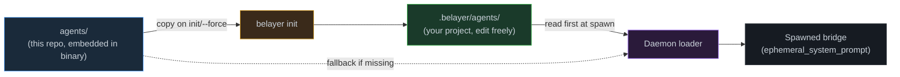
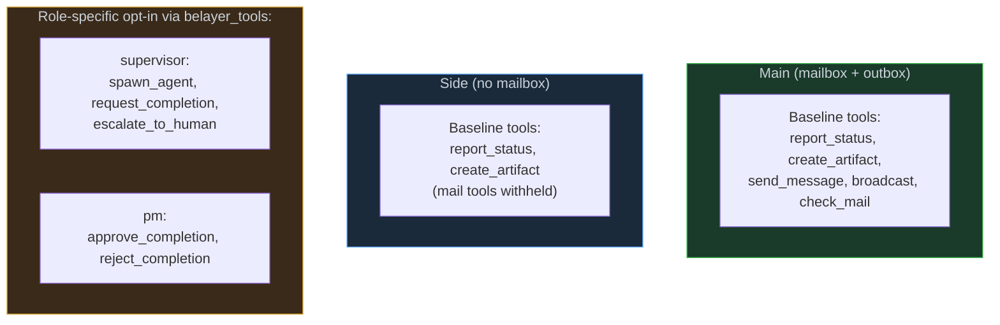

# Default Agent Team

This directory holds belayer's **shipped starter team**. It is not the
framework contract — the framework itself does not require any of these
names to exist. What the framework requires is the *shape* of an identity
directory:

```
.belayer/agents/<name>/
├── agent.yaml          # vendor, model, kind, tool allowlist
├── system-prompt.md    # the agent's soul (injected via ephemeral_system_prompt)
└── agents.md           # operating instructions, tools, workflows
```

## How these files reach your project



- `agents/` here: shipped starter templates, embedded in the `belayer` binary.
- `belayer init`: copies this tree into your project at `.belayer/agents/`.
- `.belayer/agents/` in your project: your runtime team definition — you own
  it. Edit, delete, rename, add; nothing in the framework source changes.
- At spawn time the daemon reads project-local first, falls back to the
  embedded copy only if the name is not defined locally.

## The shipped default team

Six identities, split across the two agent kinds.

| Identity       | Kind  | Ephemeral | Workspace | What it does                                                   |
|----------------|-------|-----------|-----------|----------------------------------------------------------------|
| `supervisor`   | main  | false     | none      | Party lead. Spawns peers, coordinates, gates ship, calls `finish`. |
| `backend-dev`  | main  | false     | inherit   | Backend/API implementer. Designed to be spawned on a branch.   |
| `web-dev`      | main  | false     | inherit   | Frontend/web implementer. Designed to be spawned on a branch.  |
| `pm`           | side  | true      | inherit   | Adversarial spec-vs-reality verifier. Auto-spawned by daemon on `belayer_request_completion`. |
| `qa`           | side  | true      | inherit   | Outside-in validation via browser / CLI / real APIs.           |
| `reviewer`     | side  | true      | none      | Diff / plan reviewer with structured `NO_FINDINGS / PASS_WITH_NOTES / FAIL` verdicts. |

### Mains vs sides



Mail tools are bound to `kind`. Role tools are declared in each identity's
`agent.yaml#belayer_tools:` and enforced at bridge registration — an agent
without the declaration spawns without the tool.

## Customizing

The starter team is a *starting point*. Real projects will diverge.

### Edit an identity in place

```bash
$EDITOR .belayer/agents/reviewer/system-prompt.md
```

Next spawn picks up the change; no daemon restart needed.

### Delete an identity you don't need

```bash
rm -r .belayer/agents/qa
```

Remove the reference from your supervisor's prompt too — otherwise it will
try to spawn a name that no longer resolves.

### Rename an identity

Rename the directory; update any references in other agents' prompts.

### Add a new main

```bash
mkdir -p .belayer/agents/data-eng
cat > .belayer/agents/data-eng/agent.yaml <<'YAML'
schema_version: "1"
description: "Data engineer — main implementer for ETL pipelines"
kind: main
vendor: codex
model: gpt-5.4
max_turns: 100
max_duration: "2h"
ephemeral: false
workspace: inherit
belayer_tools: []          # baseline only (mail, status, artifacts)
YAML
$EDITOR .belayer/agents/data-eng/system-prompt.md
$EDITOR .belayer/agents/data-eng/agents.md
```

Then teach your supervisor about it (add a bullet to
`.belayer/agents/supervisor/system-prompt.md`'s team roster). The supervisor
spawns it with `belayer_spawn_agent(identity="data-eng", branch="feat/...")`.

### Add a new side

Same shape; flip `kind: side`, `ephemeral: true`. Sides can't receive mail —
they get their task in the spawn message and return via `final_response` plus
artifacts. A side that needs mid-flight redirection only accepts
`--interrupt` messages (stdin injection).

### Replace the whole team

Nothing in the framework source requires `supervisor`/`pm`/`qa`/`reviewer`. If your
project wants `pilot` + `sprites`, start from `examples/templates/pilot/` and
`examples/templates/sprite/`, drop them under `.belayer/agents/`, and point
`belayer run start` at your new party lead.

```bash
rm -r .belayer/agents/*                        # clear the starter team
cp -r examples/templates/pilot .belayer/agents/
cp -r examples/templates/sprite .belayer/agents/
# ... add per-repo implementers as needed
```

## Upgrading the shipped defaults

`belayer init --force` refreshes `.belayer/agents/` with the shipped copy
from a newer framework binary. Your `config.yaml` is never touched.
Identities you added under names that don't exist in the shipped tree are
preserved; shipped names are overwritten, so rename any identity you've
heavily customized before running `--force`.

## Examples

- `examples/templates/pilot/` + `examples/templates/sprite/` — alternative
  main/side pair.
- `examples/templates/api-implementer/` + `examples/templates/app-implementer/`
  — per-repo mains with named workspaces.
- `examples/templates/reviewer/` — standalone reviewer side.
