# Agent Architecture

How agents communicate, coordinate, and stay alive inside a Belayer run.

---

## Scope

This document describes belayer's runtime model and the shipped default
workflow. It does **not** mean every consuming project should use the exact
same agent team.

Belayer ships starter identities under `agents/`, and `belayer init` copies
them into the consuming repo at `.belayer/agents/`. That project-local tree is
owned by the consuming project. Edit it there instead of changing belayer
source just to customize your team's roles, prompts, or tool access.

---

## Two kinds of agent: main and side

Every agent has `kind: main | side` in its `agent.yaml`. The distinction is
one axis: *does the agent have a mailbox?*

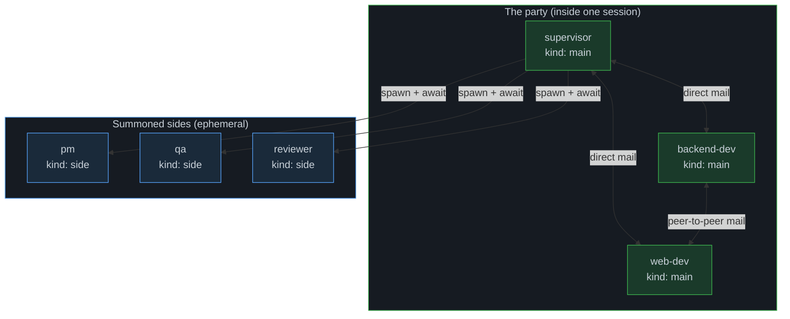

**Main.** Long-lived party member. Has inbox + outbox. Polls mail before
every turn. Accepts broadcasts. Accepts mid-flight interrupts via stdin.
Peers message each other directly — no supervisor hop required.

**Side.** Short-lived worker with a single scoped task. *No* mailbox.
Receives its task in the spawn message, produces output via `final_response`
plus registered artifacts, and exits. The only mail surface a side has is an
interrupt (`--interrupt` writes to the side's stdin).

### Tool surface per kind

| Tool                           | main (peer) | main (party lead) | side |
|--------------------------------|:-----------:|:-----------------:|:----:|
| `belayer_report_status`        | ✓           | ✓                 | ✓    |
| `belayer_create_artifact`      | ✓           | ✓                 | ✓    |
| `belayer_send_message`         | ✓           | ✓                 | ✗    |
| `belayer_broadcast`            | ✓           | ✓                 | ✗    |
| `belayer_check_mail`           | ✓           | ✓                 | ✗    |
| `belayer_spawn_agent`          | ✗           | ✓ (opt-in)        | ✗    |
| `belayer_request_completion`   | ✗           | ✓ (opt-in)        | ✗    |
| `belayer_escalate_to_human`    | ✗           | ✓ (opt-in)        | ✗    |
| `belayer_approve_completion`   | ✗           | ✗                 | ✓ (PM only) |
| `belayer_reject_completion`    | ✗           | ✗                 | ✓ (PM only) |

The mail tools (`send_message`, `broadcast`, `check_mail`) are automatic for
every `kind: main` and withheld from every `kind: side`. Role-specific tools
(`spawn_agent`, completion-gate tools) are opt-in via
`agent.yaml#belayer_tools:` and enforced at registration time — an identity
that does not declare a tool spawns without it.

The party lead is just a main that declares `belayer_spawn_agent` +
`belayer_request_completion`. It is a prompt/tool disposition, not a third
kind. The shipped default team uses `supervisor` as the party lead.

### Shipped default team

| Identity       | Kind  | Why                                                       |
|----------------|-------|-----------------------------------------------------------|
| `supervisor`   | main  | Party lead; spawns peers, coordinates, gates ship.        |
| `backend-dev`  | main  | Backend/API implementer. Worktree-isolated per spawn.     |
| `web-dev`      | main  | Frontend/web implementer. Worktree-isolated per spawn.    |
| `pm`           | side  | Spec-vs-reality gate, auto-spawned by daemon on `finish`. |
| `qa`           | side  | Outside-in validation (browser/CLI/real APIs).            |
| `reviewer`     | side  | Diff/plan reviewer with structured verdicts.              |

See `agents/README.md` for the customization guide and `examples/templates/`
for alternative team shapes (pilot + sprites + per-repo implementers).

---

## Agent toolbox

Every Hermes agent starts with a base set of tools from the harness (file editing, bash, search, etc.). Belayer injects coordination tools via the bridge at spawn time. Availability depends on `kind` plus the identity's `belayer_tools` allowlist.

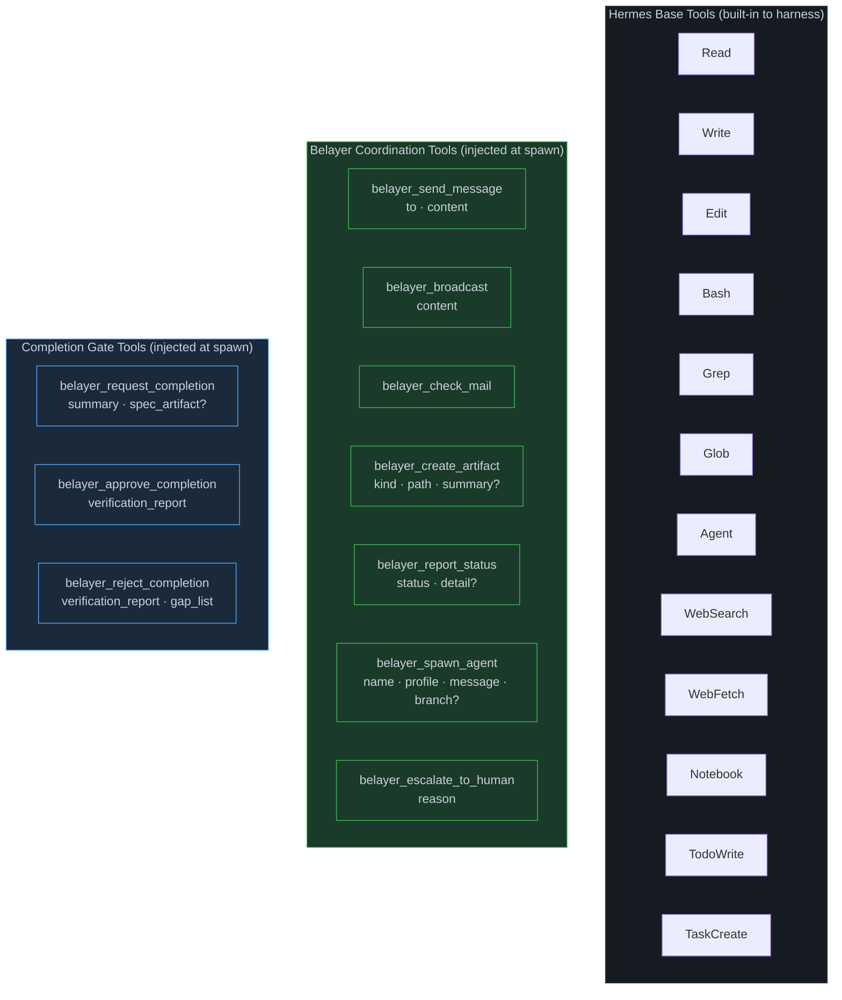

### Tool details

| Tool | Parameters | What it does |
|------|-----------|--------------|
| `belayer_send_message` | `to` (agent name), `content` (string) | Direct message to another agent via the session bus (main only) |
| `belayer_broadcast` | `content` (string) | Party-wide message to every main (main only) |
| `belayer_check_mail` | — | Poll for queued messages and broadcasts (main only) |
| `belayer_create_artifact` | `kind`, `path`, `summary?` | Register a durable output (contract, report, task-graph, etc.) |
| `belayer_report_status` | `status` (working/blocked/done/needs-review), `detail?` | Publish lifecycle state to the session bus |
| `belayer_spawn_agent` | `name`, `profile`, `message`, `branch?` | Dynamically spawn a specialist agent (supervisor only) |
| `belayer_request_completion` | `summary`, `spec_artifact?` | Signal work is done, trigger PM verification (supervisor only) |
| `belayer_approve_completion` | `verification_report` | Approve the run after spec verification (PM only) |
| `belayer_reject_completion` | `verification_report`, `gap_list` | Reject the run with gaps for supervisor to fix (PM only) |
| `belayer_escalate_to_human` | `reason` (string) | Halt the run and flag for human review (supervisor only) |

The base Hermes tools let an agent do work (read files, write code, run commands). The Belayer coordination tools let an agent coordinate (send messages, register outputs, report status, spawn teammates). The completion gate tools enforce spec verification before a run can close.

Each agent template declares role-specific tools via the `belayer_tools` field in `agent.yaml`. `report_status` and `create_artifact` are universal baseline tools registered on every agent. Mail tools (`send_message`, `broadcast`, `check_mail`) are registered only for `kind: main`. Role-specific tools are only available to identities that declare them. The supervisor can spawn agents, request completion, and escalate to human. Only the PM can approve or reject a run. This is enforced at registration time — agents never see tools they aren't authorized to use.

Side agents do not receive mail tools; they receive their task in the spawn message and return via `final_response` plus artifacts.

Agents never communicate by writing to shared files or reading each other's terminal output. All coordination flows through Belayer's session bus.

---

## The Belayer daemon: session bus

The daemon is a Go process running on a Unix socket. It owns the session state and routes all inter-agent communication.

Every run has one **party lead** (a `kind: main` agent with `belayer_spawn_agent`
+ `belayer_request_completion`, conventionally `supervisor`) plus zero or more
specialist agents (mains or sides) spawned by the party lead at runtime. A
**PM** side is auto-spawned by the daemon when the party lead calls
`belayer_request_completion`, to gate completion. Everything else is dynamic.

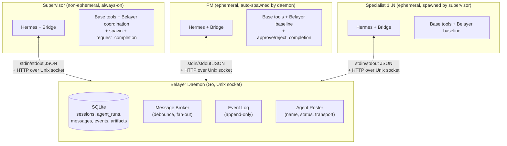

In the shipped default flow, the supervisor is the first agent spawned. It
reads the spec, decomposes work, and spawns specialists (frontend, backend,
qa, reviewer, etc.) as needed. The PM is never spawned by the supervisor — the
daemon auto-spawns it when the supervisor calls `belayer_request_completion`,
creating an adversarial verification step that the supervisor cannot skip.

Those specialist identities are defaults, not framework requirements. A
consumer project can replace them with its own roles in `.belayer/agents/`
without changing the framework source.

### What the daemon owns

| Concern | Storage | Access |
|---------|---------|--------|
| Sessions | SQLite `sessions` table | `POST /sessions`, `GET /sessions/{id}` |
| Agent roster | SQLite `agent_runs` table | `POST /sessions/{id}/agents`, `GET /sessions/{id}/agents` |
| Messages | SQLite `messages` table + in-memory broker | `POST /sessions/{id}/messages`, `GET /sessions/{id}/messages` |
| Events | SQLite `session_events` table | `POST /sessions/{id}/events`, `GET /sessions/{id}/events` |
| Artifacts | SQLite `artifacts` table | `POST /sessions/{id}/artifacts`, `GET /sessions/{id}/artifacts` |

---

## Message delivery

Only `kind: main` agents have a mailbox. Sides are excluded from both mail
endpoints — sending to a side is a 400 at the daemon unless `urgent=1`
(interrupt), and a side has no outbox to originate from.

Two delivery paths depending on urgency.

### Non-urgent (pre-turn poll)

Most mail. The bridge polls the mailbox as part of **every** pre-turn input
assembly. Messages sent mid-turn are delivered at the next turn boundary, not
deferred to completion.

```mermaid
sequenceDiagram
    participant A as Peer main A
    participant D as Daemon
    participant B as Peer main B

    A->>D: POST /messages {to: "B", content: "..."}
    Note over D: Store in messages table,<br/>log message_sent event
    Note over B: Finishes current turn
    B->>D: GET /messages?for=B&pending=true
    D->>B: [{from: "A", content: "..."}]
    Note over D: Mark delivered
    Note over B: Inject at top of next user turn;<br/>ack at turn-end via bridge:message_ack
```

The broker debounces non-urgent messages with a 2-second window; three
messages in quick succession land as one pre-turn injection on the recipient.
Worst-case delivery latency = one turn of the recipient — fast enough for
peer Q&A ("what schema does `/mcp` return?") between mains.

### Urgent (push via stdin)

For when an agent is blocked or the supervisor needs to redirect a specialist mid-turn.

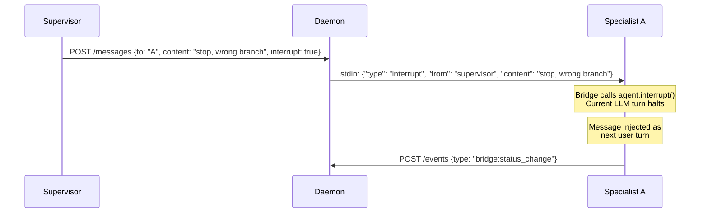

The daemon writes directly to the bridge subprocess's stdin pipe. The bridge's `StdinReader` thread picks it up, queues it, and calls `agent.interrupt()` to halt the current LLM generation. The interrupted turn returns immediately, and the urgent message becomes the next user turn.

Interrupt is also the only mail path a side supports: `send_message --to
<side> --interrupt` writes to the side's stdin. Non-urgent mail to a side is
rejected by the daemon — sides have no inbox to receive into.

### Broadcast

`belayer_broadcast` fans out party-wide. `handleBroadcastMessage` writes one
`messages` row per `kind: main` in the session (excluding sender) with
`recipient_id` set to that main's name. Mains pull broadcasts through the
same pre-turn poll as direct mail; the ack state machine applies
per-recipient. Only mains present in the roster at broadcast time receive
rows; a main that joins later will not receive earlier broadcasts unless
the sender rebroadcasts.

Sides are excluded from broadcast fan-out by construction.

---

## Agent lifecycle: party mains vs. summoned sides

Two distinct lifecycle models exist inside a single run. The shape maps
onto `kind`: mains live through the run as peer party members; sides are
spawn-and-complete.

### Party mains (non-ephemeral, always-on)

The party lead (and any peer main) stays alive for the entire run. The party lead is the only agent that can spawn other agents — the `belayer_spawn_agent` tool is opt-in via `agent.yaml#belayer_tools:` and by convention declared only on the lead. When a specialist finishes and reports back, the party lead is already there, waiting.

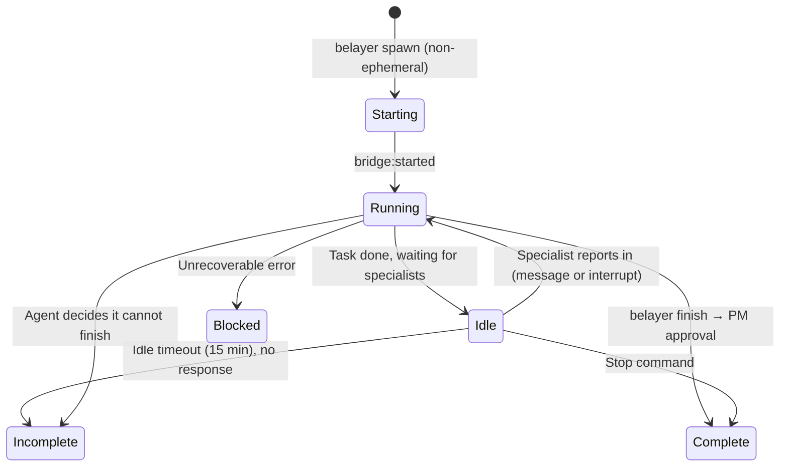

When the supervisor completes a task, it enters an **idle loop**: polling every 5 seconds for new messages, listening on stdin for interrupts. If a specialist sends a message, the supervisor wakes up and continues. If nothing happens for 15 minutes, the supervisor exits as **incomplete** — this is not a successful completion, it means no specialist reported back.

The **incomplete** state is distinct from both **complete** (work finished) and **blocked** (unrecoverable error). It means the agent made progress but could not finish — either due to idle timeout, getting stuck in a loop, or making a deliberate decision to escalate. When the supervisor reports incomplete, the daemon transitions the session to `needs_human_review`. Any agent can report incomplete via `belayer_report_status(status="incomplete")`.

The supervisor doesn't burn tokens while idling. It's not running inference. It's a Python process sleeping in a poll loop, ready to resume the Hermes conversation the moment work arrives.

Any peer main (`backend-dev`, `web-dev`, a custom main) follows the same
lifecycle. They idle between turns when their task is done, wake on mail or
interrupt, and stay available for the rest of the run.

### Sides (ephemeral, spawn-and-complete)

Sides are spawned by the party lead for a specific task. They do the work, report back, and exit.

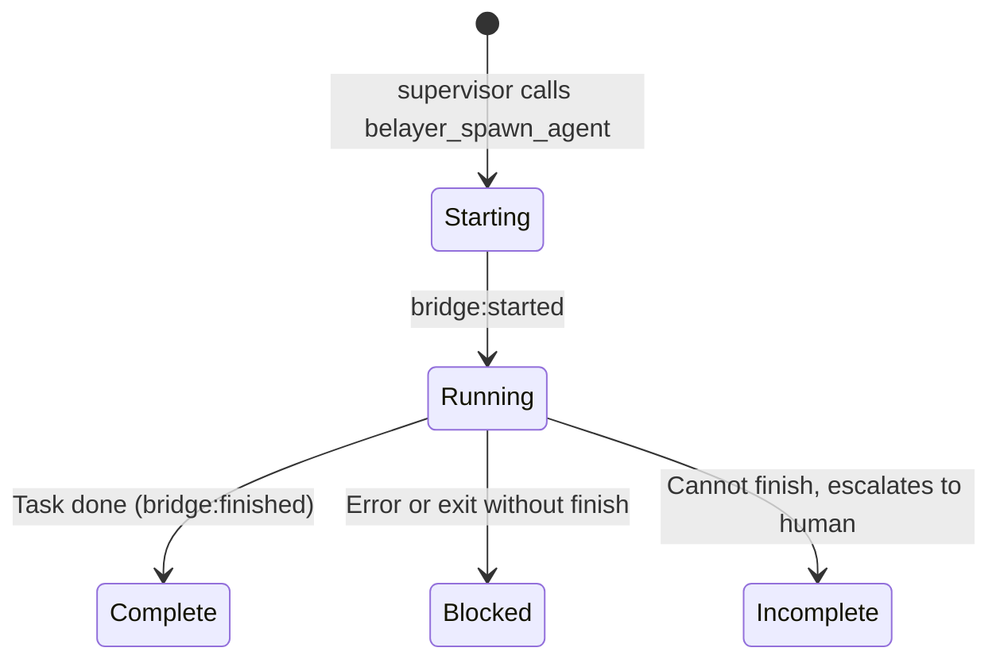

Sides are ephemeral by default (`ephemeral: true`). When their task is done, the bridge posts `bridge:finished` and the process exits. If a side gets stuck, it can report `incomplete` to escalate — the daemon logs an `agent_escalated` event and the party lead is notified.

But their **names persist**. The `agent_runs` table keeps the row. If the supervisor needs to assign more work to the same role, it spawns with the same name. The daemon detects the prior run, carries over the `HermesSessionID`, and the specialist resumes with its full conversation history.

```
First spawn:   supervisor → belayer_spawn_agent(name="api", message="implement POST /items")
                         → agent_runs row created, HermesSessionID saved on bridge:started
                         → specialist works, finishes, process exits

Second spawn:  supervisor → belayer_spawn_agent(name="api", message="now add validation")
                         → daemon finds prior row for "api", carries over HermesSessionID
                         → specialist resumes with full context from first assignment
```

This gives you persistent identity without persistent processes. The specialist sleeps (no process running, no tokens burning), but its name, conversation history, and worktree are preserved for reassignment.

---

## Telemetry: the event stream

Every significant thing that happens inside a run posts an event to the daemon's event log. This is the primary observability surface and the mechanism that enables session resume.

### Event flow

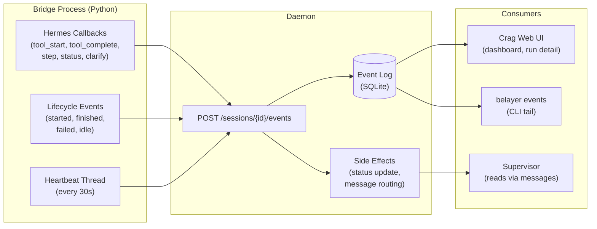

### Event types

Hermes callbacks are wired onto the agent instance at construction time. They fire automatically as the agent works:

| Event | Source | Payload | Side Effect |
|-------|--------|---------|-------------|
| `bridge:started` | Bridge main | `{agent, hermes_session_id, role, profile}` | Saves HermesSessionID for resume |
| `bridge:finished` | Bridge main | `{agent, reason?, final_response?}` | Sets agent status to `complete` |
| `bridge:failed` | Bridge main | `{agent, error}` | Sets agent to `blocked`, urgent message to supervisor |
| `bridge:idle` | Bridge main | `{agent, final_response?}` | Informational (supervisor entering idle loop) |
| `bridge:heartbeat` | Heartbeat thread | `{agent}` | Liveness signal (every 30s) |
| `bridge:step_completed` | Step callback | `{agent, step}` | Tracks conversation turn count |
| `bridge:tool_started` | Tool start callback | `{agent, tool, input_preview}` | Audit: what tool, what input |
| `bridge:tool_completed` | Tool complete callback | `{agent, tool, duration_ms, result_preview}` | Audit: how long, what result |
| `bridge:status_change` | Status callback | `{agent, status_type}` | Informational |
| `bridge:clarification_needed` | Clarify callback | `{agent, question}` | Routes question to supervisor |
| `bridge:turn_usage` | Bridge main (after each turn) | `{agent, input_tokens, output_tokens, cache_read_tokens, estimated_cost_usd, cost_status}` | Per-turn token/cost tracking |
| `bridge:session_usage` | Bridge main (on exit) | `{agent, session_total_tokens, session_estimated_cost_usd, session_api_calls}` | Cumulative session totals |
| `bridge:completion_requested` | Request completion tool | `{agent, summary, spec_artifact?}` | Auto-spawns PM agent for verification |
| `bridge:completion_approved` | Approve completion tool | `{agent, verification_report}` | Marks session complete, registers report artifact |
| `bridge:completion_rejected` | Reject completion tool | `{agent, verification_report, gap_list}` | Sends gap list to supervisor, tracks rejection cycle |

Daemon-internal events (not from bridge):

| Event | Source | Side Effect |
|-------|--------|-------------|
| `message_sent` | Message handler | Audit trail |
| `message_delivered` | Broker | Delivery confirmation |
| `agent_spawned` | Spawn handler | Roster update |
| `agent_finished` | Finish handler | Status update |
| `agent_exited_without_finish` | Exit watcher | Marks agent `blocked` |
| `agent_escalated` | Status event handler | Agent reported `incomplete`, logged for monitoring |
| `artifact_created` | Artifact handler | Registry update |
| `run_initiated` | CLI `run start` | Records initial task prompt and supervisor profile |
| `session_created` | Session handler | — |
| `session_completed` | Completion approved handler | Session status → complete |
| `session_stalled` | Bridge finished/failed handler | All agents exited without completion → session status → stalled |
| `warning:supervisor_exited_early` | Bridge finished handler | Supervisor exited while specialists still running |
| `completion_rejected` | Completion rejected handler | Tracks cycle count |
| `completion_escalated` | Rejection limit handler | Session status → needs_human_review |
| `pm_spawn_failed` | PM spawn error | Notifies supervisor to retry |

### How telemetry enables resume

The `bridge:started` event is the key. When a bridge process starts, it posts its `hermes_session_id` to the daemon. The daemon persists this in `agent_runs.hermes_session_id`.

When the supervisor re-spawns a specialist with the same name:

1. Daemon looks up prior `AgentRun` for that name
2. Finds `HermesSessionID` from the last `bridge:started` event
3. Passes it to the new bridge process via `BELAYER_HERMES_SESSION_ID` env var
4. Bridge constructs the Hermes agent with `--resume <session_id>`
5. Agent picks up with full conversation history, tool results, and context

This also enables crash recovery. If a bridge process dies unexpectedly:

1. Exit watcher detects process death without `bridge:finished` event
2. Marks agent `blocked`
3. Sends urgent message to supervisor: "agent X exited without finishing"
4. Supervisor can re-spawn with same name, daemon carries over `HermesSessionID`
5. Agent resumes from where it crashed

The heartbeat thread provides the liveness signal. If heartbeats stop arriving for an agent that's supposedly `running`, something has gone wrong. This is the daemon's dead-man switch.

---

## Spawn flow: end to end

A complete picture of what happens when the supervisor spawns a specialist:

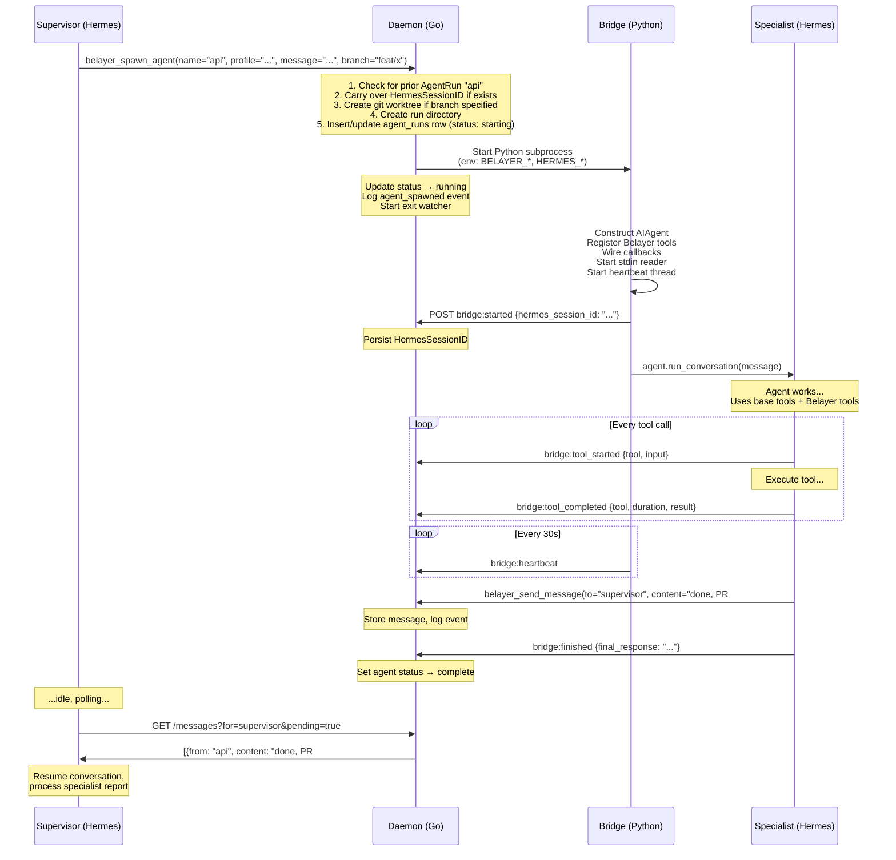

---

## Bridge architecture

The bridge is the process boundary between Go (daemon) and Python (Hermes). Each agent gets its own bridge process.

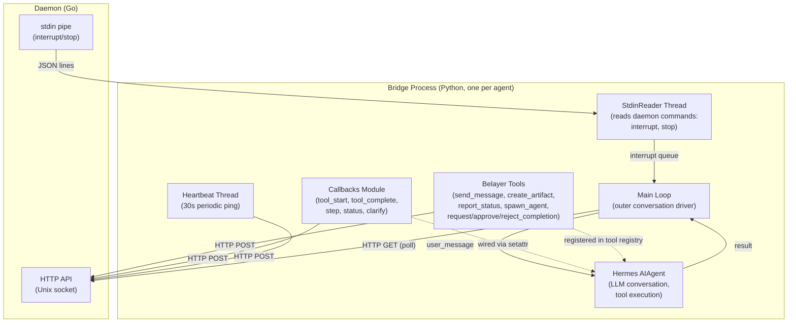

### Two communication channels

| Channel | Direction | Transport | Used for |
|---------|-----------|-----------|----------|
| **stdin pipe** | Daemon → Bridge | Newline-delimited JSON | Urgent interrupts, stop commands |
| **Unix socket HTTP** | Bridge → Daemon | HTTP over Unix socket | Tool calls, events, message polling |

The stdin pipe is push (daemon writes when it needs to interrupt). The HTTP channel is pull (bridge calls when it has something to send or needs to check for messages).

### Bridge environment toggles

The daemon injects environment variables into every bridge subprocess at spawn time (see `internal/bridge/bridge.go:BuildEnv`). Some are config-driven:

#### `HERMES_SKIP_OPENROUTER_PROBE`

Set to `1` by default. Suppresses the `openrouter.ai/api/v1/models` metadata fetch that hermes-agent performs at startup, which causes 20+ proxy-denied `CONNECT` requests per run on sandboxed deployments whose egress policy does not whitelist `openrouter.ai`.

**When to disable:** Only if your LLM vendor requires OpenRouter metadata at startup (e.g. a routing layer that resolves model IDs via the OpenRouter catalog). To opt out, add the following to `.belayer/config.yaml`:

```yaml
bridge:
  skip_openrouter_probe: false
```

**Upstream dependency:** This env var is a no-op until hermes-agent honours it. The complementary hermes-agent change must add (in `auth.py` or wherever `_fetch_openrouter_models` is called):

```python
import os
if os.getenv("HERMES_SKIP_OPENROUTER_PROBE") == "1":
    return {}
```

Until that hermes-agent change lands, setting or clearing this env var has no effect. Once it lands, the config default (`skip_openrouter_probe: true`) suppresses the probe for all spawned bridges.

---

## Worktree isolation

When the supervisor spawns a specialist with a `branch` parameter, the daemon creates a git worktree:

```
repo/
├── .belayer/
│   └── worktrees/
│       ├── api/          ← specialist A's isolated checkout
│       └── frontend/     ← specialist B's isolated checkout
├── src/                  ← supervisor works on main branch
└── ...
```

Each specialist gets its own filesystem checkout on its own branch. They can make commits without conflicting with each other or the supervisor. The supervisor can later merge branches or create PRs from them.

Worktree path: `<repoRoot>/.belayer/worktrees/<agentName>`

If no branch is specified, the specialist works in the same directory as the supervisor (shared workdir). This is simpler but means only one agent should be writing code at a time.

---

## Putting it together

The full picture of a Nightshift run:

```
Crag (always-on daemon, owns queue + targets + web UI)
│
├── submits request to available target
│
└── Target directory: ~/Projects/my-app
    │
    ├── Belayer daemon (Go, Unix socket, one per run)
    │   ├── SQLite store (sessions, agents, messages, events, artifacts)
    │   ├── Message broker (debounce, fan-out, urgent interrupt)
    │   └── Bridge process manager (spawn, monitor, stdin pipes)
    │
    ├── Supervisor (non-ephemeral)
    │   ├── Hermes agent (Opus, profile: nightshift-supervisor)
    │   ├── Base tools (Read, Write, Edit, Bash, Grep, Glob, ...)
    │   ├── Belayer tools (send_message, create_artifact, report_status, spawn_agent)
    │   ├── Completion tool: belayer_request_completion (signals "work done, verify")
    │   ├── Callbacks → daemon event log
    │   └── Lifecycle: running → idle (waiting) → running → ... → request completion
    │
    ├── Specialist "api" (ephemeral, spawned by supervisor)
    │   ├── Hermes agent (Sonnet, profile: nightshift-api)
    │   ├── Git worktree: .belayer/worktrees/api/ (branch: feat/api-items)
    │   ├── Base tools + Belayer tools (no spawn_agent)
    │   ├── Callbacks → daemon event log
    │   ├── Lifecycle: running → complete (process exits)
    │   └── Name persists in roster for re-assignment with session resume
    │
    ├── PM "pm" (ephemeral, auto-spawned by daemon on completion request)
    │   ├── Hermes agent (Sonnet, profile: default)
    │   ├── Completion tools: belayer_approve_completion, belayer_reject_completion
    │   ├── Reads spec artifact, git diff, artifact registry
    │   ├── Lifecycle: spawned → verify → approve (session complete) or reject (gaps to supervisor)
    │   └── Bounded: max 3 rejection cycles before escalating to human
    │
    └── Specialist "qa" (ephemeral, spawned by supervisor)
        ├── Hermes agent (Sonnet, profile: nightshift-qa)
        ├── Same workdir as supervisor (no worktree, reads but doesn't write code)
        ├── Base tools + Belayer tools (no spawn_agent)
        ├── Callbacks → daemon event log
        └── Lifecycle: running → complete
```

The supervisor orchestrates. Specialists execute. The PM verifies. The daemon routes. Events record everything. Names persist across spawns. Sessions resume from where they left off.

---

## Cost observability

Hermes exposes per-turn token usage and cost estimates from `run_conversation()`. The bridge posts these as events so the daemon can aggregate per-agent costs and Crag can display per-run cost breakdowns.

### Data available from Hermes

Per turn (from `run_conversation()` return dict):

| Field | Type | Description |
|-------|------|-------------|
| `input_tokens` | int | Non-cached input tokens |
| `output_tokens` | int | Completion tokens |
| `cache_read_tokens` | int | Tokens served from prompt cache |
| `cache_write_tokens` | int | Tokens written to prompt cache |
| `reasoning_tokens` | int | Extended thinking tokens |
| `total_tokens` | int | Total (prompt + completion) |
| `api_calls` | int | Number of API calls this turn |
| `estimated_cost_usd` | float | USD cost estimate |
| `cost_status` | string | "actual", "estimated", "included", or "unknown" |

Per session (from `agent` instance properties):

| Property | Description |
|----------|-------------|
| `agent.session_total_tokens` | Cumulative tokens across all turns |
| `agent.session_estimated_cost_usd` | Cumulative cost estimate |
| `agent.session_api_calls` | Total API calls |

### Event flow

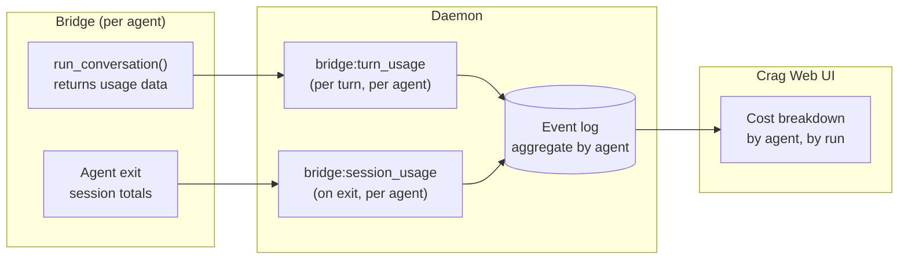

### What this enables

- **Per-agent cost breakdown**: see that the supervisor used $0.80 (Opus, orchestration overhead) while the implementer used $2.10 (Sonnet, heavy code generation)
- **Per-run total cost**: sum across all agents for one Nightshift run
- **Cost trending**: Crag can show cost-per-run over time, catch cost regressions
- **Budget enforcement**: future feature, Crag could set cost limits per run and pause/escalate when approaching them

### Implementation status

Wired in `hermes_bridge/__main__.py`. After each `run_conversation()` call, the bridge posts `bridge:turn_usage` with per-turn token counts and cost. On exit, it posts `bridge:session_usage` with cumulative totals from the `agent.session_*` properties. The daemon stores these in the event log like any other bridge event. Aggregation in Crag is not yet built.

---

## The completion gate: Product Manager agent

See [PM Agent design doc](design-docs/2026-04-16-product-manager-agent.md) for the full design rationale.

The supervisor and specialists have a structural bias toward reporting "done." Nobody in the roster has the incentive to say "wait, you skipped half the spec." The PM agent fixes this.

### How it works (implemented)

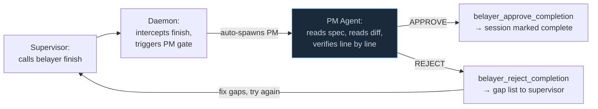

### The flow

1. **Supervisor signals completion**: calls `belayer finish "summary"` (CLI) or `belayer_request_completion(summary="...")` (bridge tool). Both paths converge in the daemon, which intercepts the finish and triggers the PM gate instead of marking the session complete.

2. **Daemon auto-spawns PM**: the event handler in `bridge_events.go` looks up the spec artifact (by kind: `spec` or `design-doc`), gathers the artifact registry, and spawns the PM via the bridge with a message containing full context. The PM's system prompt is loaded from `.belayer/agents/pm/system-prompt.md (project-local), or `<BelayerRoot>/agents/pm/system-prompt.md` (shipped default)` and injected as `ephemeral_system_prompt`.

3. **PM verifies**: reads the spec, reads the git diff, walks through the spec line by line. Produces a structured verification report (Passed / Failed / Deferred).

4. **PM decides**:
   - **APPROVE**: calls `belayer_approve_completion(verification_report="...")`. Daemon registers the report as an artifact, marks the session status as `complete`, and logs `session_completed`.
   - **REJECT**: calls `belayer_reject_completion(verification_report="...", gap_list="...")`. Daemon sends the gap list to the supervisor as an urgent message. Supervisor addresses gaps and calls `belayer finish` again.

5. **Bounded cycles**: after 3 rejections, the daemon marks the session as `needs_human_review` and sends an escalation message to the supervisor. No more automated retries.

### Key design decisions

- **The PM controls run completion, not the supervisor.** The supervisor calls `belayer finish`, but the daemon intercepts it and spawns the PM for verification. The PM calls `belayer_approve_completion` to actually close the session. There is no way for the supervisor to directly complete the run.
- **The daemon enforces the gate.** The PM is auto-spawned by the daemon when the supervisor finishes. The supervisor can't skip or forget the gate.
- **The spec is the source of truth, not the supervisor's summary.** The PM reads the original spec artifact directly. It receives the supervisor's summary for context but verifies against the spec.
- **Tool access is declared in agent templates.** Each template's `agent.yaml` declares which belayer tools that role receives. The supervisor gets spawn and request_completion. The PM gets approve and reject. Specialists get baseline only. The Belayer Hermes plugin enforces this at plugin-discovery time: it reads the per-agent `BELAYER_TOOLS` allowlist (set by the daemon from `agent.yaml`) and only registers tools the agent is permitted to call.
- **PM is ephemeral.** It spawns, verifies, decides, and exits. If rejected, a new PM process spawns on the next `belayer finish` call.
- **PM identity lives in `agents/pm/` (shipped) and `.belayer/agents/pm/` (project-local override).** The system prompt is injected via Hermes's `ephemeral_system_prompt` at spawn time. The Hermes profile stays `default` for now.

> **TODO: Hermes profile bootstrap.** Currently all bridge agents use the `default` Hermes profile, with identity injected via `ephemeral_system_prompt` and model overridden via `BELAYER_MODEL`. This works for local testing because every agent shares the machine's auth context. But a Hermes profile controls more than the soul: provider selection, API keys, OAuth token state, model routing, skills, plugins, and MCP server configs. When agents need different providers (e.g. PM on Anthropic sonnet, implementer on OpenAI codex) or deploy to Crag where there's no interactive `hermes auth`, the default profile can't cover it. Belayer needs a way to construct or materialize per-agent Hermes profiles at spawn time, either from `agents/<name>/agent.yaml` declarations or from daemon-held credential sets.

### Implementation files

| File | What it does |
|------|--------------|
| `agents/pm/` (shipped) and `.belayer/agents/pm/` (project-local) | PM identity: `agent.yaml`, `system-prompt.md`, `agents.md` |
| `plugins/belayer/tools.py` | Tool schemas and handlers for every `belayer_*` tool (`request_completion`, `approve_completion`, `reject_completion`, plus `send_message` / `broadcast` / `check_mail` / `report_status` / `create_artifact` / `spawn_agent` / `escalate_to_human`) — owned by the Hermes 0.11 plugin, registered at plugin discovery time |
| `plugins/belayer/__init__.py` | Plugin `register(ctx)` entry point. Applies kind gate (main/side) and BELAYER_TOOLS allowlist to pick which tools to register per bridge subprocess. Exposes `pop_turn_mail_ids()` for the bridge's end-of-turn ack drain. |
| `internal/cli/hermes_plugin.go` | Extracts `plugins/` from the binary into `$HERMES_HOME/plugins/` on daemon startup; idempotently enables `belayer` in `$HERMES_HOME/config.yaml` `plugins.enabled` |
| `hermes_bridge/__main__.py` | Reads `BELAYER_SYSTEM_PROMPT` and injects as `ephemeral_system_prompt` |
| `internal/daemon/bridge_events.go` | Event handlers: `handleBridgeCompletionRequested`, `handleBridgeCompletionApproved`, `handleBridgeCompletionRejected` |
| `internal/daemon/agents.go` | `spawnAgentInternal` for auto-spawning PM; `handleFinishAgent` intercepts supervisor finish to trigger PM gate; agent system-prompt resolution from `.belayer/agents/<name>/system-prompt.md` then `<BelayerRoot>/agents/<name>/system-prompt.md` |
| `internal/bridge/bridge.go` | `Config.SystemPrompt` field, passed as `BELAYER_SYSTEM_PROMPT` env var |

> **hermes_bridge location.** The `hermes_bridge` Python package is extracted from the binary at daemon startup into the **runtime dir** (default `$XDG_STATE_HOME/belayer/runtime`, or `$HOME/.local/state/belayer/runtime`). It does NOT live inside any workspace's `.belayer/` directory. This means workspace agents running destructive cleanup (e.g. `rm -rf .belayer/`) cannot destroy the module required for spawning peer bridges. Override the location via `BELAYER_RUNTIME_DIR` or `runtime_dir:` in `.belayer/config.yaml`.

---

## Exit-condition resolution

Exit conditions describe the shape of a finished run, orthogonal to the
spec. Resolution precedence at PM spawn time:

1. **Per-run override** — `belayer run start --exit-condition "<text>"`
   delivered to the supervisor in an `<exit_conditions_override>` block
   inside the initial task message. The override replaces the config list
   entirely.
2. **Project config** — `.belayer/config.yaml#exit_conditions:` — the
   default-team list includes role-agnostic conditions requiring QA
   evidence and a reviewer PASS verdict as durable artifacts.
3. **None** — if neither source produces conditions, the PM validates
   only the spec.

The daemon resolves the final list via `resolveExitConditions` (see
`internal/daemon/bridge_events.go`) and injects an explicit
"Exit conditions for this run" block into the PM's task prompt. The PM
rejects completion per-condition: any condition lacking observable
evidence produces a specific gap in the rejection report, and the
supervisor must close that gap before re-requesting completion.

The PM-side contract is in `agents/pm/system-prompt.md`'s Definition-of-Done
section; the supervisor-side planning contract is in
`agents/supervisor/system-prompt.md`'s "Definition of done" section.

---

## Tool registration layers

Agents receive belayer tools in two layers:

1. **Universal baseline tools** — always registered on every agent:
   `belayer_report_status`, `belayer_create_artifact`.
2. **Main-mail tools** — registered only for `kind: main`:
   `belayer_send_message`, `belayer_broadcast`, `belayer_check_mail`.
3. **Role-specific tools** — opt-in via `agent.yaml#belayer_tools:`:
   - `belayer_spawn_agent` — supervisor only
   - `belayer_request_completion` — supervisor only
   - `belayer_approve_completion`, `belayer_reject_completion` — PM only
   - `belayer_escalate_to_human` — supervisor only (last-resort stop)

Side agents (`kind: side`) do not receive mail tools. They receive their task in the spawn message and return via `final_response` plus artifacts.

The daemon reads `belayer_tools` from the spawning agent's
`agent.yaml`, passes the allowlist to the bridge subprocess via
`BELAYER_TOOLS`, and the Hermes plugin's `register(ctx)` (at
`plugins/belayer/__init__.py`) registers only the baseline + permitted
tools during plugin discovery — which fires when the bridge's `from
run_agent import AIAgent` triggers `discover_plugins()`. By the time
`AIAgent.__init__` reads the tool registry via `get_tool_definitions`,
only the allowed tools are visible. An identity that forgets to declare
a needed role-specific tool in `belayer_tools` will spawn without it —
the failure mode is "tool missing from inventory," caught at the first
attempted call.

---

## Write confinement via Landlock

When `confine_agent_writes: true` is set in `.belayer/config.yaml` (or
`--confine-agent-writes` is passed to `belayer daemon`), each bridge
subprocess is launched via the `belayer-landlock-exec` helper binary. That
binary applies a Linux **Landlock v2** ruleset before exec-replacing itself
with the actual bridge command. The ruleset is an allow-list: the entire
filesystem is read-only, and a per-agent set of paths is read+write.

### Kernel floor and fallback

Landlock v2 requires **Linux 5.19+**. The helper uses `go-landlock`'s
`BestEffort()` call, so on older kernels the restriction silently degrades
to passthrough — the bridge runs unconfined. There is no hard failure.

To check at runtime whether Landlock is active, inspect the kernel ABI
version:

```
cat /sys/kernel/security/landlock/abi
```

A value of `2` or higher confirms that Landlock v2 (file truncation
control) is available. If the file does not exist, Landlock is absent.

### Per-role write-root tables

| Role | Writable paths |
|------|---------------|
| **supervisor** | All top-level workspace children except `.belayer/` root, plus `.belayer/runs/`, `.belayer/artifacts/`, `.belayer/worktrees/`, and `/tmp` |
| **pm** | Agent run dir (`<workspace>/.belayer/runs/<session>/pm`) + `/tmp` |
| **branched specialist** | Worktree dir + agent run dir + git common dir (`<parent>.git/worktrees/<name>`) + `AgentSharedWritePaths` + `/tmp` |
| **unbranched specialist** | Agent run dir + `/tmp` |

The supervisor carve-out enumerates workspace top-level children at spawn
time (not dynamically). Directories created after spawn are not
automatically added to the allow-list.

### What this protects

- A specialist agent that is manipulated into running `rm -rf /workspace/.belayer` will
  receive **EACCES** from the kernel regardless of prompt discipline. This
  structurally prevents Gap 10 (runtime deletion) and Gap 15 (worktree
  escape).
- The supervisor cannot delete `.belayer/` root because `.belayer/` is
  excluded from its allow-list; it can only write to the three explicit
  sub-dirs.

### Limitations and known gaps

- **Reads are not restricted.** Landlock only limits writes here; an agent
  can still read any file on the filesystem it has OS read permission for.
- **File-descriptor inheritance bypasses Landlock.** Descriptors opened
  before the ruleset is applied (e.g. log files opened by the daemon, passed
  to the bridge via stdin/stdout) are not restricted. Landlock governs
  `open()`-time path resolution, not existing descriptors.
- **`/tmp` is always writable.** Compilers, pip, npm, and other tools need
  OS scratch space. An agent can write anything to `/tmp` and the daemon
  makes no attempt to clean or monitor it. This is a known exfiltration
  channel.
- **Opt-in by default.** `confine_agent_writes` defaults to `false` to
  avoid breaking existing deployments. Once the feature is validated in
  production, flipping the default to `true` is a follow-up task.
- **`belayer-landlock-exec` must be on PATH.** The daemon does not ship or
  locate the binary — callers are responsible for ensuring it is installed.
  See `docs/DEPLOYMENT.md` for notes on baking it into deployment images.
