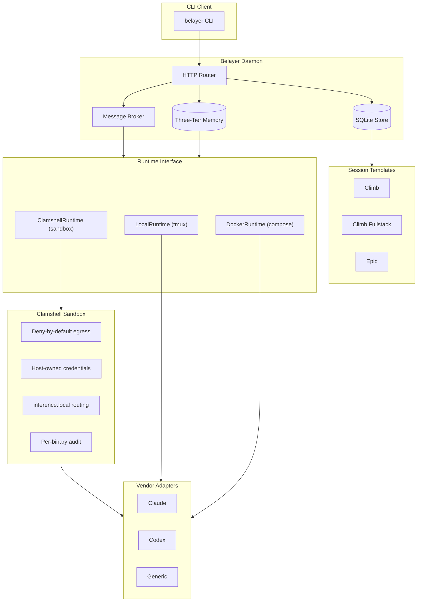
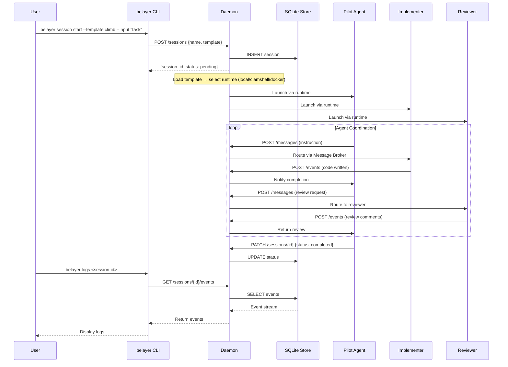
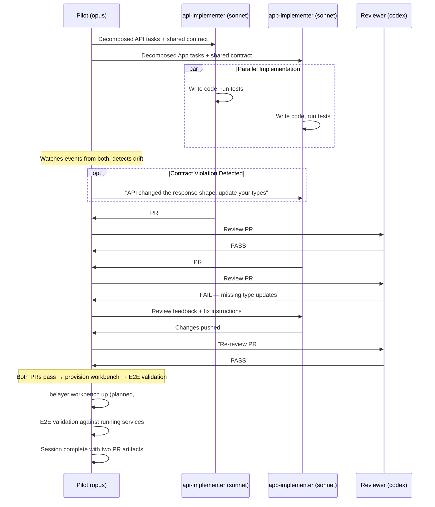

# Belayer v6 Architecture

Status: `implemented` — v6 session runtime (2026-04-09)

> Many robots, bring your own pilots.

Belayer v6 is a daemon-based session runtime for orchestrating multiple AI coding agents through structured session templates. Agent sandboxes are powered by clamshell for deny-by-default isolation. This document provides both high-level diagrams and implementation details for technical audiences.

---

## System Architecture Diagram



---

## Session Lifecycle (Climb)



---

## Agent Collaboration Model

The daemon handles plumbing. Agents handle judgment. The pilot orchestrates, implementers write code, the reviewer provides fresh-eyes feedback. All communication flows through the message broker — agents never talk directly.

### Agent Roster

#### Climb (single-repo)

| Agent | Model | Workspace | Role |
|-------|-------|-----------|------|
| **Pilot** | claude opus | reads events + diffs | Orchestrate, facilitate review loop, decide done |
| **Implementer** | claude sonnet | repo worktree | Write code, run tests, create PR |
| **Reviewer** | codex | reads PR diffs | Review PR, provide structured feedback |

#### Climb-Fullstack (multi-repo)

| Agent | Model | Workspace | Role |
|-------|-------|-----------|------|
| **Pilot** | claude opus | reads events + diffs | Decompose spec, detect cross-repo drift, facilitate review loops |
| **api-implementer** | claude sonnet | extend-api worktree | Implement API changes, create PR |
| **app-implementer** | claude sonnet | extend-app worktree | Implement frontend changes, create PR |
| **Reviewer** | codex | reads PR diffs | Review both PRs sequentially |

#### Epic (workspace orchestration)

| Agent | Model | Workspace | Role |
|-------|-------|-----------|------|
| **Pilot** | claude opus | cross-session | Decompose epic, create parallel sessions, monitor progress, trigger integration tests |

### The Review Loop

The core coordination pattern. PR-based, not diff-based — the reviewer sees the PR with fresh eyes and no implementation context.

```
Pilot reads spec, messages implementer with task
  │
  ▼
Implementer works (write code, run tests, iterate)
  │
  ▼
Implementer creates PR
  │
  ▼
Pilot sees PR event, messages reviewer: "PR #42 ready. Spec context: ..."
  │
  ▼
Reviewer reads PR diff (fresh eyes — different vendor, no implementation context)
Reviewer provides structured feedback
  │
  ├─ PASS → Pilot proceeds (single-repo: done; fullstack: wait for other repo or E2E)
  │
  └─ FAIL → Pilot sends feedback to implementer
            Implementer fixes, pushes to PR branch
            Pilot messages reviewer: "Changes pushed, re-review"
            Loop until PASS
```

Review loops evolve via agent memory and reflection, not hardcoded rules. The pilot adapts based on accumulated coordination knowledge — which patterns work, which drift patterns recur, what feedback implementers most often need.

### Multi-Repo Coordination (Fullstack)



The pilot decomposes the spec into per-repo tasks with a shared contract (API shapes, types, endpoints). Both implementers work in parallel. The pilot monitors events from both and intervenes proactively when it detects semantic drift between repos.

### Message Flow

All agent-to-agent communication goes through the daemon's message broker:

```
Agent A                    Daemon                     Agent B
   │                         │                          │
   │  POST /messages         │                          │
   │  {to: "implementer",   │                          │
   │   body: "task..."}     │                          │
   │────────────────────────►│                          │
   │                         │  2s debounce window      │
   │                         │  (coalesce rapid msgs)   │
   │                         │                          │
   │                         │  tmux send-keys          │
   │                         │  (bracketed paste)       │
   │                         │─────────────────────────►│
   │                         │                          │
   │                         │  POST /events            │
   │                         │◄─────────────────────────│
   │                         │  {type: "message_read"}  │
```

- **Debounce**: 2s window coalesces rapid messages (e.g., pilot sends task + context + constraints as separate messages — delivered as one)
- **Urgent bypass**: Messages marked urgent skip debounce (e.g., "stop, the spec changed")
- **Broadcast**: `belayer message broadcast` delivers to all agents in the session
- **Bracketed paste**: tmux delivery uses bracketed paste mode to prevent injection

### Agent Memory & Learning

All agents — including the pilot — get personal memory that persists across sessions. The pilot's memory is especially valuable: it learns which coordination patterns work, which drift patterns recur, and what review feedback implementers most often need.

```
.belayer/
├── agents/
│   ├── pilot/
│   │   ├── config.yaml
│   │   ├── system-prompt.md
│   │   ├── agents.md                      ← orchestration playbook
│   │   └── memory/
│   │       └── system/
│   │           ├── coordination-patterns.md  ← "app always forgets TS types when API changes"
│   │           ├── review-priorities.md      ← "SpiceDB permission check is highest-value review"
│   │           └── codebase-relationships.md ← "cards endpoint depends on rate-limit middleware"
│   │
│   ├── api-implementer/
│   │   ├── config.yaml
│   │   ├── system-prompt.md
│   │   └── memory/
│   │       └── system/
│   │           ├── codebase.md               ← "Spring Boot, Kotlin, Flyway, Redis for caching"
│   │           └── patterns.md               ← "always register in PermissionRegistry.kt"
│   │
│   ├── app-implementer/
│   │   └── memory/
│   │       └── system/
│   │           ├── codebase.md               ← "React, TypeScript, webpack, proxy to API"
│   │           └── patterns.md               ← "shared types in src/models/"
│   │
│   └── reviewer/
│       └── memory/
│           └── system/
│               ├── review-checklist.md       ← evolved from experience, not static config
│               └── common-issues.md          ← "missing SpiceDB checks (caught 5x)"
│
└── learnings/                                ← shared institutional knowledge all agents see
```

**Three-tier memory** (`internal/memory/`):

The memory system has three tiers designed for different access patterns. SQLite is the runtime index; markdown files on disk are authoritative. The FTS5 index can be rebuilt from markdown at any time via `RebuildIndex`.

| Tier | What it stores | Access pattern | Implementation |
|------|---------------|----------------|----------------|
| **Core** | Session-scoped key-value pairs (e.g., "current_task", "review_status") | Always in context — injected into every prompt. Small, frequently updated. | `core_memory` table, upsert by `(session_id, key)`. MemFS writes `core.md` per repo. |
| **Archival** | Long-term learnings with provenance (session, source file, date, tags) | Append-mostly, full-text searchable via FTS5. Grows over time. | `archival_memory` table + `archival_memory_fts` virtual table. MemFS writes `archival/{topic}.md` per repo. |
| **Recall** | Combined view: core entries for current session + archival search results for a query | On-demand assembly when agent calls `belayer recall "query"`. | `Recall()` combines `ReadCore(sessionID)` + `SearchArchival(query, 20)`. |

**How memory flows through a session:**

```
Session start
  │
  ├─ Core memory loaded for this session (key-value pairs)
  ├─ Personal agent memory loaded from .belayer/agents/{name}/memory/
  ├─ Shared learnings loaded from .belayer/learnings/
  └─ All injected into compiled prompt
  │
  ▼
During session
  │
  ├─ Agent writes core memory: belayer recall write --key "task_status" --value "PR created"
  ├─ Agent searches archival: belayer recall "SpiceDB permission patterns"
  └─ Agent notes observations: belayer note "implementer forgot TS types again"
  │
  ▼
Session ends (or agent goes idle)
  │
  ├─ Daemon launches reflection agent in its own sandbox
  ├─ Reflection reads exported session events + current memory
  ├─ Consolidates into:
  │     Personal memory updates (per agent) → .belayer/agents/{name}/memory/
  │     Shared learnings (all agents see)   → .belayer/learnings/
  └─ FTS5 index updated from new markdown files
```

**Markdown is authoritative:** The MemFS layer (`memfs.go`) manages markdown files that are the source of truth. Core memory is `{repo}/core.md` (h2-delimited key-value). Archival memory is `{repo}/archival/{topic}.md` (h2-delimited entries with provenance headers). SQLite FTS5 is a derived index — `RebuildIndex` can repopulate it from the markdown files after a fresh clone.

**Reflection cycle:**
1. Session completes (or agent goes idle)
2. Daemon launches a reflection agent in its own sandbox
3. Reflection reads exported session events + current memory files
4. Writes updated personal memory for each agent + shared learnings as markdown
5. Over 50 sessions, each agent becomes an expert at its role for this codebase

### Prompt Compilation

Each agent's prompt is compiled at session start from multiple sources:

```
┌─────────────────────────────────────────┐
│            Compiled Prompt              │
├─────────────────────────────────────────┤
│ 1. system-prompt.md (role identity)    │
│ 2. agents.md (team roster + playbook)  │
│ 3. Personal memory (memory/system/*)   │
│ 4. Shared learnings (.belayer/learnings)│
│ 5. Task input (spec, ticket, etc.)     │
│ 6. Tool registry (available tools)     │
└─────────────────────────────────────────┘
```

The pilot's `agents.md` is the orchestration playbook — it contains the team roster, spawn commands, and coordination patterns. No hardcoded workflows. The pilot adapts orchestration to team composition through LLM judgment + accumulated memory.

### Observability

```bash
# Watch all agents in real-time
belayer logs <id> -f
# → 10:01:00 [pilot/opus]       message_sent → api-implementer: "Implement rate limiting..."
# → 10:05:00 [api-impl/sonnet]  tool_use: Edit src/middleware/RateLimiter.kt
# → 10:08:00 [api-impl/sonnet]  tool_use: Bash ./gradlew test (pass)
# → 10:09:00 [api-impl/sonnet]  artifact: PR #42
# → 10:09:01 [pilot/opus]       message_sent → reviewer: "PR #42 ready"
# → 10:11:00 [reviewer/codex]   message_sent → pilot: "FAIL: missing SpiceDB check"
# → 10:11:01 [pilot/opus]       message_sent → api-implementer: "Review failed: ..."

# Attach to any agent's terminal
belayer attach pilot                # watch the orchestrator think
belayer attach api-implementer      # watch code being written

# Session status with cost tracking
belayer status
# → Session abc123: running (12m)
# →   pilot (opus):             2,100 in / 800 out — $0.08
# →   api-implementer (sonnet): 45,000 in / 12,000 out — $0.19
# →   app-implementer (sonnet): 38,000 in / 11,000 out — $0.16
# →   reviewer (codex):         8,000 in / 2,000 out — $0.04
# →   Total: ~$0.47

# Full-text search across all session events
belayer recall "SpiceDB permission"

# Restart a crashed agent with compiled context
belayer session wake <id> --agent implementer
```

### Restart & Resume

When an agent crashes, belayer preserves session state and can restart with full context:

1. Agent crash detected → `session.agent_stopped` event emitted
2. `belayer session wake --agent <name>` compiles restart context from: previous events, git state, pending review feedback, review loop state
3. Vendor adapters provide `CompileRestartPrompt` for vendor-specific formatting
4. Session continues from where it stopped; token usage aggregated across restart boundary

---

## Component Overview

Belayer v6 is built around a session runtime rather than a pipeline engine.

## Runtime Layers

1. **CLI shell** (`internal/cli/`)
   - Starts and inspects runtime processes
   - Operator entrypoint: daemon, session, attach, logs, status, recall
   - Connects to daemon via Unix socket HTTP client

2. **Daemon / supervisor** (`internal/daemon/`)
   - Long-lived process on Unix socket (`~/.belayer/daemon.sock`)
   - Session CRUD, event logging, graceful shutdown
   - Brokers session lifecycle transitions

3. **Session adapters** (`internal/vendor/`)
   - Claude adapter (stream-json parsing, token extraction)
   - Codex adapter (structured JSON, usage tracking)
   - Generic adapter (raw transcript, any CLI agent)
   - Registry pattern for vendor lookup

4. **Runtime storage** (`internal/store/`, `internal/memory/`)
   - SQLite + WAL for sessions and events with FTS5 search
   - Three-tier memory: core (session-scoped key-value, always in prompt), archival (append-only learnings with FTS5 full-text search), recall (combined core + archival query on demand)
   - MemFS layer manages authoritative markdown files; SQLite FTS5 is a derived index rebuilt via `RebuildIndex`

5. **Runtime interface** (`internal/runtime/`)
   - `Runtime` interface with `Mode()`, `Containerized()`, `SupportsDynamicAgents()`
   - `LocalRuntime` — tmux sessions, no isolation, full host access
   - `DockerRuntime` — compose-based containers with network isolation (legacy)
   - `ClamshellRuntime` — deny-by-default sandboxes with host-owned credentials
   - `Select(useDocker, useClamshell)` dispatcher chooses backend

6. **Execution environments** (`internal/tmux/`, `internal/docker/`, `internal/clamshell/`)
   - tmux Runner interface with bracketed paste and pipe-pane capture
   - Docker sandboxes: compose generation, network isolation (none/limited/full)
   - Clamshell integration: `clamshell sandbox create/connect` for agent isolation
   - Per-agent worktrees via `git worktree add` for session isolation
   - Worktree cleanup wired into session stop and `belayer session clean`

7. **Communication** (`internal/broker/`)
   - Message broker: send, broadcast, subscribe, interrupt
   - 2s debounce coalescing for rapid messages
   - Urgent messages bypass debounce

8. **Agent framework** (`internal/agent/`, `internal/session/`, `internal/reflection/`)
   - YAML agent configs with role validation and tool registry
   - Session templates: climb, climb-fullstack, epic
   - Pilot-always-present invariant enforced in climb sessions
   - `Tier` field on AgentSpec (main, peripheral, ephemeral)
   - Sleep-time reflection for memory consolidation

## Package Dependency Graph

```
cli → daemon → store
cli → session (templates)
cli → runtime (Local/Docker/Clamshell selection)
cli → clamshell (sandbox connect for attach)
daemon → store
broker → store (message history)
reflection → memory + store
memory → (SQLite)
runtime → (interface only)
docker → (os/exec)
clamshell → (os/exec)
tmux → (os/exec)
vendor → (independent)
agent → (yaml.v3)
workspace → (os/exec, encoding/json)
```

## Security & Isolation Model

Belayer provides defense in depth through multiple isolation layers. Clamshell is the primary isolation backend.

### Clamshell Sandbox Architecture

```
Belayer Daemon (trusted control plane)
  - Pure Go binary, never runs LLM-generated code
  - Manages session lifecycle, messaging, events
  - Triggers reflection (launches sandbox, never runs LLM itself)

Clamshell Gateway (trusted, host-side)
  - Holds real credentials (API keys, tokens)
  - Runs managed proxy with policy enforcement
  - Provides inference.local routing (credential injection at proxy boundary)
  - Audit logging of all egress

Agent Sandboxes (untrusted, clamshell-managed)
  - Vendor CLI + git + belayer CLI
  - Worktree mounted at /workspace
  - NO real credentials (inference.local handles API auth)
  - Deny-by-default network (only proxy on loopback)
  - Per-binary egress policy
```

### Clamshell Isolation Properties

| Concern | How clamshell solves it |
|---------|----------------------|
| **Network isolation** | Deny-by-default iptables. Sandbox processes can only reach the managed proxy on loopback. |
| **Credential isolation** | Host-owned secrets, never mounted into sandbox. `inference.local` routing injects credentials at the proxy boundary. |
| **Egress control** | Per-binary policy — `claude` can reach `api.anthropic.com`; agent-written scripts cannot. |
| **Filesystem isolation** | Writable `/workspace`, read-only root. Host control plane never visible inside sandbox. |
| **Audit** | Deny event logs with binary identity, target, reason. `clamshell doctor` for health. |
| **Interactive access** | tmux-backed sessions. `belayer attach` wraps `clamshell sandbox connect`. |

### Runtime Comparison

| Aspect | Local (tmux) | Clamshell | Docker (legacy) |
|--------|-------------|-----------|-----------------|
| Network | Full host | Deny-by-default + per-binary policy | Internal Docker network + tinyproxy |
| Credentials | Environment variables | Host-owned, inference.local routing | Mounted .env file |
| Filesystem | Full host access | /workspace only, read-only root | Container overlayfs + mounts |
| Process | tmux session | Clamshell sandbox | Docker container |
| Use case | Development, trusted envs | Production default | Legacy deployments |

### Threat Model

| Threat | Mitigation |
|--------|------------|
| Agent escapes sandbox | Clamshell deny-by-default network + read-only root + no host paths |
| Agent accesses other sessions | Per-session sandbox names + session-scoped worktrees |
| Credential exfiltration | Credentials never enter sandbox (inference.local routing) + per-binary egress |
| Agent modifies host system | /workspace is only writable mount + no host filesystem access |
| Prompt injection via logs | Structured JSON logging + no shell interpolation of log content |
| Agent-written code phones home | Per-binary egress policy — only approved binaries reach approved endpoints |

---

## ASCII Architecture Reference

For environments without Mermaid rendering support:

```
┌─────────────────────────────────────────────────────────────────────────────┐
│                           BELAYER v6 SYSTEM VIEW                            │
└─────────────────────────────────────────────────────────────────────────────┘

┌──────────────┐     HTTP/Unix      ┌─────────────────────────────────────────┐
│   CLI User   │◄─────Socket───────►│            BELAYER DAEMON               │
└──────────────┘                    │  ┌─────────┐  ┌─────────┐  ┌─────────┐  │
                                    │  │  HTTP   │  │ SQLite  │  │ Message │  │
┌──────────────┐                    │  │ Router  │  │ + FTS5  │  │ Broker  │  │
│   Agents     │◄───Agent IPC──────►│  └────┬────┘  └────┬────┘  └────┬────┘  │
│ (Claude,     │                    │       └────────────┴────────────┘       │
│  Codex, etc) │                    │              ┌─────────┐                │
└──────────────┘                    │              │ 3-Tier  │                │
                                    │              │ Memory  │                │
                                    │              └─────────┘                │
                                    └─────────────────────────────────────────┘

┌─────────────────────────────────────────────────────────────────────────────┐
│                          SESSION TEMPLATES                                  │
└─────────────────────────────────────────────────────────────────────────────┘

    CLIMB               CLIMB-FULLSTACK          EPIC
   ┌─────────────┐     ┌─────────────────┐     ┌─────────────┐
   │   ┌─────┐   │     │     ┌─────┐     │     │   ┌─────┐   │
   │   │Pilot│   │     │     │Pilot│     │     │   │Pilot│   │
   │   └─┬─┬─┘   │     │     └─┬─┬─┘     │     │   └──┬──┘   │
   │     │ │     │     │       │ │       │     │      │      │
   │     ▼ ▼     │     │    ┌──┘ └──┐    │     │   Orchestrate│
   │  ┌───────┐  │     │    ▼       ▼    │     │   Sessions   │
   │  │Implmnt│  │     │ ┌─────┐ ┌─────┐│     └─────────────┘
   │  │   +   │  │     │ │ API │ │ App ││
   │  │Review │  │     │ │Impl │ │Impl ││
   │  └───────┘  │     │ └─────┘ └─────┘│
   └─────────────┘     │    + Reviewer   │
                       └─────────────────┘

┌─────────────────────────────────────────────────────────────────────────────┐
│                     CLAMSHELL SANDBOX ARCHITECTURE                          │
└─────────────────────────────────────────────────────────────────────────────┘

┌───────────────────────────────┐
│   Clamshell Gateway (host)   │
│  ┌─────────────────────────┐ │
│  │  Managed Proxy          │ │         ┌──────────────┐
│  │  + inference.local      │─┼────────►│   Internet   │
│  │  + credential injection │ │         │  (per-binary  │
│  │  + egress policy        │ │         │   filtered)  │
│  └────────────┬────────────┘ │         └──────────────┘
│               │ loopback     │
│  ┌────────────▼────────────┐ │
│  │   Agent Sandbox         │ │
│  │   (deny-by-default)     │ │
│  │                         │ │
│  │   /workspace (RW)       │ │
│  │   vendor CLI (claude)   │ │
│  │   belayer CLI           │ │
│  │   NO real credentials   │ │
│  └─────────────────────────┘ │
└───────────────────────────────┘

Runtime Selection:
• local     → tmux sessions (no isolation)
• clamshell → deny-by-default sandbox (recommended)
• docker    → compose containers (legacy)
```

---

## API Reference

### Session Endpoints

| Method | Endpoint | Description |
|--------|----------|-------------|
| POST | `/sessions` | Create new session |
| GET | `/sessions` | List all sessions |
| GET | `/sessions/{id}` | Get session by ID |
| PATCH | `/sessions/{id}` | Update session status |
| GET | `/sessions/{id}/events` | Get session events |
| POST | `/sessions/{id}/events` | Log event |
| POST | `/sessions/{id}/messages` | Send message to agent |
| POST | `/sessions/{id}/messages/broadcast` | Broadcast to all agents |

### Utility Endpoints

| Method | Endpoint | Description |
|--------|----------|-------------|
| GET | `/health` | Health check |
| GET | `/search?q={query}` | FTS5 search across events |

### Planned Endpoints

| Method | Endpoint | Description | Issue |
|--------|----------|-------------|-------|
| POST | `/sessions/{id}/workbench` | Provision workbench stack | #43 |
| GET | `/sessions/{id}/workbench` | Workbench status + endpoints | #43 |
| DELETE | `/sessions/{id}/workbench` | Tear down workbench | #43 |
| POST | `/sessions/{id}/tools/{name}` | Execute tool | #44 |
| GET | `/sessions/{id}/tools` | List available tools | #44 |
| GET | `/sessions/{id}/events?after={id}&wait=30s` | Long-poll events | #53 |
| GET | `/events/stream?sessions=id1,id2` | SSE multi-session stream | #53 |

---

## Workspace Directory Structure

```
~/.belayer/
├── daemon.sock              # Unix socket (daemon listens here)
├── belayer.db               # SQLite database (WAL mode)
├── belayer.db-shm           # SQLite shared memory
├── belayer.db-wal           # SQLite write-ahead log
├── templates/
│   ├── pilot/               # Agent template (agent.yaml + system-prompt.md + agents.md)
│   ├── api-implementer/
│   ├── app-implementer/
│   ├── reviewer/
│   └── sprite/              # Ephemeral agent template
├── policies/
│   └── extend-fullstack.yaml  # Clamshell egress policy
├── environments/
│   └── extend-fullstack.yaml  # Environment config (repos, agents, policy, tools)
├── worktrees/
│   └── {sessionID}/
│       ├── extend-api/      # Per-repo per-session git worktree
│       └── extend-app/
└── repos.json               # Repository name → path mappings
```
