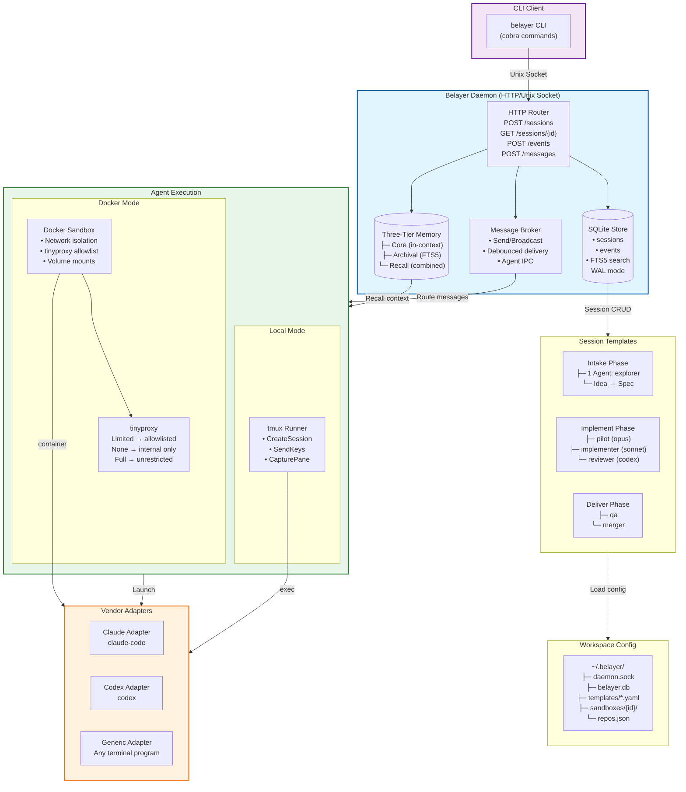
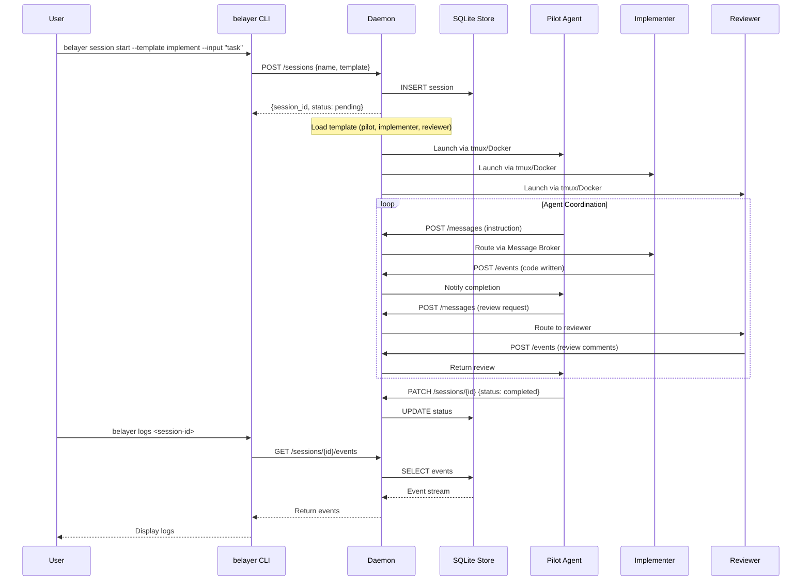

# Belayer v6 Architecture

Status: `implemented` — v6 session runtime (2026-04-09)

> Many robots, bring your own pilots.

Belayer v6 is a daemon-based session runtime for orchestrating multiple AI coding agents through a structured three-phase workflow. This document provides both high-level diagrams and implementation details for technical audiences.

---

## System Architecture Diagram



---

## Session Lifecycle (Implement Phase)



---

## Component Overview

Belayer v6 is built around a session runtime rather than a pipeline engine.

## Runtime Layers

1. **CLI shell** (`internal/cli/`)
   - Starts and inspects runtime processes
   - Operator entrypoint: daemon, session, attach, logs, status, recall
   - Connects to daemon via Unix socket HTTP client

2. **Daemon / supervisor** (`internal/daemon/`)
   - Long-lived process on Unix socket (`~/.belayer/daemon.sock`)
   - Session CRUD, event logging, graceful shutdown
   - Brokers session lifecycle transitions

3. **Session adapters** (`internal/vendor/`)
   - Claude adapter (stream-json parsing, token extraction)
   - Codex adapter (structured JSON, usage tracking)
   - Generic adapter (raw transcript, any CLI agent)
   - Registry pattern for vendor lookup

4. **Runtime storage** (`internal/store/`, `internal/memory/`)
   - SQLite + WAL for sessions and events with FTS5 search
   - Three-tier memory: core (in-context), archival (FTS5), recall (combined)
   - Markdown is authoritative; FTS5 is a derived index

5. **Execution environments** (`internal/tmux/`, `internal/docker/`)
   - tmux Runner interface with bracketed paste and pipe-pane capture
   - Docker sandboxes: compose generation, network isolation (none/limited/full), tinyproxy allowlisting
   - Per-agent worktrees via `git worktree add` for session isolation
   - Daemon socket mounted into containers for agent self-observability
   - Container entrypoint with PID 1 init (UID/GID sync, EXIT trap, two-window tmux)

6. **Communication** (`internal/broker/`)
   - Message broker: send, broadcast, subscribe, interrupt
   - 2s debounce coalescing for rapid messages
   - Urgent messages bypass debounce

7. **Agent framework** (`internal/agent/`, `internal/session/`, `internal/reflection/`)
   - YAML agent configs with role validation and tool registry
   - Intake/Implement/Deliver session templates
   - Pilot-always-present invariant enforced in Implement
   - Sleep-time reflection for memory consolidation

## Package Dependency Graph

```
cli → daemon → store
cli → session (templates)
daemon → store
broker → store (message history)
reflection → memory + store
memory → (SQLite)
docker → (os/exec)
tmux → (os/exec)
vendor → (independent)
agent → (yaml.v3)
workspace → (os/exec, encoding/json)
```

## Security Model

- **Shell safety**: All YAML template values pass through `internal/shell.Quote` before shell interpolation. Template validation rejects agent names and env keys with unsafe characters.
- **Directory permissions**: All `.belayer/` directories created with 0700. Daemon socket chmod'd to 0600. Compose files and templates written with 0600.
- **Network isolation**: Docker `internal: true` networks prevent direct internet access. Limited mode uses tinyproxy with anchored regex patterns. Host validation rejects broad patterns (`.*`, `.`, `*`) and non-hostname characters.
- **Auth isolation**: Vendor credentials forwarded via mounted `.env` file (0600), never embedded in compose YAML or shell commands.
- **Compose safety**: All values in generated docker-compose.yml are YAML double-quoted to prevent YAML injection.

---

## ASCII Architecture Reference

For environments without Mermaid rendering support:

```
┌─────────────────────────────────────────────────────────────────────────────┐
│                           BELAYER v6 SYSTEM VIEW                            │
└─────────────────────────────────────────────────────────────────────────────┘

┌──────────────┐     HTTP/Unix      ┌─────────────────────────────────────────┐
│   CLI User   │◄─────Socket───────►│            BELAYER DAEMON               │
└──────────────┘                    │  ┌─────────┐  ┌─────────┐  ┌─────────┐  │
                                    │  │  HTTP   │  │ SQLite  │  │ Message │  │
┌──────────────┐                    │  │ Router  │  │ + FTS5  │  │ Broker  │  │
│   Agents     │◄───Agent IPC──────►│  └────┬────┘  └────┬────┘  └────┬────┘  │
│ (Claude,     │                    │       └────────────┴────────────┘       │
│  Codex, etc) │                    │              ┌─────────┐                │
└──────────────┘                    │              │ 3-Tier  │                │
                                    │              │ Memory  │                │
                                    │              └─────────┘                │
                                    └─────────────────────────────────────────┘

┌─────────────────────────────────────────────────────────────────────────────┐
│                          THREE-PHASE WORKFLOW                               │
└─────────────────────────────────────────────────────────────────────────────┘

    INTAKE              IMPLEMENT                 DELIVER
   ┌─────────┐         ┌─────────────┐           ┌─────────────┐
   │         │         │   ┌─────┐   │           │   ┌─────┐   │
   │ Explorer│         │   │Pilot│◄──┼──coord───►│   │ QA  │   │
   │    │    │         │   └─┬─┬─┘   │           │   └──┬──┘   │
   │    ▼    │         │     │ │     │           │      │      │
   │  Spec   │         │     │ │     │           │   Validate   │
   └─────────┘         │     ▼ ▼     │           │      │      │
                       │  ┌───────┐  │           │   ┌──┴──┐   │
                       │  │Implmnt│  │           │   │Merge│   │
                       │  │   +   │  │           │   │ /PR │   │
                       │  │Review │  │           │   └─────┘   │
                       │  └───────┘  │           └─────────────┘
                       └─────────────┘

┌─────────────────────────────────────────────────────────────────────────────┐
│                      DOCKER SANDBOX ARCHITECTURE                            │
└─────────────────────────────────────────────────────────────────────────────┘

┌─────────────────────┐
│   Docker Network    │
│  (per-session isol) │
│  ┌───────────────┐  │         ┌──────────────┐
│  │  Agent Cont.  │  │◄───────►│   tinyproxy  │
│  │  (claude-code)│  │         │  (optional)  │
│  └───────┬───────┘  │         └──────┬───────┘
│          │ mount    │                │
│          ▼          │                ▼
│  ┌───────────────┐  │         ┌──────────────┐
│  │  Unix Socket  │  │         │   Internet   │
│  │ daemon.sock   │◄─┼─────────│  (filtered)  │
│  └───────────────┘  │         └──────────────┘
└─────────────────────┘

Network Modes:
• none    → Internal Docker network only (air-gapped)
• limited → Allowlisted hosts via tinyproxy
• full    → Unrestricted internet access
```

---

## API Reference

### Session Endpoints

| Method | Endpoint | Description |
|--------|----------|-------------|
| POST | `/sessions` | Create new session |
| GET | `/sessions` | List all sessions |
| GET | `/sessions/{id}` | Get session by ID |
| PATCH | `/sessions/{id}` | Update session status |
| GET | `/sessions/{id}/events` | Get session events |
| POST | `/sessions/{id}/events` | Log event |
| POST | `/sessions/{id}/messages` | Send message to agent |
| POST | `/sessions/{id}/messages/broadcast` | Broadcast to all agents |

### Utility Endpoints

| Method | Endpoint | Description |
|--------|----------|-------------|
| GET | `/health` | Health check |
| GET | `/search?q={query}` | FTS5 search across events |

---

## Workspace Directory Structure

```
~/.belayer/
├── daemon.sock              # Unix socket (daemon listens here)
├── belayer.db               # SQLite database (WAL mode)
├── belayer.db-shm           # SQLite shared memory
├── belayer.db-wal           # SQLite write-ahead log
├── templates/
│   ├── intake.yaml          # Custom template overrides
│   ├── implement.yaml
│   └── deliver.yaml
├── sandboxes/
│   └── {session-id}/
│       └── docker-compose.yml
├── environments/
│   └── {env-name}.yaml      # Docker environment configs
└── repos.json               # Repository mappings
```
