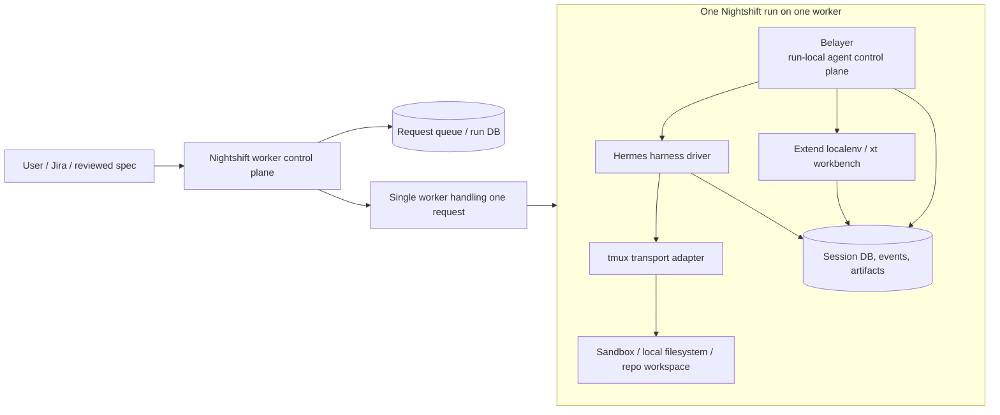

# Belayer Architecture

Status: `active redesign` — Nightshift v1 / Extend-first direction (2026-04-15)

> Belayer is no longer best understood as a generic multi-agent coding runtime.
> For the current direction, it is the **run-local agent control plane** inside a single Nightshift worker run.

This document is the high-level architecture reference. For detailed current thinking, also see:

- [Nightshift v1 Deployment Topology](design-docs/2026-04-15-nightshift-v1-deployment-topology.md)
- [Belayer Run Model for Nightshift v1](design-docs/2026-04-15-belayer-run-model-for-nightshift-v1.md)
- [Nightshift Extend-First Architecture](design-docs/2026-04-15-nightshift-extend-first-architecture.md)
- [Implementation Delta](design-docs/2026-04-15-nightshift-extend-first-implementation-delta.md)

---

## Current architectural stance

Nightshift v1 has **two control planes**:

1. **Worker control plane** — always-on Nightshift service that queues requests and assigns a worker
2. **Agent control plane** — Belayer, inside one worker run, coordinating planner + specialists

Belayer owns the second one.

For v1:

- one worker handles one request at a time
- one Belayer session exists inside that worker
- Hermes is the default harness
- tmux is the default transport adapter
- Extend-localenv (`xt`) is the Extend-specific workbench/runtime interface
- Clamshell remains the preferred sandbox boundary for production deployment

---

## System architecture

### Reading the diagram

- The **outer control plane** decides *where* a request runs.
- Belayer decides *how the agents inside that run coordinate*.
- Hermes is the execution harness.
- tmux is the wire used to launch and message harnesses.
- Artifacts and events are the durable record of the run.

---

## Belayer's three layers

Belayer should be understood as three layers:

### 1. Session bus / control plane

Owns:

- session lifecycle
- agent roster
- typed messages and events
- artifact registration and lookup
- observability and run state

This is the real Belayer role.

### 2. Harness driver

Owns:

- how a harness process starts
- which profile/identity is loaded
- environment variables injected into the harness
- how Belayer delivers instructions into the harness

For v1, the primary harness is **Hermes**.

### 3. Transport adapter

Owns:

- tmux session creation
- send-keys / bracketed paste
- capture-pane
- attach / interrupt / kill

For v1, the default transport adapter is **tmux**.

tmux is a practical delivery layer, not the architectural center.

---

## Intra-run coordination model

Agents coordinate through Belayer, not by directly talking to each other's terminals.

### Coordination primitives

#### Messages
Use for direct communication:

- planner → api
- planner → reviewer
- api → planner

#### Events
Use for machine-readable state transitions:

- `task_assigned`
- `message_sent`
- `message_delivered`
- `agent_finished`
- `agent_exited_without_finish`
- `artifact_created`

#### Artifacts
Use for durable outputs:

- `task-graph`
- `shared-contract`
- `specialist-report`
- `review-report`
- `verification-report`
- `handoff`

This split is central to the new architecture:

> messages are for conversation,
> events are for orchestration state,
> artifacts are for durable shared outputs.

---

## Current implemented slice

The following is implemented today in the repo:

### Run/session bus
- daemon-backed session creation
- message routing through the broker
- session event log
- agent roster storage (`agent_runs`)

### Hermes/tmux integration
- Hermes launch command builder
- Belayer env injection into Hermes runs
- project-local plugin enablement for Nightshift runs
- tmux-backed spawn + message delivery

### Run-local CLI
- `belayer run start`
- `belayer spawn`
- `belayer roster`
- `belayer finish`
- `belayer artifact create`
- `belayer artifact list`

### Completion discipline
- Hermes project-local hook detects explicit `belayer finish`
- launcher wrapper records finish marker
- Belayer watcher marks an agent `blocked` if its tmux session exits without explicit finish

This is enough to prove the run-local control-plane model works for planner + api slices.

---

## Aspirational next steps

The following are part of the intended architecture but not fully implemented yet:

### 1. Live idle nudging
If an agent remains running but appears idle without calling `belayer finish`, Belayer should nudge it through tmux and remind it to finish or mark blocked.

### 2. Better specialist identities
The current slice uses existing Hermes profiles plus project-local skills/plugins. The longer-term direction is a more explicit identity model with role-specific profiles and portable skills/memory.

### 3. Extend-first workbench integration
Belayer should treat `xt` as the primary Extend workbench interface, not generic compose-first workbench provisioning.

### 4. Worker control plane integration
Belayer should remain the run-local control plane, while a higher-level Nightshift service handles queueing, worker assignment, and run lifecycle across machines.

### 5. Centralized identity materialization
Longer term, profiles/skills/memory may be materialized from a git-backed canonical identity source rather than relying on purely local profile state.

---

## What Belayer is not trying to be right now

Belayer should not be trying to be:

- the worker scheduler
- the cluster manager
- the hypervisor
- the universal hosted identity service
- the only place where all memory and orchestration logic lives

For the current direction, Belayer is specifically:

> the session bus and run-local control plane for a planner-led Nightshift run.

That narrower role is a strength.
