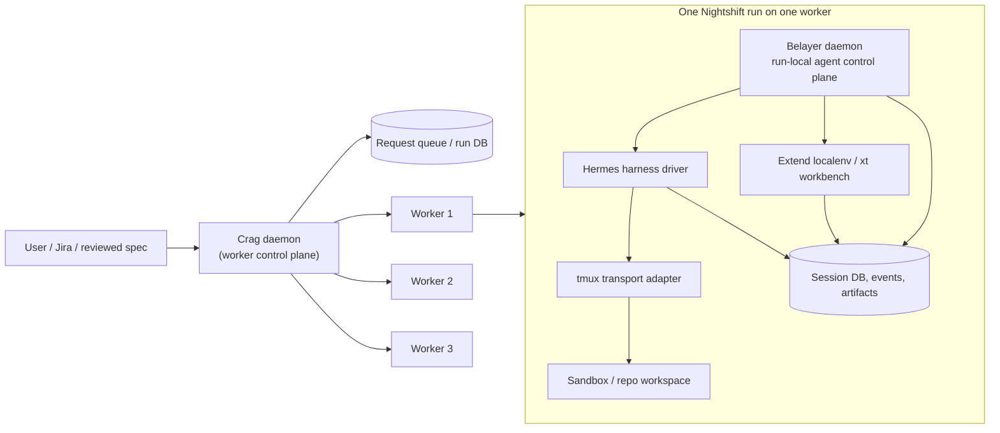
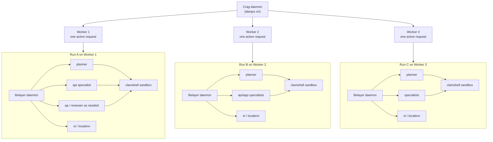

# Belayer Architecture

Status: `active redesign` — Nightshift v1 / Extend-first direction (2026-04-15)

> Belayer is no longer best understood as a generic multi-agent coding runtime.
> For the current direction, it is the **run-local agent control plane** inside a single Nightshift worker run.

This document is the high-level architecture reference. For detailed current thinking, also see:

- [Nightshift v1 Deployment Topology](design-docs/2026-04-15-nightshift-v1-deployment-topology.md)
- [Belayer Run Model for Nightshift v1](design-docs/2026-04-15-belayer-run-model-for-nightshift-v1.md)
- [Nightshift Extend-First Architecture](design-docs/2026-04-15-nightshift-extend-first-architecture.md)
- [Implementation Delta](design-docs/2026-04-15-nightshift-extend-first-implementation-delta.md)

---

## Current architectural stance

Nightshift v1 has **two control planes**:

1. **Worker control plane (Crag)** — always-on daemon that queues requests, manages targets, and spawns Belayer runs. See [Crag design doc](design-docs/2026-04-15-crag-daemon.md).
2. **Agent control plane (Belayer)** — inside one run, coordinating planner + specialists

Belayer owns the second one. Crag owns the first.

For v1:

- one worker handles one request at a time
- one Belayer session exists inside that worker
- Hermes is the default harness
- tmux is the default transport adapter
- Extend-localenv (`xt`) is the Extend-specific workbench/runtime interface
- Clamshell remains the preferred sandbox boundary for production deployment

---

## System architecture

### Parallel worker picture

### Reading the diagram

- The **outer control plane** decides *where* a request runs.
- Multiple workers can run in parallel, but each worker still handles **one request at a time** in v1.
- Each worker hosts a **Belayer daemon** for the active run on that worker.
- Belayer decides *how the agents inside that run coordinate*.
- Hermes is the execution harness.
- tmux is the wire used to launch and message harnesses.
- Artifacts and events are the durable record of the run.

---

## Belayer's three layers

Belayer should be understood as three layers:

### 1. Session bus / control plane

Owns:

- session lifecycle
- agent roster
- typed messages and events
- artifact registration and lookup
- observability and run state

This is the real Belayer role.

### 2. Harness driver

Owns:

- how a harness process starts
- which profile/identity is loaded
- environment variables injected into the harness
- how Belayer delivers instructions into the harness

For v1, the primary harness is **Hermes**.

### 3. Transport adapter

Owns:

- tmux session creation
- send-keys / bracketed paste
- capture-pane
- attach / interrupt / kill

For v1, the default transport adapter is **tmux**.

tmux is a practical delivery layer, not the architectural center.

---

## Intra-run coordination model

Agents coordinate through Belayer, not by directly talking to each other's terminals.

### Coordination primitives

#### Messages
Use for direct communication:

- planner → api
- planner → reviewer
- api → planner

#### Events
Use for machine-readable state transitions:

- `task_assigned`
- `message_sent`
- `message_delivered`
- `agent_finished`
- `agent_exited_without_finish`
- `artifact_created`

#### Artifacts
Use for durable outputs:

- `task-graph`
- `shared-contract`
- `specialist-report`
- `review-report`
- `verification-report`
- `handoff`

This split is central to the new architecture:

> messages are for conversation,
> events are for orchestration state,
> artifacts are for durable shared outputs.

---

## Current implemented slice

The following is implemented today in the repo:

### Run/session bus
- daemon-backed session creation
- message routing through the broker
- session event log
- agent roster storage (`agent_runs`)

### Hermes/tmux integration
- Hermes launch command builder
- Belayer env injection into Hermes runs
- project-local plugin enablement for Nightshift runs
- tmux-backed spawn + message delivery

### Run-local CLI
- `belayer run start`
- `belayer spawn`
- `belayer roster`
- `belayer finish`
- `belayer artifact create`
- `belayer artifact list`

### Completion discipline
- Hermes project-local hook detects explicit `belayer finish`
- launcher wrapper records finish marker
- Belayer watcher marks an agent `blocked` if its tmux session exits without explicit finish
- Belayer idle watcher nudges a still-running agent if its tmux pane stops changing without an explicit finish

This is enough to prove the run-local control-plane model works for planner + api slices.

---

## Future scaling: extend-localenv and extend-clamshell beyond MVP

The current MVP proves the run-local control plane with Hermes + tmux + explicit finish/artifact discipline. The next scaling layers for real Nightshift deployments are **extend-localenv** and **extend-clamshell**.

### extend-localenv beyond MVP

`xt` should scale into Nightshift as the **Extend-specific workbench interface**, not as a side utility.

Belayer/Nightshift should eventually treat `xt` as the standard way to:

- validate host prerequisites (`xt doctor`)
- bring up local Extend runtime dependencies (`xt up`)
- inspect readiness (`xt status`)
- tear down cleanly (`xt down`)
- mint local runtime auth/tokens where appropriate (`xt token`)

This means the future workbench shape should be:

- **planner/specialists run in a sandbox/session workspace**
- **Belayer invokes `xt` as the Extend runtime adapter**
- **artifacts capture the resulting environment state, health, and verification evidence**

In other words: Belayer should not reinvent a generic workbench if Extend-localenv already models the Extend environment well.

### extend-clamshell beyond MVP

Clamshell should scale into Nightshift as the **production sandbox boundary**.

The current tmux-based transport and local filesystem execution are useful for proving the run model. But for higher trust and Linux worker deployment, clamshell provides:

- deny-by-default egress
- host-owned credential mediation
- explicit policy control
- runtime inspection and audit surfaces
- stronger separation between trusted runtime and untrusted agent execution

The intended future relationship is:

- **Nightshift daemon** assigns a request to a worker
- **worker** provisions a run namespace and sandbox policy
- **Belayer daemon** runs inside that worker namespace as the agent control plane
- **Hermes harnesses** execute inside or against clamshell-constrained workspaces
- **xt/localenv** brings up Extend runtime dependencies for validation

### Why both matter together

These two systems solve different scaling problems:

- **extend-localenv** answers: "how do we make the Extend app/api stack runnable and testable?"
- **extend-clamshell** answers: "how do we make the coding agent environment trustworthy and bounded?"

Nightshift needs both.

### Practical future topology

The likely near-future production shape is:

1. Nightshift daemon manages a small pool of Linux workers
2. each worker runs one active request at a time
3. each active request gets a run-local Belayer daemon
4. Belayer spawns Hermes specialists for that run
5. clamshell constrains code execution / egress
6. xt provides the Extend runtime/workbench behavior
7. Belayer records artifacts, events, and handoff outputs

That gives us parallelism at the **worker** level while keeping the run model simple inside each worker.

---

## Aspirational next steps

The following are part of the intended architecture but not fully implemented yet:

### 1. Git-backed agent identity (soul + capabilities)

See [Git-Backed Agent Identity](design-docs/2026-04-15-git-backed-agent-identity.md) for the full design.

Each agent type is defined by two co-authored halves in a git repo:

- **Soul** — who the agent is, how it thinks, what it cares about. Injected as the system prompt. Carries behavioral dispositions (e.g., "don't trust frontend work until you've seen it in a browser"), not task checklists.
- **Capabilities** — what infrastructure the agent needs. MCP servers, runtimes (headless Chrome for QA), auth tokens, Hermes plugins/skills. Read by the worker control plane to provision the environment before the run starts.

The current `AgentSpec.SystemPrompt` is proto-soul. `AgentSpec.MCPConfig`, `Settings`, and `Env` are proto-capabilities. The migration path starts by extracting the current inline system prompts into `identities/*/soul.md` files, then adding `capabilities.yaml` parsing.

### 2. Extend-first workbench integration
Belayer should treat `xt` as the primary Extend workbench interface, not generic compose-first workbench provisioning.

### 3. Crag: the always-on worker control plane

See [Crag design doc](design-docs/2026-04-15-crag-daemon.md).

Crag is the always-on daemon that spawns and manages Belayer runs. It owns the request queue, target management, run provisioning, and the web UI.

For local dev: Crag registers directories as targets and spawns Belayer daemons against them. One target = one concurrent run. Multiple targets = parallel runs.

For production: targets become remote machines or containers. Same Crag API, heavier provisioning (clone repo, install deps, stage credentials, start MCP servers from capabilities.yaml).

The web UI lives in Crag, not in Belayer. Crag aggregates run state across all active Belayer sessions for the dashboard, run detail views, and artifact browsing.

### 4. Remote agent bootstrapping
When agents run on remote workers, nothing is pre-installed. Crag reads each agent's `capabilities.yaml` from the identity repo and provisions the required infrastructure before spawning Belayer. Credential mediation likely flows through Clamshell.

---

## What Belayer is not trying to be right now

Belayer should not be trying to be:

- the worker scheduler (that's Crag)
- the cluster manager (that's Crag)
- the hypervisor
- the universal hosted identity service
- the web UI host (that's Crag)
- the only place where all memory and orchestration logic lives

For the current direction, Belayer is specifically:

> the session bus and run-local control plane for a planner-led Nightshift run.

Crag is everything outside the run. Belayer is everything inside the run. That split is the architecture.
