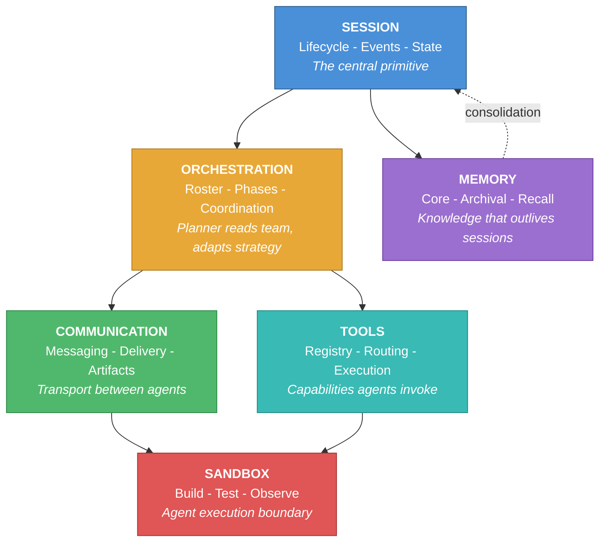
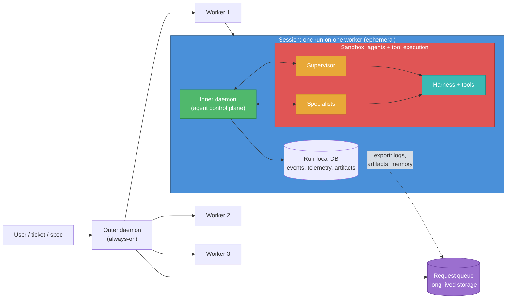

# Philosophy

A portable specification for multi-agent coding runtimes.

## The Thesis

A multi-agent coding session, where multiple AI agents collaborate to write, review, and ship software, requires six infrastructure interfaces. These interfaces are the same regardless of which LLMs, vendors, or orchestration patterns power the agents.

This document defines those interfaces and the invariants that bind them. It is a specification, not a product description. Belayer is one implementation. The specification is language-agnostic and could be realized on any stack.

---

## The OS Analogy

An operating system virtualizes hardware into stable abstractions (processes, IPC, filesystems, permissions) so applications can focus on domain logic rather than managing resources directly. A multi-agent coding runtime does the same for AI coding agents: it virtualizes the infrastructure that every multi-agent coding session needs, so agents can focus on writing software.

| OS Concept | Runtime Interface | What it virtualizes |
|---|---|---|
| Process | **Session** | Agent lifecycle, state, event history |
| Scheduler | **Orchestration** | Team composition, coordination |
| Container / VM | **Sandbox** | Agent execution boundary: build, test, observe |
| IPC | **Communication** | Agent-to-agent messaging, delivery |
| Filesystem | **Memory** | Knowledge persistence across sessions |
| Syscalls / Drivers | **Tools** | Capabilities agents invoke, execution routing |

The key property: applications don't need to know about each other's implementation details. A runtime that correctly virtualizes these six interfaces lets you swap any agent, model, vendor, or isolation backend without changing the contracts.

---

## Topology

A multi-agent coding system needs **two control planes** at different scopes:

1. **Outer daemon** — always-on, manages a pool of workers, queues requests, persists long-lived data (logs, memory, artifacts) that outlive any individual run.
2. **Inner daemon** — ephemeral, lives inside one worker for one run, coordinates agent-to-agent communication, records telemetry and artifacts to a run-local database.

The inner daemon and everything it manages are **ephemeral** — when the worker dies, the run-local state dies with it. Anything that matters beyond the run (logs, learned knowledge, output artifacts) must be exported to the outer daemon before the worker is reclaimed.

> Colors map to the six interfaces: blue = Session, amber = Orchestration, green = Communication, red = Sandbox, purple = Memory, teal = Tools. The sandbox wraps the agents and their tool-execution surface — everything the agents actively drive. Communication (inner daemon) and the run-local DB sit inside the session but outside the sandbox: they're trusted infrastructure the agents talk through, not run inside.

---

## The Six Interfaces

### 1. Session

The session is the central primitive. It is the unit of work, the scope for state, and the recovery boundary.

- Append-only event log that survives agent crashes
- Lifecycle management (create, run, stop, resume)
- Queryable state (events, status, agent health)
- Session-scoped identity for all agents in the run
- Artifact registration for durable outputs

What is outside this interface: what events mean (agent judgment), when a session is "done" (orchestration judgment), where events are stored (implementation choice).

### 2. Orchestration

Orchestration determines who does what. The orchestrator is an LLM that reads the team roster and adapts its coordination strategy to the task.

- Declarative team rosters (role, profile, scope, tier)
- Dynamic agent spawning
- Roster-adaptive task assignment
- Completion and blockage signaling

What is outside this interface: the coordination logic itself (that's the planner's judgment), exact workflow sequences (not hardcoded), cluster-wide scheduling (belongs to the outer control plane).

### 3. Sandbox

The sandbox is the boundary around the agents and their tool-execution surface. It's where they execute — build the app, run tests, read logs — and it's what keeps their execution bounded. Agents are untrusted; the daemon and DB are trusted infrastructure the agents talk *through*, not run *inside*.

- Agent execution surface (build, test, observe)
- Workspace filesystem (source, outputs, artifacts for this run)
- Trust boundary (agents cannot self-impose it — the runtime imposes it)
- Pluggable backend (host process, container, VM — implementation choice)

### 4. Communication

Communication is the transport layer between agents. Agents don't know each other's runtime. They send messages through the session bus, which handles delivery.

- Point-to-point messaging and broadcast
- Delivery guarantees (coalescing, urgent bypass)
- Transport abstraction (agents don't care how delivery works)
- Durable coordination artifacts

What is outside this interface: message content or meaning (that's between the agents), when to send messages (orchestration judgment).

### 5. Memory

Memory is knowledge that persists beyond any single agent invocation or session. The runtime owns memory infrastructure (storage, indexing, injection, consolidation triggers). Agents own their memory content (what to remember, how to organize it, when to prune).

- Core, archival, and recall layers or equivalents
- Agent-managed content, runtime-managed plumbing
- Background consolidation / sleep-time support
- Provenance and staleness awareness

### 6. Tools

Tools are capabilities that agents invoke through the runtime. The runtime routes execution to the correct target.

- Declarative tool registry
- Execution routing (which environment runs the command)
- Safety constraints (read-only, audit, target restrictions)

---

## Agent Identity

An agent is not a process. It's an identity. The process (Hermes, Claude Code, Codex, whatever) is the runtime detail. The identity is what persists.

An agent identity is a portable directory of files: config, system prompt, operating instructions. The harness loads it at spawn time. The identity should be transferable across harnesses in principle, even if a given implementation only supports one.

---

## Design principle

> Keep the philosophy broad, keep the implementation narrow enough to finish.
