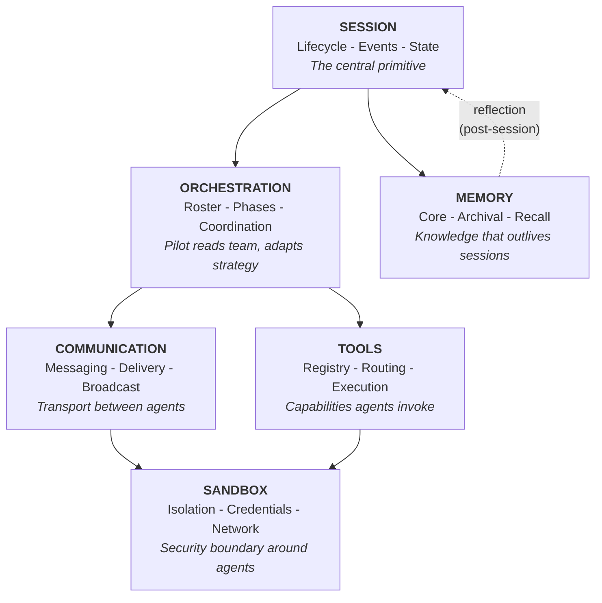
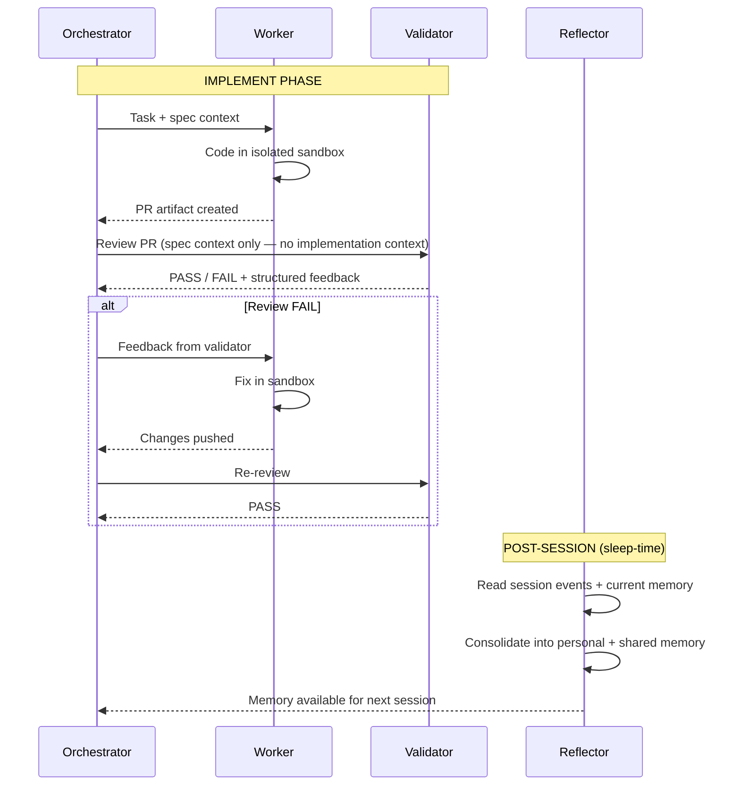
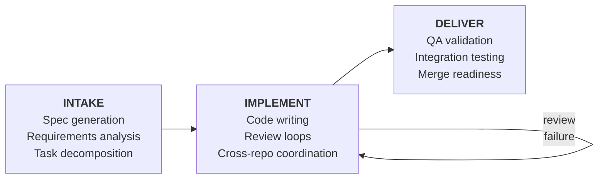

# Philosophy

A portable specification for multi-agent coding runtimes.

## The Thesis

A multi-agent coding session — where multiple AI agents collaborate to write, review, and ship software — requires six infrastructure interfaces. These interfaces are the same regardless of which LLMs, vendors, or orchestration patterns power the agents.

This document defines those interfaces, the invariants that bind them, and the agent roles that operate through them. It is a specification, not a product description. Belayer is one implementation in Go. The specification is language-agnostic and could be realized on any stack — including by composing existing open-source tools that fulfill individual interface contracts (Letta for memory, Scion for messaging and sandboxing, etc.).

Each interface solves a problem that agents cannot solve for themselves: sessions outlive agent crashes, sandboxes enforce boundaries agents can't self-impose, memory persists knowledge agents would otherwise lose, and communication bridges transport gaps between agents that don't share a runtime.

## The OS Analogy

An operating system virtualizes hardware into stable abstractions — processes, IPC, filesystems, permissions — so applications can focus on domain logic rather than managing resources directly. A multi-agent coding runtime does the same for AI coding agents: it virtualizes the infrastructure that every multi-agent coding session needs, so agents can focus on writing software.

| OS Concept | Runtime Interface | What it virtualizes |
|---|---|---|
| Process | **Session** | Agent lifecycle, state, event history |
| Scheduler | **Orchestration** | Team composition, coordination |
| Container / VM | **Sandbox** | Network isolation, credentials, filesystem |
| IPC | **Communication** | Agent-to-agent messaging, delivery |
| Filesystem | **Memory** | Knowledge persistence across sessions |
| Syscalls / Drivers | **Tools** | Capabilities agents invoke, execution routing |

The key property: applications don't need to know about each other's implementation details. A runtime that correctly virtualizes these six interfaces lets you swap any agent, model, vendor, or isolation backend without changing the contracts.

### Interface Relationships

Session is the root primitive — everything is scoped to a session. Orchestration and Memory depend on Session. Communication and Tools are directed by Orchestration. Sandbox is where Communication and Tools physically execute. Memory feeds back into future Sessions via the reflection cycle.

---

## The Six Interfaces

### 1. Session

The session is the central primitive. It is the unit of work, the scope for state, and the recovery boundary.

**Contract:**
- Append-only event log that survives agent crashes
- Lifecycle management (create, run, stop, resume)
- Queryable state (events, status, agent health)
- Session-scoped identity for all agents

**Inside this interface:**
- Event storage and retrieval (structured, searchable)
- Session metadata (template, status, timestamps, cost)
- Agent lifecycle within the session (start, crash, wake)
- Restart context compilation from event history

**Outside this interface:**
- What events mean (agent judgment)
- When a session is "done" (orchestration judgment)
- Where events are stored (SQLite, Postgres, files — implementation choice)

**Why agents can't own this:** Agents crash. Their context windows fill. They get restarted on different machines. The session persists independently so that any agent — or a replacement — can resume from the event log.

---

### 2. Orchestration

Orchestration determines who does what. The orchestrator (pilot) is an LLM that reads the team roster and adapts its coordination strategy to the task.

**Contract:**
- Declarative team rosters (agent name, vendor, model, role, tier)
- Phase-based session templates (intake, implement, deliver)
- Dynamic agent spawning (the orchestrator can expand the team at runtime)
- Roster-adaptive coordination (same orchestrator works with any team shape)

**Inside this interface:**
- Template definitions (which agents, which phases)
- Agent tier system (main, peripheral, ephemeral)
- Pilot system prompt with roster and available tools
- Phase transitions and completion criteria

**Outside this interface:**
- The coordination logic itself (that's the pilot LLM's judgment)
- Specific workflow sequences (those emerge from pilot reasoning + memory)
- Review loop mechanics (the pilot decides when and how to route to review)

**Why this requires LLM judgment:** Different tasks need different coordination. A refactoring needs tight review loops. A greenfield feature needs loose exploration. A multi-repo change needs drift detection. No static workflow graph handles all cases — the pilot adapts because it reasons about the task, the code, and the team.

---

### 3. Sandbox

The sandbox is the security boundary between the runtime (trusted) and agents (untrusted). Agents cannot self-impose isolation.

**Contract:**
- Network isolation (deny-by-default, allowlisted egress)
- Credential isolation (agents never hold real secrets)
- Filesystem boundaries (agents see only their workspace)
- Per-agent worktrees (agents can't trample each other's work)
- Pluggable backends (local, containers, VMs — same contract)

**Inside this interface:**
- Isolation enforcement (network, filesystem, process)
- Credential proxying (real secrets injected at the boundary, not inside the sandbox)
- Egress policy (per-binary or per-agent allowlists)
- Worktree provisioning and cleanup
- Audit logging of boundary violations

**Outside this interface:**
- Which isolation backend to use (Docker, clamshell, Podman, K8s — implementation choice)
- What agents do inside the sandbox (the sandbox enforces boundaries, not behavior)

**Why agents can't own this:** An agent told to "not access the database directly" might comply, or might not. An agent told to "not exfiltrate credentials" has the credentials in its context. The sandbox makes violations impossible rather than relying on compliance.

---

### 4. Communication

Communication is the transport layer between agents. Agents don't know each other's runtime — they send messages through the runtime, which handles delivery.

**Contract:**
- Point-to-point messaging (agent A to agent B)
- Broadcast (agent A to all agents in session)
- Delivery guarantees (coalescing, debounce, urgent bypass)
- Transport-agnostic (tmux send-keys, stdin, API — agents don't care)

**Inside this interface:**
- Message routing and delivery
- Debounce windowing (coalesce rapid messages into one delivery)
- Urgent message bypass (interrupt debounce for critical updates)
- Injection safety (bracketed paste or equivalent)
- Message event logging

**Outside this interface:**
- Message content or meaning (that's between the agents)
- When to send messages (that's orchestration judgment)
- Message persistence beyond delivery (that's a session event, not a communication concern)

**Why agents can't own this:** Agents run in different sandboxes, potentially on different machines, using different vendor CLIs with different input mechanisms. The runtime bridges these transport gaps transparently.

---

### 5. Memory

Memory is knowledge that persists beyond any single agent invocation or session. The runtime owns memory infrastructure; a dedicated reflection agent writes to it.

**Contract:**
- Three tiers with different access patterns:
  - **Core** — always injected into agent prompts, small, frequently updated
  - **Archival** — searchable long-term knowledge with provenance
  - **Recall** — on-demand combined query across core and archival
- Personal agent memory (per-agent, persists across sessions)
- Shared institutional memory (all agents can read, reflection-managed)
- Sleep-time reflection (post-session consolidation by a separate agent)
- Staleness detection (entries carry provenance: session, date, source)

**Inside this interface:**
- Memory storage and retrieval across all three tiers
- Reflection agent lifecycle (launch post-session, provide event access)
- Memory injection into agent prompts at session start
- Quality pattern accumulation (what fails review in this codebase)

**Outside this interface:**
- What to remember (that's the reflection agent's LLM judgment)
- Storage backend (SQLite FTS5, vector DB, markdown files — implementation choice)
- Agent intelligence (memory augments prompts, it doesn't replace reasoning)

**Why agents can't own this:** Working agents are biased by their current task. A reflection agent runs post-session with clean perspective — consolidating what actually happened, not what the agent wished happened. This separation prevents self-serving memory and ensures institutional knowledge reflects reality.

---

### 6. Tools

Tools are capabilities that agents invoke through the runtime. The runtime routes execution to the correct target — the same tool call might execute in the agent's sandbox, a workbench container, the host, or a remote service.

**Contract:**
- Declarative tool registry (name, description, input schema, execution target)
- Execution routing (sandbox, workbench, host, infrastructure)
- Safety guarantees (parameter quoting, timeouts, audit logging)
- Environment-specific tool sets (different environments expose different tools)

**Inside this interface:**
- Tool definitions and discovery
- Execution target routing and dispatch
- Parameter validation and shell-safe interpolation
- Workbench provisioning (on-demand test infrastructure — a tool with lifecycle)
- Database access proxying (read-only enforcement, connection routing)
- Session management tools (the orchestrator creates/monitors child sessions through tools)

**Outside this interface:**
- Which tools to call (agent judgment)
- Tool implementation details (a shell command, an API call, a container — the registry abstracts this)
- When to provision infrastructure (orchestration judgment)

**Workbench as a tool, not an interface:** A workbench (running application stack for integration testing) is provisioned through the Tools interface. It has lifecycle (up/down/health), but it's a capability agents invoke, not a contract every session requires. Single-repo refactoring doesn't need a workbench. Similarly, database access, migration runners, and deployment triggers are all tools — capabilities with varying complexity, routed by the runtime, invoked by agents.

---

## Agent Roles

The specification defines four structural roles. Implementations may use different names, but the roles map to distinct interface dependencies and trust boundaries.

| Role | Primary Interfaces | Key Property |
|---|---|---|
| **Orchestrator** | Orchestration, Communication, Tools | Adapts coordination to roster and task |
| **Worker** | Sandbox, Communication, Tools | Operates in isolation, produces artifacts |
| **Validator** | Communication, Sandbox (read-only) | Context-isolated from workers |
| **Reflector** | Memory, Session (read events) | Sole writer of persistent memory |

### Orchestrator

Coordinates the session. Decomposes tasks, assigns work, monitors progress, decides completion. Always an LLM — never a state machine.

- Reads team roster from template, adapts coordination to team shape
- Sends instructions via Communication, monitors progress via Session events
- Can dynamically spawn ephemeral agents via Tools
- Accumulates coordination patterns in Memory ("app-implementer forgets TypeScript types when API changes")
- In epic sessions, orchestrates across multiple child sessions

### Worker

Writes code, runs tests, creates artifacts. Operates inside a Sandbox.

- Receives tasks via Communication
- Executes in an isolated Sandbox with a dedicated worktree
- Creates PRs, runs tests — all within sandbox boundaries
- Reports progress via Session events
- Accumulates codebase patterns in Memory ("always register in PermissionRegistry.kt")

### Validator

Provides independent review. The critical property is **context isolation**: the validator has no access to implementation context — only the artifacts (PR diffs, test results) and the original spec.

- Receives review requests from orchestrator (never directly from worker)
- Reads artifacts in a read-only sandbox
- Provides structured pass/fail feedback
- **Must be a different vendor or model than the worker** — architecturally enforced independence
- Accumulates review patterns in Memory ("missing SpiceDB permission checks — caught 5 times")

### Reflector

Runs post-session (sleep-time compute). Consolidates raw session events into structured memory. Working agents cannot write their own persistent memory — only the reflector can.

- Reads Session events and current Memory state
- Writes updated personal memory for each agent
- Writes shared institutional learnings
- Flags contradictions rather than silently resolving them
- Over N sessions, each agent becomes an expert at its role for this codebase

---

## Agent Tiers

Agents operate at three tiers of persistence:

| Tier | Lifetime | Messaging | Spawned by | Example |
|---|---|---|---|---|
| **Main** | Persistent across sessions | Peer-to-peer | Template | Pilot, primary implementers |
| **Peripheral** | Session-scoped | Receives instructions | Template | Reviewer, secondary workers |
| **Ephemeral** | Task-scoped, auto-cleanup | Receives instructions | Orchestrator at runtime | Research agent, migration helper |

Templates define the starting lineup. The orchestrator expands the team at runtime based on discovered needs — spawning an ephemeral agent to research a dependency, or a peripheral worker for a repo that unexpectedly needs changes.

---

## The Phased Session Model

Sessions follow a three-phase model. Phases are structural guidance, not rigid state machines — the orchestrator decides when to transition based on its judgment.

**Intake** — A single agent analyzes the input (ticket, description, design doc) and produces a structured specification. The spec becomes the source of truth for the implement phase.

**Implement** — The orchestrator decomposes the spec, assigns work, and facilitates review loops. Workers implement in isolated sandboxes. Validators review with fresh eyes and no implementation context. The loop continues until all artifacts pass validation. For multi-repo sessions, the orchestrator monitors parallel workers and intervenes on semantic drift.

**Deliver** — QA validation, integration testing (via workbench tools), and merge readiness. The orchestrator provisions test infrastructure, runs end-to-end validation, and confirms all artifacts are compatible.

**Epic (cross-session orchestration)** — An orchestrator-only session. It analyzes a large body of work (a Jira epic, a multi-ticket initiative), creates parallel implement sessions for independent tasks, monitors progress via event streams, and triggers integration testing at milestones.

---

## Cross-Cutting Invariants

These hold regardless of implementation:

1. **The orchestrator is an LLM, not a state machine.** Coordination requires understanding code, specs, and intent. Heuristics break on every new codebase. The orchestrator adapts through reasoning and accumulated memory, not rules.

2. **Context isolation is a feature, not a limitation.** The validator's independence is architecturally enforced — different vendor, no implementation context, separate sandbox. An agent reviewing work it watched being written is performing sycophantic self-review.

3. **Agents are cattle, not pets.** Any agent can crash and be replaced. The session event log provides continuity. A replacement agent receives compiled restart context from event history. No agent holds irreplaceable state.

4. **The runtime learns.** Session N+1 benefits from sessions 1 through N. Quality patterns accumulate through reflection. The reviewer's checklist evolves. The orchestrator's coordination strategies improve. This is not aspirational — it's the core feedback mechanism.

5. **Vendor-agnostic by contract.** The orchestrator could be Claude, the worker Codex, the validator Gemini. Vendor adapters normalize output format, token tracking, and message delivery. Swapping a vendor changes an adapter, not the architecture.

6. **The runtime handles plumbing; agents handle judgment.** The runtime never decides what code to write, whether a review should pass, or how to decompose a spec. It provides sessions, delivers messages, enforces isolation, persists memory, and routes tools. Every decision that requires understanding code or intent belongs to an agent.

---

## What the Spec Does Not Own

- **Agent intelligence** — the spec coordinates agents, it doesn't make them smart
- **Code editing, testing, or deployment** — agents do this inside sandboxes
- **CI/CD pipelines** — the spec delivers artifacts (PRs); CI runs independently
- **Specific workflow sequences** — templates define rosters and phases; the orchestrator decides the workflow
- **Plugin or extension systems** — the spec is six interfaces, not a platform
- **Language or framework conventions** — agents bring their own domain knowledge

---

## On Portability

Each interface can be sourced from existing tools:

| Interface | Existing implementations |
|---|---|
| Session | SQLite, Postgres, append-only log files |
| Orchestration | Any LLM with tool use (Claude, GPT, Gemini) |
| Sandbox | Docker, Podman, clamshell, Kubernetes, Firecracker |
| Communication | Scion message broker, NATS, Redis pub/sub, Unix pipes |
| Memory | Letta (three-tier + sleep-time reflection), any vector DB + markdown |
| Tools | MCP servers, shell commands, API gateways |

The spec's value is not any single interface — it's the composition. How sessions scope memory. How orchestration directs communication. How sandboxes bound tool execution. How reflection feeds memory back into future sessions. The interfaces are individually simple; their composition is what makes multi-agent coding sessions reliable.

An implementation that fulfills all six interface contracts — whether as a monolithic daemon, a composed set of existing tools, or a library — is a conforming runtime. The test is behavioral: does the system provide session persistence, LLM-driven orchestration, enforced isolation, transparent messaging, persistent memory with reflection, and routed tool execution?
