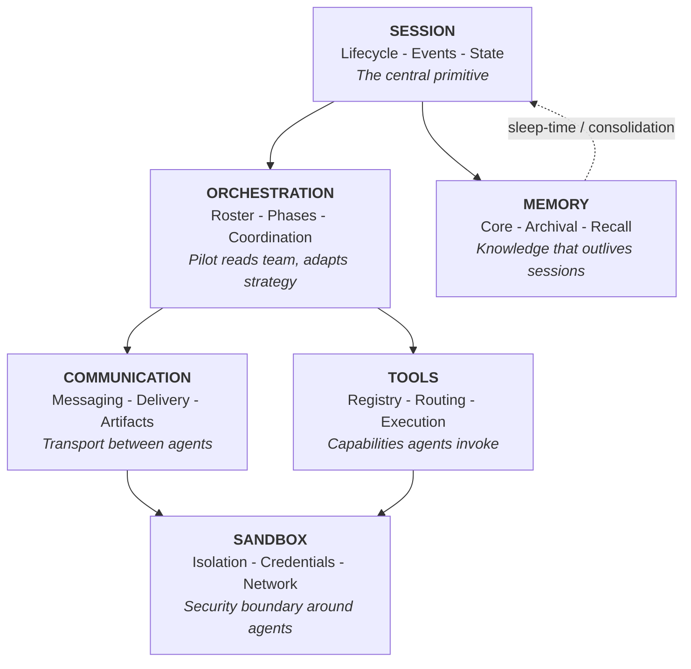

# Philosophy

A portable specification for multi-agent coding runtimes.

## The Thesis

A multi-agent coding session — where multiple AI agents collaborate to write, review, and ship software — requires six infrastructure interfaces. These interfaces are the same regardless of which LLMs, vendors, or orchestration patterns power the agents.

This document defines those interfaces, the invariants that bind them, and the agent roles that operate through them. It is a specification, not a product description. Belayer is one implementation in Go. The specification is language-agnostic and could be realized on any stack — including by composing existing open-source tools that fulfill individual interface contracts.

## Current interpretation for Belayer

The specification remains broad, but the current Belayer implementation effort is intentionally narrower:

- **Nightshift v1 is Extend-first**
- **one worker handles one request at a time**
- Belayer is the **run-local agent control plane** inside that worker
- Hermes is the preferred harness for v1
- tmux is the preferred transport adapter for v1

This means the philosophy is still portable, but the current implementation focus is not trying to prove every possible runtime variation at once.

---

## The OS Analogy

An operating system virtualizes hardware into stable abstractions — processes, IPC, filesystems, permissions — so applications can focus on domain logic rather than managing resources directly. A multi-agent coding runtime does the same for AI coding agents: it virtualizes the infrastructure that every multi-agent coding session needs, so agents can focus on writing software.

| OS Concept | Runtime Interface | What it virtualizes |
|---|---|---|
| Process | **Session** | Agent lifecycle, state, event history |
| Scheduler | **Orchestration** | Team composition, coordination |
| Container / VM | **Sandbox** | Network isolation, credentials, filesystem |
| IPC | **Communication** | Agent-to-agent messaging, delivery |
| Filesystem | **Memory** | Knowledge persistence across sessions |
| Syscalls / Drivers | **Tools** | Capabilities agents invoke, execution routing |

The key property: applications don't need to know about each other's implementation details. A runtime that correctly virtualizes these six interfaces lets you swap any agent, model, vendor, or isolation backend without changing the contracts.

### Interface Relationships

In the current Belayer/Nightshift interpretation:

- Session is the run-local truth inside one worker run
- Orchestration is planner-led but mediated through Belayer's session bus
- Communication includes not only messages, but also typed events and durable artifacts

---

## The Six Interfaces

### 1. Session

The session is the central primitive. It is the unit of work, the scope for state, and the recovery boundary.

**Contract:**
- Append-only event log that survives agent crashes
- Lifecycle management (create, run, stop, resume)
- Queryable state (events, status, agent health)
- Session-scoped identity for all agents in the run

**Inside this interface:**
- Event storage and retrieval (structured, searchable)
- Session metadata (template, status, timestamps, cost)
- Agent lifecycle within the session (start, exit, block, finish)
- Restart context compilation from event history
- Artifact registration for durable outputs

**Outside this interface:**
- What events mean (agent judgment)
- When a session is "done" (orchestration judgment)
- Where events are stored (SQLite, Postgres, files — implementation choice)

**Current Belayer interpretation:** one Belayer session per Nightshift run inside one worker.

---

### 2. Orchestration

Orchestration determines who does what. The orchestrator (planner/pilot) is an LLM that reads the team roster and adapts its coordination strategy to the task.

**Contract:**
- Declarative team rosters (role, profile, repo scope, tier)
- Dynamic agent spawning
- Phase-aware coordination
- Roster-adaptive task assignment

**Inside this interface:**
- Role definitions
- Planner capabilities
- Spawn contract for specialists
- Completion and blockage signaling

**Outside this interface:**
- The coordination logic itself (that's the planner's judgment)
- Exact workflow sequences for every task
- Cluster-wide worker scheduling (that belongs to the outer Nightshift control plane)

**Current Belayer interpretation:** Belayer handles intra-run orchestration only, not worker assignment across machines.

---

### 3. Sandbox

The sandbox is the security boundary between the runtime (trusted) and agents (untrusted). Agents cannot self-impose isolation.

**Contract:**
- Network isolation (deny-by-default, allowlisted egress)
- Credential isolation
- Filesystem boundaries
- Local workspace scope for the run
- Pluggable enforcement backend

**Current preferred implementation:** extend-clamshell for production-oriented runs, with Linux as the preferred deployment environment.

---

### 4. Communication

Communication is the transport layer between agents. Agents don't know each other's runtime — they send messages through the runtime, which handles delivery.

**Contract:**
- Point-to-point messaging
- Broadcast
- Delivery guarantees (coalescing, urgent bypass)
- Transport abstraction (tmux, stdin, API — agents don't care)
- Durable coordination artifacts

**Inside this interface:**
- Message routing and delivery
- Debounce windowing
- Urgent bypass
- Injection safety (bracketed paste or equivalent)
- Message event logging
- Artifact registration and lookup

**Outside this interface:**
- Message content or meaning (that's between the agents)
- When to send messages (that's orchestration judgment)
- Whether a message should instead be an artifact (agent judgment guided by skilling)

**Current Belayer interpretation:** Belayer is the session bus. tmux is only the transport adapter. Agents should communicate through Belayer, never through raw tmux.

---

### 5. Memory

Memory is knowledge that persists beyond any single agent invocation or session. The runtime owns memory infrastructure — storage, indexing, injection, and consolidation triggers. Agents own their memory content — they decide what to remember, how to organize it, and when to prune.

This follows the same principle as the rest of the spec: **the runtime handles plumbing, agents handle judgment.**

**Contract:**
- Core, archival, and recall layers or equivalents
- Agent-managed memory
- Portable identity across harnesses in principle
- Background consolidation / sleep-time support
- Provenance and staleness awareness

**Current Belayer interpretation:** memory architecture remains aspirational. The current MVP relies more heavily on Hermes profiles, skills, project-local plugins, and explicit run artifacts than on a fully realized Belayer-owned long-term identity system.

---

### 6. Tools

Tools are capabilities that agents invoke through the runtime. The runtime routes execution to the correct target.

**Contract:**
- Declarative tool registry
- Execution routing
- Safety guarantees
- Environment-specific tool sets

**Current Belayer interpretation:** tools now include not just shell-like execution, but also run-local coordination primitives such as:

- `belayer spawn`
- `belayer message`
- `belayer note`
- `belayer finish`
- `belayer artifact`

These are not generic shell conveniences — they are part of the run control protocol.

---

## Agent Identity

An agent is not a process — it's an identity. The process (Hermes, Claude Code, Codex, Letta, etc.) is the runtime detail. The identity is what persists.

### Current Belayer/Nightshift MVP stance

For the MVP, identity is injected in a simpler layered way:

- Hermes profile selection
- Belayer environment variables (`BELAYER_SESSION_ID`, `BELAYER_AGENT_ID`, etc.)
- project-local Hermes plugin support
- project-local Belayer communication skill
- workdir / repo binding

This is enough to get a working, owned, inspectable system before solving full canonical cross-machine identity materialization.

Longer term, a git-backed canonical identity model remains compatible with this philosophy.

---

## Final note

The philosophy still aims at a portable multi-agent runtime model.

But the current implementation discipline is:

> keep the philosophy broad, keep the implementation narrow enough to finish.
