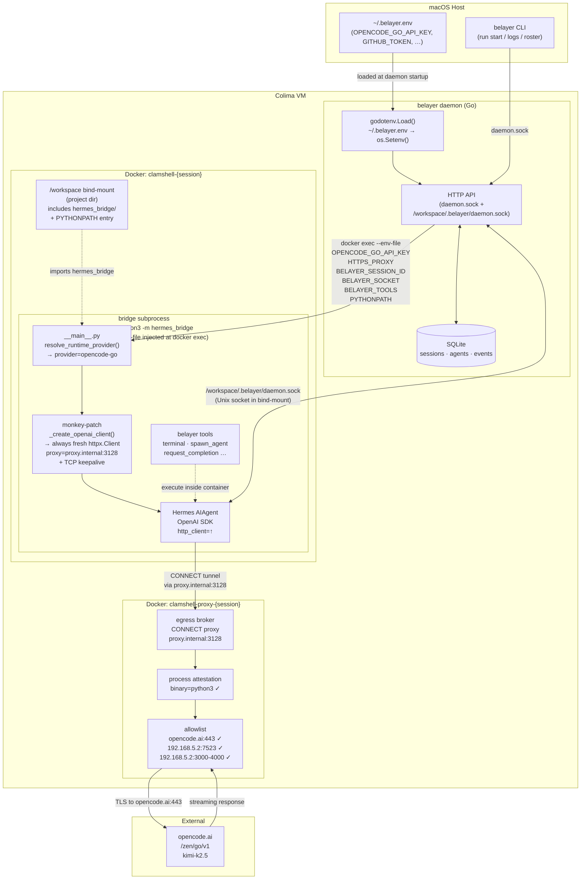

# Clamshell Sandboxing

Clamshell is Belayer's Docker-based sandbox mode. Each session runs its bridge subprocess inside an isolated container with a MITM CONNECT proxy enforcing an egress allowlist and process attestation.

## Architecture

## Credential chain

Provider credentials (e.g. `OPENCODE_GO_API_KEY`) live in `~/.belayer.env` on the host. At daemon startup, `godotenv.Load()` reads the workspace `.belayer/.belayer.env` first (workspace wins), then `~/.belayer.env`. Both are loaded into the daemon's `os.Environ()` without overwriting already-set variables.

When the daemon spawns a bridge subprocess via `docker exec`, `bridge.BuildEnv()` serialises the daemon's env into a temp env-file. The container process inherits `OPENCODE_GO_API_KEY` (and any other provider-specific vars) from there. `resolve_runtime_provider()` in `__main__.py` detects the key and selects the `opencode-go` Hermes provider.

`BELAYER_PROVIDER` / `BELAYER_BASE_URL` act as fallbacks only — they are ignored when the Hermes config already resolves a provider.

## Proxy client lifecycle fix

Hermes rebuilds its OpenAI client on every tool-call cycle (`_close_openai_client` → `_create_openai_client`). The close tears down the underlying `httpx.Client`, breaking the proxy connection for subsequent LLM calls.

The fix monkey-patches `agent._create_openai_client` at spawn time so every invocation creates a **fresh** `httpx.Client` with:
- `proxy=httpx.Proxy("http://proxy.internal:3128")`
- TCP keepalive socket options (SO_KEEPALIVE, TCP_KEEPIDLE=30, TCP_KEEPINTVL=10, TCP_KEEPCNT=3)

The patched method strips any `http_client` key from the kwargs snapshot before forwarding to the original method, so Hermes's internal recovery path (`_try_recover_primary_transport`) also gets a fresh client automatically.

## hermes_bridge distribution gap

`hermes_bridge/` is plain Python source — it is **not** embedded in the Go binary. The container imports it from `/workspace/hermes_bridge/` (the project's bind-mounted directory). This means:

1. Every project that uses Clamshell must have a copy of `hermes_bridge/` checked in or synced.
2. Changes to `hermes_bridge/` in the belayer repo must be manually propagated to each project.

Long-term options: embed a wheel in the binary and extract via `belayer init`, or publish `hermes_bridge` as a PyPI package.
