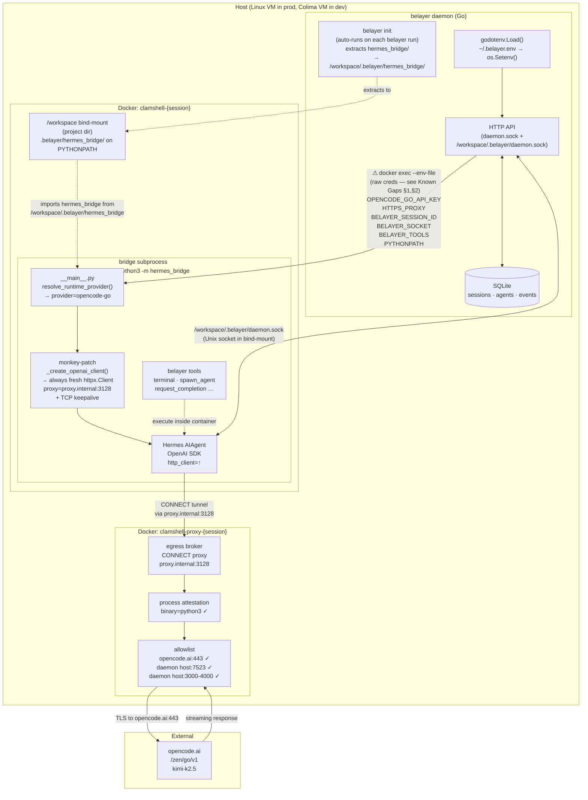

# Clamshell Sandboxing

Clamshell is Belayer's Docker-based sandbox mode. Each session runs its bridge subprocess inside an isolated container with a MITM CONNECT proxy enforcing an egress allowlist and process attestation.

## Architecture



## Credential chain

Provider credentials (e.g. `OPENCODE_GO_API_KEY`) live in `~/.belayer.env` on the host. At daemon startup, `godotenv.Load()` reads the workspace `.belayer/.belayer.env` first (workspace wins), then `~/.belayer.env`. Both are loaded into the daemon's `os.Environ()` without overwriting already-set variables.

When the daemon spawns a bridge subprocess, `bridge.BuildEnv()` serialises the daemon's env into a temp env-file. The container process inherits `OPENCODE_GO_API_KEY` (and any other provider-specific vars) from there. `resolve_runtime_provider()` in `__main__.py` detects the key and selects the `opencode-go` Hermes provider.

`BELAYER_PROVIDER` / `BELAYER_BASE_URL` act as fallbacks only — they are ignored when the Hermes config already resolves a provider. `BELAYER_API_KEY` is the exception: it always overrides the key returned by `resolve_runtime_provider()`, because the in-container user may carry an invalid or stale token (e.g. from a copied-in OAuth cache) that would otherwise win.

**Security note:** this chain today hands the real API key to the bridge process inside the container. See Known Gaps §2.

## Proxy client lifecycle

Hermes rebuilds its OpenAI client on every tool-call cycle (`_close_openai_client` → `_create_openai_client`). The close tears down the underlying `httpx.Client`, breaking the proxy connection for subsequent LLM calls.

The fix monkey-patches `agent._create_openai_client` at spawn time so every invocation creates a **fresh** `httpx.Client` with:
- `proxy=httpx.Proxy("http://proxy.internal:3128")`
- TCP keepalive socket options (SO_KEEPALIVE, TCP_KEEPIDLE=30, TCP_KEEPINTVL=10, TCP_KEEPCNT=3)

The patched method strips any `http_client` key from the kwargs snapshot before forwarding to the original method, so Hermes's internal recovery path (`_try_recover_primary_transport`) also gets a fresh client automatically.

## hermes_bridge distribution

`hermes_bridge/` ships embedded in the belayer binary (`//go:embed all:hermes_bridge` in `embed.go`). On every `belayer init` — and on every `belayer run` via `autoInitIfMissing` — the embedded tree is extracted to `.belayer/hermes_bridge/`, **always overwriting**. The tree is gitignored: it is machine-generated output pinned to the binary version, not project source.

Inside the clamshell container, PYTHONPATH is set to `/workspace/.belayer` (the container's view of the project's `.belayer/` directory). `python3 -m hermes_bridge` then resolves to `/workspace/.belayer/hermes_bridge/__main__.py`. There is no manual sync step; binary upgrades automatically refresh the extracted bridge on the next run.

---

## Deployment topologies

### Ideal: Nightshift Linux VM (production)

This is the intended deployment. The daemon runs directly on a Linux VM that hosts the Nightshift worker.

```
Linux VM
├── /usr/local/bin/belayer           (Linux binary, no cross-compile)
├── ~/.belayer.env                   (OPENCODE_GO_API_KEY + other creds)
└── project workspace (git clone)
    └── .belayer/                     (scaffolded by `belayer init`)
        ├── agents/                   (user-editable identity templates)
        ├── hermes_bridge/            (extracted from binary, gitignored)
        ├── config.yaml
        └── policies/standard.yaml
```

**Moving pieces:** three — the daemon process, the clamshell bridge container, and the clamshell proxy container. No VM abstraction layer above the host. `belayer init` handles bridge extraction automatically on every run.

**Deploy steps on a fresh VM:**

1. Install Docker + iptables (the proxy container uses REDIRECT rules).
2. Copy the Linux `belayer` binary to `/usr/local/bin/belayer`.
3. Drop `~/.belayer.env` (or mount it from a secret store).
4. In the project workspace, run `belayer daemon` once to start the supervisor and `belayer run start --task "<task>"` to launch a session.

No other moving parts. The architecture diagram above describes this topology exactly.

### Local dev: macOS via Colima

Developing on macOS adds one layer: Colima provides a Linux VM because macOS can't run iptables REDIRECT natively. This is a **local dev tax** for proving Linux patterns on macOS — not the intended production setup.

Extra steps compared to the ideal topology:

1. **Cross-compile** on the macOS host:
   ```bash
   GOOS=linux GOARCH=arm64 go build -tags clamshell -o belayer-linux-arm64 ./cmd/belayer
   ```
   The `-tags clamshell` flag is required; without it the sandbox driver is not compiled in.

2. **Install the binary inside the Colima VM:**
   ```bash
   # On Colima VM (kill any running daemon first — the binary can't be
   # overwritten while in use)
   sudo cp belayer-linux-arm64 /usr/local/bin/belayer
   ```

3. **Credentials live on the VM**, not the macOS host:
   ```
   # ~/.belayer.env on the Colima VM
   OPENCODE_GO_API_KEY=<key>
   ```

4. **Workspace path** on the VM is typically `/home/<user>/<project>` (virtiofs mirror of the macOS path, or a separate checkout — either works).

Everything downstream of the VM boundary — daemon, containers, proxy, bridge — is identical to the production topology.

**OrbStack** is a faster drop-in replacement for Colima if Colima's virtiofs performance becomes painful. Pure open-source alternatives (Lima, Rancher Desktop) also use QEMU + virtiofs and land at the same performance level as Colima.

---

## Known security gaps

These are active gaps in the current implementation, not design principles. They are documented here so they are not forgotten and so operators understand what the sandbox does and does not enforce today.

### §1. Bridge exec bypasses the clamshell CLI

`internal/sandbox/clamshell.go` `Clamshell.Exec` invokes `docker exec --env-file <tmpfile> <container> sh -lc '...'` directly. The clamshell CLI is used for `sandbox create`, `sandbox connect`, `sandbox stop`, and `gateway start` — but not for the hot-path exec that launches bridge subprocesses.

**What this means:** any policy or credential-handling a future `clamshell exec` wrapper would enforce is absent today. Every bridge spawn is a raw `docker exec`.

**Fix:** introduce a `clamshell exec` command that wraps `docker exec` with sandbox-aware credential handling. Bridge spawn plumbs through it instead of calling Docker directly. Designed in a follow-up doc.

### §2. Agent process sees raw provider credentials

The env-file written by `docker exec --env-file` contains `OPENCODE_GO_API_KEY=<real key>` (plus `HTTPS_PROXY`, `BELAYER_*`, `PYTHONPATH`). That file — and the container process environment that inherits from it — is readable inside the sandbox. A compromised agent can `cat /proc/self/environ`, exfiltrate the key, and the attacker walks away with a real opencode credential.

**What this means:** the sandbox today prevents the agent from *using* unauthorized egress (proxy allowlist does that work), but it does not prevent the agent from *seeing* the credential that makes that egress valuable. If exfiltrated through an allowed channel, the key is real and usable from anywhere.

**Fix:** the agent should receive an opaque session token rather than the real credential. The credential swap happens at egress — either proxy-side (strip the session token, inject the real `Authorization` based on the attested session) or via a clamshell-owned credential broker. Designed in a follow-up doc alongside §1 since both fixes share the `clamshell exec` plumbing.
