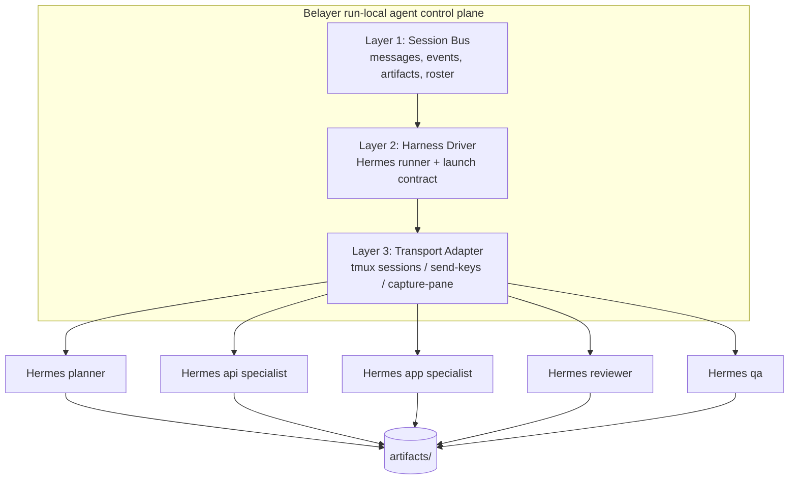
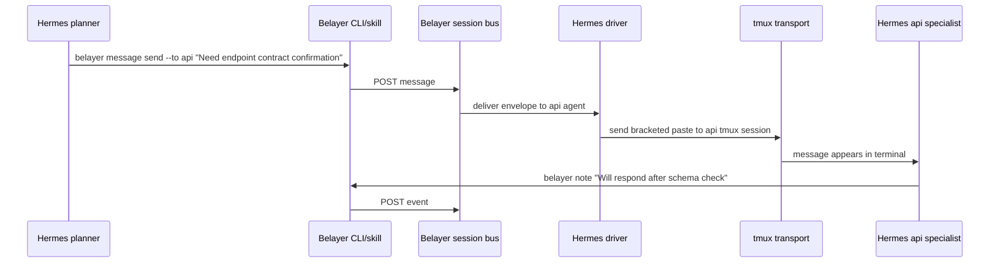

# Belayer Run Model for Nightshift v1

This document defines Belayer's role inside a single Nightshift v1 worker run.

It intentionally narrows scope.

For v1:

- one worker handles one request at a time
- one Belayer session exists inside that worker
- Belayer is the **agent control plane for that one run**
- Hermes is the default harness
- tmux is the default transport driver

The goal is not to design a universal protocol for all future agent systems. The goal is to make one planner-led multi-agent coding run work reliably for Extend.

---

## Core framing

Belayer should be modeled as three layers.

### Layer 1: Session bus / control plane

This is the actual Belayer role.

It owns:

- session creation and lifecycle
- agent roster for the run
- typed messages and events
- artifact registration and lookup
- delivery routing
- run-local observability
- planner-facing orchestration primitives

Belayer should be the source of truth for **who exists, what happened, and what artifacts are authoritative** inside a run.

### Layer 2: Harness driver

This is how Belayer launches and talks to an agent harness.

For v1, the primary harness is Hermes.

The harness driver owns:

- how the harness process starts
- what environment variables it receives
- what profile/identity is loaded
- how Belayer delivers instructions into the harness
- how Belayer captures output for logs/debugging

Belayer should define an abstract driver contract, but only Hermes needs to be first-class in v1.

### Layer 3: Transport adapter

This is the concrete I/O path used by the harness driver.

For v1, tmux is the default transport adapter.

The transport adapter owns:

- create session/pane
- send keys or bracketed paste
- capture pane output
- attach for human debugging
- stop/interrupt the process

This keeps tmux in the right place:

> tmux is the transport mechanism, not the control plane.

---

## Why these three layers matter

They let us separate concerns cleanly.

- If Hermes remains the harness but tmux becomes too limiting later, we can keep Belayer and swap the transport adapter.
- If we later want Claude Code or Codex as alternative harnesses, we can add new harness drivers without rewriting the Belayer run model.
- If we never add those other harnesses, this still gives us a clean internal architecture instead of accidental coupling.

For v1, though, the practical stance is:

- **Belayer session bus** = first-class
- **Hermes harness driver** = first-class
- **tmux transport adapter** = first-class
- everything else = deferred

---

## High-level diagram



---

## The Belayer session bus

The session bus is the part we should optimize first.

### Responsibilities

Inside one run, Belayer must answer:

- what agents exist?
- what role does each one have?
- what phase is the run in?
- what messages have been sent?
- what events have occurred?
- what artifacts are available?
- what is blocked, in progress, or ready for review?

### Suggested core objects

#### Run
Outer identity for one Nightshift request on one worker.

Suggested fields:

- `run_id`
- `ticket_ref`
- `worker_id`
- `status` (`preparing|running|reviewing|handoff|completed|failed`)
- `sandbox_ref`
- `started_at`
- `finished_at`

#### Session
Belayer's run-local coordination context.

Suggested fields:

- `session_id`
- `run_id`
- `phase` (`intake|planning|implementation|review|qa|handoff`)
- `planner_agent_id`
- `current_summary`

#### AgentRun
One launched harness instance for a role.

Suggested fields:

- `agent_id`
- `role` (`planner|api|app|reviewer|qa`)
- `harness` (`hermes` for v1)
- `profile`
- `transport` (`tmux` for v1)
- `tmux_session`
- `workspace_path`
- `repo_scope`
- `status` (`starting|idle|busy|blocked|complete|failed|stopped`)

#### Message
Directed communication mediated by Belayer.

Suggested fields:

- `message_id`
- `session_id`
- `from_agent`
- `to_agent`
- `kind`
- `body`
- `urgent`
- `created_at`
- `delivered_at`

#### Event
Machine-readable state transition or observation.

Suggested event kinds:

- `agent_started`
- `agent_output`
- `message_sent`
- `message_delivered`
- `artifact_created`
- `artifact_updated`
- `task_assigned`
- `blocked`
- `needs_review`
- `verification_passed`
- `verification_failed`
- `handoff_ready`

#### Artifact
Durable coordination object.

Suggested artifact kinds:

- `ticket-intake`
- `task-graph`
- `shared-contract`
- `specialist-report`
- `review-report`
- `verification-report`
- `handoff`

---

## The other two layers

### Layer 2: Hermes harness driver

This layer turns a Belayer `AgentRun` into a live Hermes process.

For v1, the Hermes driver should own:

- selecting the Hermes profile for the role
- setting `BELAYER_SESSION_ID`
- setting `BELAYER_AGENT_ID`
- setting daemon socket path
- setting workspace cwd
- optionally loading a Belayer communication skill
- starting Hermes in the correct terminal mode
- registering pane capture

#### Hermes driver contract

Belayer should conceptually expose something like:

- `Launch(run, roleConfig) -> AgentRun`
- `DeliverMessage(agentRun, envelope)`
- `Interrupt(agentRun, envelope)`
- `Capture(agentRun) -> output`
- `Attach(agentRun)`
- `Stop(agentRun)`

The Hermes driver is where we encode Hermes-specific knowledge. Belayer's session bus should not know how Hermes CLI arguments work.

### Layer 3: tmux transport adapter

This layer is deliberately dumb.

It should only know how to:

- create a tmux session
- send bracketed-paste text
- send Enter
- optionally send Ctrl+C
- capture pane contents
- attach or kill

This is why tmux is a good v1 fit:

- it works with Hermes today
- it works with Claude Code / Codex later if needed
- it is debuggable by humans
- it avoids inventing a custom protocol before we need one

But tmux should remain below the harness driver.

---

## How agent communication should work

Agents should **not** directly know about tmux session names or other agents' terminals.

All communication should go through Belayer.

### Desired mental model for agents

When an agent wants to:

- ask another specialist a question
- hand off work
- report a blocker
- publish an artifact
- request review

it should think:

> "Use Belayer."

Not:

> "I should directly message that other terminal."

### Communication path



### Preferred communication types

#### 1. Direct message
For targeted questions/instructions.

Examples:

- planner → api specialist
- reviewer → planner
- qa → planner

#### 2. Event
For status changes.

Examples:

- `blocked`
- `needs_review`
- `artifact_created`

#### 3. Artifact publication
For durable outputs.

Examples:

- shared contract
- specialist report
- verification report

This is the important split:

- **messages** are for conversation
- **events** are for orchestration state
- **artifacts** are for durable shared outputs

---

## How we teach Hermes agents to use Belayer

This needs to be explicit.

We should not assume the agent will naturally invent the correct communication behavior.

For v1, the answer is:

> **yes — Belayer CLI plus a Hermes skill is the right approach**

### Why this is the best v1 approach

It has several benefits:

- simplest to implement
- visible and git-traceable
- easy to iterate on in prompts/skills
- does not require custom Hermes core changes
- keeps Belayer in control of the session bus
- works with tmux-based harness execution

### What the skill should teach

Every Nightshift specialist profile should load a Belayer communication skill that says, in effect:

1. You are operating inside a Belayer-managed session.
2. Never attempt to contact other agents directly.
3. When you need another specialist or the planner, use `belayer message send`.
4. When you learn something the whole run should know, use `belayer note` or write an artifact.
5. When you create a durable output, register it as an artifact through Belayer.
6. If you are blocked, emit a blocker note/event rather than waiting silently.
7. If you need review, send the planner a message and publish the supporting artifact.

### Minimum runtime environment for each Hermes run

Each run should receive at least:

- `BELAYER_SESSION_ID=<session-id>`
- `BELAYER_AGENT_ID=<role-id>`
- `BELAYER_SOCKET=<daemon-socket>`
- `BELAYER_RUN_DIR=<run-dir>`

That makes commands simple inside the agent:

```bash
belayer message send --to planner "I need the shared API contract clarified"
belayer note "Blocked on auth token shape mismatch"
```

No extra flags required in the common case.

---

## Recommended Hermes profile pattern

For v1, each Hermes specialist should have:

- a stable profile name
- a role-specific persona
- role-specific repo skills
- the Belayer communication skill
- explicit guidance that Belayer is the coordination substrate

Example profiles:

- `nightshift-planner`
- `nightshift-extend-api`
- `nightshift-extend-app`
- `nightshift-reviewer`
- `nightshift-qa`

### Belayer communication skill outline

The skill should contain sections like:

- when to message the planner
- when to message another specialist
- when to create a note
- when to publish an artifact
- when to stop and mark blocked
- examples of exact CLI commands

This is preferable to relying only on generic system prompt text because:

- it is reusable
- it is versioned
- it is inspectable in git
- it can evolve as the run model matures

---

## What Belayer should expose to agents in v1

The CLI surface does not need to be huge.

For v1, agents mainly need:

### Messaging

- `belayer message send --to <agent> "..."`
- `belayer message broadcast "..."`

### Session observation

- `belayer context`
- `belayer logs <session>` or session-scoped equivalent

### Notes and status

- `belayer note "..."`

### Artifact operations

Belayer should likely add a small artifact CLI for Nightshift v1:

- `belayer artifact create --kind shared-contract --path artifacts/shared-contract.md`
- `belayer artifact list`
- `belayer artifact show <artifact-id>`

That would make the artifact bus as explicit as the message bus.

---

## Planner-centric communication contract

The planner should remain the primary coordinator.

That means most specialist traffic should look like one of these:

### Specialist → planner

- question
- blocker
- completion notice
- review request
- artifact ready

### Planner → specialist

- task assignment
- clarification
- shared contract update
- review feedback
- resume / stop / reprioritize

### Specialist ↔ specialist

Allowed, but only when valuable.

Examples:

- api asks app to confirm shape assumptions
- app asks api for endpoint semantics

Even then, Belayer should still mediate it, and the planner should remain able to inspect the conversation in the event log.

This keeps the system from turning into uncontrolled peer-to-peer chatter.

---

## What not to do in v1

### Do not teach agents to target tmux directly

Agents should never need to know pane names, session names, or send-keys details.

### Do not make every interaction a freeform conversation

Promote:

- artifacts for durable outputs
- typed events for state transitions
- direct messages only when needed

### Do not depend on harness-specific hidden magic

The Belayer communication model should remain explicit and inspectable.

### Do not attempt equal multi-harness support immediately

Hermes-first is the right choice for v1.

---

## Proposed v1 implementation sequence

### Step 1: Formalize the three layers in code

Belayer packages should move toward:

- `internal/runbus/` or reuse daemon/store/broker as the session bus layer
- `internal/harness/hermes/`
- `internal/transport/tmux/`

Exact package names can vary, but the separation should become explicit.

### Step 2: Make Hermes the default harness driver

Stop centering vendor adapters as the primary abstraction for Nightshift.

### Step 3: Add a Belayer communication skill for Hermes specialists

This is the main behavioral teaching mechanism.

### Step 4: Add artifact CLI support

Without this, too much state stays trapped in prose and logs.

### Step 5: Ensure all inter-agent communication routes through Belayer

Belayer should remain the authoritative session bus, even if tmux is the transport underneath.

---

## Final recommendation

For Nightshift v1, the right model is:

- **Belayer = session bus / control plane inside one run**
- **Hermes = default harness for specialist identities**
- **tmux = transport adapter, not architecture**
- **Belayer CLI + Hermes communication skill = primary way agents coordinate**

That is the smallest coherent system that:

- we can own
- we can inspect
- we can version
- we can teach
- and we can evolve without waiting for another vendor to define our orchestration model
