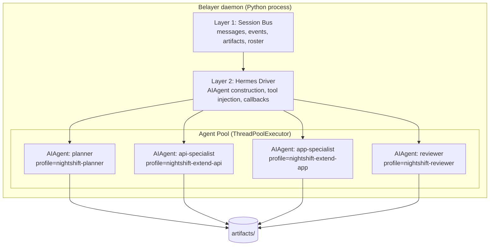
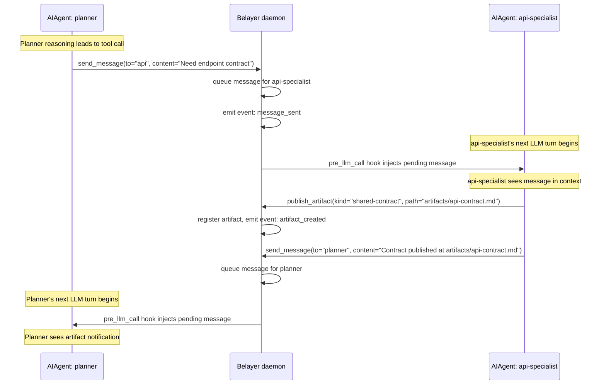

# Headless Hermes Daemon Architecture

This document proposes replacing tmux (Layer 3) with Hermes's programmatic Python API as the transport and execution mechanism for Belayer's agent control plane. It preserves the session bus (Layer 1) and narrows the harness driver (Layer 2) to direct in-process integration with Hermes's `AIAgent` class.

The motivation: tmux works but is fragile. Hermes already has a headless API, lifecycle hooks, runtime tool registration, and multi-harness dispatch via ACP. We can build the Belayer daemon directly on these primitives without simulating humans typing into terminals.

---

## Context and motivation

### The tmux model and its limits

The current Belayer run model (see [run model doc](2026-04-15-belayer-run-model-for-nightshift-v1.md)) uses tmux as the transport adapter. Messages reach agents via `tmux send-keys` with bracketed paste. Output is captured via `tmux capture-pane`. This works for proving the run model but introduces real fragility:

- **Message delivery is text injection, not an API call.** There is no structured contract between Belayer and the harness. Messages are formatted as `---BEGIN SCION MESSAGE---` blocks and pasted into a terminal buffer. The agent must parse these from its TUI input stream.
- **Output capture is terminal scraping.** Belayer reads `capture-pane` output and hopes the agent wrote its response where expected. TUI layout changes break parsing.
- **Tmux input is a race condition.** Scion (a production tmux-based orchestrator with 23k+ GitHub stars) implements a 2-second debounce buffer specifically to prevent rapid messages from corrupting each other.
- **No structured feedback from agents.** When an agent finishes, stalls, or needs input, Belayer must infer this from terminal activity (idle pane watcher, exit-without-finish detection). There is no callback or event.
- **Every harness update is a potential break.** Changes to Hermes's TUI rendering, Claude Code's confirmation dialogs, or Codex's multi-line paste handling can silently break message delivery.

These are not theoretical risks. They are engineering constraints that shape what the system can reliably do.

### What we learned from the ecosystem

We surveyed the landscape of multi-agent orchestration patterns to understand what alternatives exist beyond tmux-based terminal simulation.

#### Tmux-based orchestrators (reference implementations)

**Scion** (Google, github.com/GoogleCloudPlatform/scion): Production-grade tmux orchestration. Wraps harnesses (Claude Code, Gemini CLI, Codex, OpenCode) in containers, coordinates via `tmux send-keys`, provides structured messaging with JSON envelopes, agent discovery via CLI, git worktree isolation per agent. Supports hub mode with WebSocket tunneling for distributed execution. The scion-athenaeum example demonstrates five agents across three vendors collaborating on a quest.

**Gastown**: File-based mailbox system backed by beads (Dolt-based version control). Two-phase delivery tracking with ack semantics, priority routing, fan-out to mailing lists/groups/channels/queues, idle/interrupt delivery modes. Production-grade message routing but still delivers to agents via tmux nudges.

Both demonstrate that tmux orchestration works. Both also demonstrate the engineering cost: debounce buffers, bracketed paste handling, pane capture parsing, idle detection, per-harness auth resolution (450+ lines in Scion), and constant adaptation to harness CLI changes.

#### Non-tmux programmatic frameworks

| Framework | Communication | Concurrency | Key pattern |
|---|---|---|---|
| **Letta** (MemGPT) | REST API: `send_message_to_agent_async`, `_and_wait_for_reply`, broadcast by tags. Shared memory blocks. | True concurrent server-side processes | Stateful agents with self-editing memory, async/sync messaging |
| **AutoGen distributed** | gRPC bidirectional streaming. Topic-based pub/sub. | True concurrent across processes/machines | Agents unaware of distribution; runtime handles routing |
| **Mastra** (23k stars, TS) | Agents-as-tools (auto-wrapped as callable). Workflow graphs with suspend/resume. | Parallel in workflows | Every agent is automatically a tool for other agents |
| **Google A2A protocol** | JSON-RPC over HTTP(S). Agent Cards for discovery. Task lifecycle states. | Fully async | The emerging interop standard (v1.0, 150+ orgs, Linux Foundation) |

The key insight from this survey: **programmatic agent-to-agent communication is the industry direction.** A2A reached v1.0 with backing from Google, Microsoft, AWS, Anthropic, and OpenAI. MCP + A2A together is the emerging standard stack (MCP for tool access, A2A for agent coordination). Terminal simulation is practical but not where the ecosystem is heading.

#### What LangGraph offers (and doesn't)

We also evaluated LangGraph as an alternative orchestration backbone, since the superlemmings project currently uses it.

**What LangGraph does well:**
- `Command({ goto })` enables runtime-determined routing (nodes decide their successor, not the graph builder)
- `Send()` provides dynamic parallel fan-out
- PostgresSaver gives durable checkpointing across graph state transitions
- LangSmith provides structured tracing and replay

**Where LangGraph falls short for this use case:**
- Agents inside LangGraph nodes are opaque. LangGraph checkpoints graph-level state, but can't checkpoint or resume an agent's internal session.
- All agents run in one process. No natural crash isolation.
- Inter-agent communication must flow through shared state and graph edges. No ad-hoc messaging.
- Nesting a full agent loop (Hermes or Claude Code) inside a LangGraph node means LangGraph is paying framework overhead for what amounts to `await agent.run_conversation()`. The graph adds structure around sequential function calls that could be plain Python.

LangGraph is a good state machine for workflows with complex branching, retries, and human gates. It is a poor model for autonomous agents that need to collaborate dynamically.

### Why Hermes's API changes the equation

Hermes is not just a CLI with a TUI. It has a complete programmatic Python API that makes tmux unnecessary as a transport layer. The critical findings:

1. **`AIAgent` is fully headless.** `AIAgent(quiet_mode=True)` runs without any terminal. `run_conversation()` takes a string, returns structured results with `final_response`, `messages`, `api_calls`, exit reason, and token counts.

2. **Eight callback slots provide real-time visibility.** `tool_start_callback`, `tool_complete_callback`, `thinking_callback`, `stream_delta_callback`, `step_callback`, `clarify_callback`, and more. These fire during agent execution, not after.

3. **Lifecycle hooks give pre/post control.** `pre_tool_call` can block tool execution. `pre_llm_call` can inject context into the prompt before each LLM call. `post_llm_call` captures the full turn result. These are registered via the plugin system without modifying Hermes source.

4. **Tools are registerable at runtime.** `registry.register(name, schema, handler)` adds tools that the agent discovers and uses naturally. No special prompting required.

5. **Multi-harness dispatch is built in.** `delegate_task(acp_command="claude", acp_args=["--acp", "--stdio"])` spawns Claude Code headlessly via the Agent Client Protocol. Also supports Copilot and any ACP-capable agent. Batch mode runs up to N children concurrently via `ThreadPoolExecutor`.

6. **Concurrent sessions work.** The ACP adapter runs 4 concurrent `AIAgent` instances. `SessionManager` handles creation, persistence, forking, and cleanup. Each session has its own agent, history, and workspace.

7. **Profiles provide identity isolation.** Each `HERMES_HOME` directory contains config, API keys, memory, sessions, skills, and gateway state. Profiles are the mechanism for giving agents distinct identities.

8. **Memory and skills persist across sessions.** Agents that learn and improve across runs, not just within one conversation.

---

## Proposed architecture

### Layer 3 replacement: Hermes programmatic API instead of tmux

The tmux transport adapter is replaced entirely. Agents are `AIAgent` instances (or ACP-dispatched harnesses) running headlessly in the daemon process.

### Layer 2 update: direct API integration instead of CLI wrapping

The harness driver no longer launches a Hermes CLI process and talks to it through a terminal. Instead, it constructs an `AIAgent` directly, registers coordination tools, attaches callbacks, and calls `run_conversation()`.

### Layer 1 preserved: session bus unchanged

The session bus contract (messages, events, artifacts, roster) from the [run model doc](2026-04-15-belayer-run-model-for-nightshift-v1.md) is preserved exactly. The objects (Run, Session, AgentRun, Message, Event, Artifact) and their fields remain the same. What changes is how messages reach agents and how events are captured.

### High-level diagram



Note: tmux is gone. There is no Layer 3. The harness driver talks directly to `AIAgent` instances.

---

## How inter-agent communication works

The communication model from the run model doc is preserved. Messages are for conversation, events are for orchestration state, artifacts are for durable shared outputs. What changes is the delivery mechanism.

### Tool-based coordination (replaces Belayer CLI)

Instead of agents calling `belayer message send --to api "..."` as a shell command, each agent receives injected tools at spawn time that call back into the daemon:

```python
# Registered on each AIAgent at construction
registry.register(
    name="send_message",
    toolset="belayer",
    schema=SEND_MESSAGE_SCHEMA,
    handler=lambda args, **kw: daemon.route_message(
        from_agent=kw["parent_agent"].agent_id,
        to_agent=args["to"],
        content=args["content"],
        kind=args.get("kind", "direct"),
    ),
)

registry.register(
    name="publish_artifact",
    toolset="belayer",
    schema=PUBLISH_ARTIFACT_SCHEMA,
    handler=lambda args, **kw: daemon.register_artifact(
        agent_id=kw["parent_agent"].agent_id,
        kind=args["kind"],
        path=args["path"],
        summary=args.get("summary"),
    ),
)

registry.register(
    name="signal_blocked",
    toolset="belayer",
    schema=SIGNAL_BLOCKED_SCHEMA,
    handler=lambda args, **kw: daemon.mark_blocked(
        agent_id=kw["parent_agent"].agent_id,
        reason=args["reason"],
        needs_from=args.get("needs_from"),
    ),
)

registry.register(
    name="request_info",
    toolset="belayer",
    schema=REQUEST_INFO_SCHEMA,
    handler=lambda args, **kw: daemon.route_request(
        from_agent=kw["parent_agent"].agent_id,
        to_agent=args["from_agent"],
        question=args["question"],
    ),
)
```

The agent discovers these tools naturally and uses them as part of its reasoning. No special skill document is needed to teach agents CLI commands. The tools appear in the agent's tool list like any other tool.

### Message delivery via `pre_llm_call` hook

When a message arrives for an agent, the daemon queues it. Before the agent's next LLM call, the `pre_llm_call` hook injects it as context:

```python
def make_pre_llm_hook(agent_id, daemon):
    def hook(**kwargs):
        pending = daemon.get_pending_messages(agent_id)
        if not pending:
            return None
        formatted = format_messages_for_injection(pending)
        daemon.mark_messages_delivered(pending)
        return {"context": formatted}
    return hook
```

The agent sees the message as part of its conversation context on the next turn. This is structurally cleaner than tmux send-keys: the message enters the LLM prompt directly, not as simulated keyboard input that the TUI must parse.

### Event capture via callbacks

Agent lifecycle events are captured through callbacks, not terminal scraping:

```python
agent = AIAgent(
    # ... config ...
    tool_start_callback=lambda event, name, preview, args:
        daemon.emit_event("tool_started", agent_id, tool=name, preview=preview),
    tool_complete_callback=lambda event, name, result:
        daemon.emit_event("tool_completed", agent_id, tool=name),
    step_callback=lambda api_calls, tools:
        daemon.update_agent_activity(agent_id, api_calls, tools),
    clarify_callback=lambda question, choices:
        daemon.handle_clarification(agent_id, question, choices),
)
```

When an agent finishes, `run_conversation()` returns. No exit-without-finish detection needed. When an agent stalls, `step_callback` stops firing. When an agent needs input, `clarify_callback` fires and the daemon can route the question to the planner or another specialist.

### Communication sequence (replaces the tmux sequence diagram)



No tmux. No bracketed paste. No send-keys. No capture-pane. No debounce buffer.

---

## Multi-harness dispatch via ACP

Hermes's `delegate_task` tool already supports dispatching Claude Code, Copilot, or any ACP-capable agent as a child:

```python
delegate_task(
    goal="Implement the /transactions endpoint with pagination support",
    context="Working in extend-api repo. See artifacts/api-contract.md for the agreed schema.",
    acp_command="claude",
    acp_args=["--acp", "--stdio", "--model", "claude-opus-4-6"],
)
```

This runs Claude Code headlessly via the Agent Client Protocol subprocess transport. The parent Hermes agent blocks until Claude Code completes and receives a structured result with summary, tool trace, token counts, and duration.

For batch parallel dispatch:

```python
delegate_task(tasks=[
    {"goal": "Implement API endpoint", "acp_command": "claude", ...},
    {"goal": "Build frontend component", "acp_command": "claude", ...},
    {"goal": "Research auth pattern", "toolsets": ["web"]},  # Hermes subagent
])
```

All three run concurrently via `ThreadPoolExecutor`. The planner does not need to know whether a child is a Hermes subagent or a Claude Code instance — the interface is the same.

This means the Belayer daemon does not need to build its own multi-harness dispatch layer. Hermes already is one.

### Where delegate_task falls short and what the daemon adds

`delegate_task` is parent-child, fire-and-forget. The parent blocks until children complete. Children cannot message the parent mid-execution, cannot message each other, and have no persistent identity across delegations.

The Belayer daemon extends this model by running agents as **persistent peers** (not ephemeral children), with the session bus providing the inter-agent communication that `delegate_task` lacks. The daemon uses `delegate_task` when an agent needs to dispatch a one-shot coding task to Claude Code, but uses the session bus when agents need to collaborate as a team.

---

## Agent lifecycle in the daemon

### Spawning an agent

```python
def spawn_agent(self, role: str, profile: str, workspace: str):
    agent = AIAgent(
        model=self.resolve_model(role),
        provider=self.resolve_provider(role),
        quiet_mode=True,
        enabled_toolsets=self.resolve_toolsets(role),
        persist_session=True,
        session_db=self.session_db,
        # Callbacks for daemon integration
        tool_start_callback=self.make_tool_callback(role),
        tool_complete_callback=self.make_tool_complete_callback(role),
        step_callback=self.make_step_callback(role),
        clarify_callback=self.make_clarify_callback(role),
        thinking_callback=self.make_thinking_callback(role),
    )

    # Inject Belayer coordination tools
    self.register_coordination_tools(agent, role)

    # Register pre_llm_call hook for message injection
    self.register_message_injection_hook(agent, role)

    # Register pre_tool_call hook for security policy enforcement
    self.register_security_hook(agent, role)

    # Track in roster
    self.roster[role] = AgentRun(
        agent_id=role,
        agent=agent,
        profile=profile,
        workspace=workspace,
        status="idle",
    )

    return agent
```

### Running an agent on a task

Agents run on background threads. The daemon dispatches tasks and monitors via callbacks:

```python
def dispatch_task(self, role: str, task: str):
    agent_run = self.roster[role]
    agent_run.status = "busy"
    self.emit_event("task_assigned", role, task=task)

    future = self.executor.submit(
        agent_run.agent.run_conversation,
        user_message=task,
    )

    def on_complete(f):
        result = f.result()
        agent_run.status = "idle"
        self.emit_event("agent_finished", role,
            summary=result.get("final_response"),
            exit_reason=result.get("exit_reason"),
        )

    future.add_done_callback(on_complete)
    return future
```

### Handling clarifications as inter-agent routing

When an agent's `clarify_callback` fires, the daemon can route the question to another agent instead of a human:

```python
def make_clarify_callback(self, role):
    def callback(question, choices):
        # Route to planner for decision
        self.route_message(
            from_agent=role,
            to_agent="planner",
            content=f"Clarification needed: {question}",
            kind="clarification",
        )
        # Block until planner responds (with timeout)
        response = self.wait_for_response(
            from_agent="planner",
            to_agent=role,
            timeout=300,
        )
        return response or choices[0] if choices else ""
    return callback
```

---

## Security policy enforcement

The run model doc notes that agents should not perform certain actions without authorization. The `pre_tool_call` hook provides this:

```python
def register_security_hook(self, agent, role):
    def pre_tool_call_hook(**kwargs):
        tool_name = kwargs.get("tool_name")
        args = kwargs.get("args", {})

        # Block git push for non-planner agents
        if tool_name == "terminal" and "git push" in str(args):
            if role != "planner":
                return {"action": "block", "message": "Only the planner may push. Use send_message to request a push."}

        # Block file operations outside workspace
        if tool_name in ("write_file", "edit_file"):
            path = args.get("path", "")
            if not path.startswith(self.workspace_root):
                return {"action": "block", "message": f"Cannot write outside workspace: {path}"}

        return None  # allow

    # Register via plugin system
    agent.plugin_context.register_hook("pre_tool_call", pre_tool_call_hook)
```

This replaces clamshell's network egress policies for tool-level enforcement. Clamshell remains valuable for process-level isolation and network boundaries in production, but tool-level hooks provide finer-grained control within the agent's reasoning loop.

---

## What this preserves from the run model doc

### Preserved exactly

- **Session bus objects**: Run, Session, AgentRun, Message, Event, Artifact — same fields, same semantics
- **Communication types**: messages for conversation, events for orchestration state, artifacts for durable outputs
- **Planner-centric coordination**: planner remains the primary coordinator; specialist traffic flows through planner
- **Agent roles**: planner, api-specialist, app-specialist, reviewer, qa
- **Hermes profiles**: `nightshift-planner`, `nightshift-extend-api`, etc.
- **Environment variables**: `BELAYER_SESSION_ID`, `BELAYER_AGENT_ID`, `BELAYER_SOCKET`, `BELAYER_RUN_DIR`

### Changed

- **Transport**: tmux send-keys/capture-pane replaced by `pre_llm_call` hook injection and callbacks
- **Harness driver**: CLI process wrapping replaced by direct `AIAgent` construction
- **Agent teaching mechanism**: Belayer communication skill (Markdown doc teaching CLI commands) replaced by injected tools that appear in the agent's tool list natively
- **Completion detection**: idle pane watcher and exit-without-finish detection replaced by `run_conversation()` return and `step_callback`
- **Multi-harness dispatch**: tmux as universal CLI launcher replaced by Hermes's `delegate_task` with ACP support

### Deferred (not addressed here)

- **Clamshell sandbox integration**: the daemon model is compatible with clamshell but doesn't change the sandbox architecture
- **Outer worker control plane**: Nightshift daemon → worker → Belayer relationship unchanged
- **Extend-localenv integration**: `xt` workbench usage unchanged

---

## Comparison: tmux transport vs. Hermes API

| Concern | tmux transport | Hermes programmatic API |
|---|---|---|
| Message delivery | `tmux send-keys` with bracketed paste | `pre_llm_call` hook context injection |
| Output capture | `tmux capture-pane` + parsing | `post_llm_call` callback + `stream_delta_callback` |
| Agent completion | Detect tmux session exit, check for finish marker | `run_conversation()` returns with structured result |
| Agent stall detection | Idle pane watcher (poll capture-pane for changes) | `step_callback` stops firing |
| Agent needs input | Pattern-match terminal output | `clarify_callback` fires with question and choices |
| Tool execution visibility | None (opaque terminal) | `tool_start_callback`, `tool_complete_callback` |
| Security enforcement | Clamshell network egress only | `pre_tool_call` hook blocks + clamshell |
| Multi-harness dispatch | Launch any CLI in a tmux session | `delegate_task(acp_command="claude")` |
| Process isolation | Natural (separate tmux sessions) | Requires ThreadPoolExecutor or subprocess |
| Human debugging | `tmux attach` — watch agent work live | Build log viewer or monitoring UI |
| Harness update resilience | Any CLI change can break send-keys/capture | API is stable; callbacks are a defined contract |

---

## What this does not replace

### Tmux for human debugging

Tmux remains valuable for human operators who want to attach to an agent and watch it work or intervene manually. The daemon could optionally wrap agents in tmux sessions for debugging purposes, but tmux would not be in the critical path for inter-agent communication.

### Clamshell for production isolation

The daemon runs inside the same clamshell sandbox boundary. Network egress policies, credential mediation, and filesystem isolation are orthogonal to how agents communicate internally.

### Hermes profiles and skills

The identity model is unchanged. Agents get role-specific profiles, skills, and memory. The daemon constructs `AIAgent` instances with the appropriate `HERMES_HOME` for each role.

---

## Relationship to the protocol landscape

This design is intentionally Hermes-native for v1. However, it positions well for future protocol adoption:

**A2A compatibility**: The session bus's message/event/artifact model maps cleanly to A2A's Task/Message/Artifact primitives. An A2A adapter could expose each agent as an A2A-compliant endpoint without changing the internal daemon architecture.

**MCP integration**: Hermes already has MCP client and server support. Agents can consume external MCP tools, and the daemon could expose run state as MCP resources for external monitoring.

**Letta-like patterns**: The daemon's REST API (when added for the outer control plane) could follow Letta's `send_message_to_agent_async` / `_and_wait_for_reply` patterns, providing a clean interface for the Nightshift worker to interact with Belayer.

The principle: **build for Hermes today, design the interfaces so protocols can be added later without rewriting the core.**

---

## Risks and mitigations

### Risk: Hermes API instability

Hermes is open-source (MIT, Nous Research) and actively developed. The `AIAgent` constructor, `run_conversation()`, and plugin hook system could change across versions.

**Mitigation**: Pin Hermes version. Wrap `AIAgent` interaction in a thin adapter layer within Belayer's harness driver. If the API changes, the adapter absorbs the delta.

### Risk: Single-process crash propagation

All agents run in one Python process. A segfault in one agent's tool call could take down the daemon.

**Mitigation**: For v1, accept this constraint (it matches the one-worker-one-request model). For v2, consider running each agent in a subprocess via the same `AIAgent` API, with the daemon communicating via pipes or sockets.

### Risk: Thread safety in Hermes internals

Hermes's `AIAgent` was designed for the ACP adapter's 4-thread pool, but running 5+ concurrent agents may surface thread-safety issues in shared globals (e.g., `model_tools._last_resolved_tool_names`, which the delegate_task code explicitly saves and restores).

**Mitigation**: Each agent should get its own tool resolution scope. The delegate_task implementation shows the pattern for saving/restoring global state around child construction. The daemon should apply the same discipline.

### Risk: Loss of visual debugging

Without tmux, operators cannot attach and watch agents work.

**Mitigation**: Build a structured log viewer that consumes daemon events and callbacks. Consider an optional tmux wrapper for development that shows agent output in panes but does not use tmux for message delivery.

---

## Proposed implementation sequence

### Step 1: Daemon skeleton with session bus

Build the core daemon process with:
- Run and Session objects
- Agent roster
- Message queue with delivery tracking
- Event log
- Artifact registry
- SQLite or file-backed persistence (match existing Belayer patterns)

This is the session bus from the run model doc, implemented as a Python service.

### Step 2: Hermes agent spawning via AIAgent

Replace tmux launch with direct `AIAgent` construction:
- Profile-based configuration
- `quiet_mode=True` headless execution
- Thread pool for concurrent agents
- `run_conversation()` dispatch on background threads

### Step 3: Coordination tool injection

Register `send_message`, `publish_artifact`, `signal_blocked`, `request_info` tools on each agent at spawn time. Wire handlers to the session bus.

### Step 4: Message delivery via pre_llm_call

Implement the hook that injects pending messages into each agent's context before its next LLM call. Test that agents receive and act on messages naturally.

### Step 5: Event capture via callbacks

Wire `tool_start_callback`, `step_callback`, `clarify_callback` to the event log. Implement stall detection via step_callback timeout.

### Step 6: Security hooks

Implement `pre_tool_call` policies for workspace boundary enforcement, dangerous operation blocking, and role-based restrictions.

### Step 7: Multi-harness dispatch

Verify that `delegate_task(acp_command="claude")` works from within daemon-managed agents. Ensure ACP-dispatched children inherit the correct workspace and credentials.

### Step 8: Outer API for Nightshift worker

Expose the daemon's session bus via HTTP or Unix socket for the Nightshift worker control plane to submit runs, inspect status, and read events.

---

## Final recommendation

For Nightshift v1, replace the tmux transport adapter with Hermes's programmatic API:

- **Belayer = session bus / control plane inside one run** (unchanged)
- **Hermes `AIAgent` = headless agent execution with callbacks and hooks** (replaces tmux)
- **Injected tools = coordination primitives** (replaces Belayer CLI + Hermes skill)
- **`delegate_task` with ACP = multi-harness dispatch to Claude Code / Copilot** (built-in)

This preserves everything that works about the current run model (session bus, planner-centric coordination, Hermes profiles, message/event/artifact split) while eliminating the fragility of terminal simulation.

The daemon is the smallest coherent system that:

- we can own
- we can inspect and trace programmatically
- we can version
- we can test without terminals
- and we can evolve toward protocol standards (A2A, MCP) without rewriting the core
