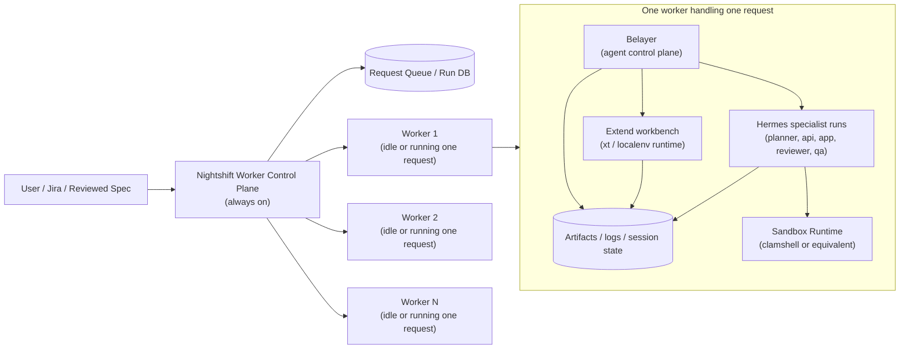
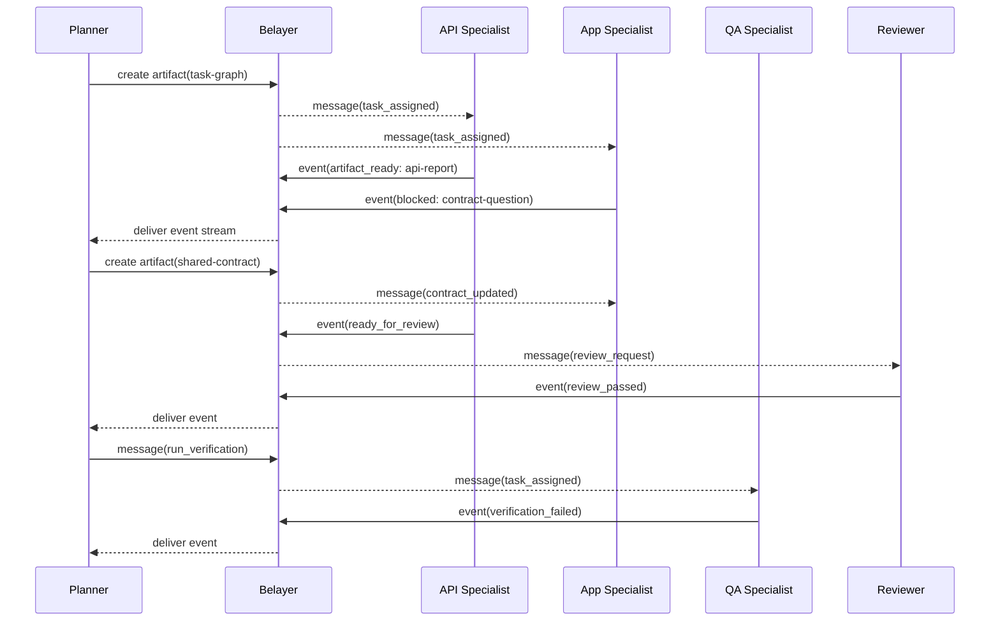
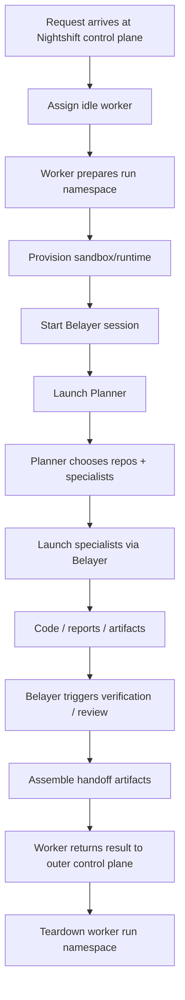

# Nightshift v1 Deployment Topology

This document refines the deployment picture for Nightshift v1 and narrows the architecture aggressively for MVP.

## MVP constraint

For v1, **one worker handles one request at a time**.

No multi-session workers. No multi-tenant worker packing. No worker-side contention management. No worktree juggling inside Nightshift itself.

That gives us a much simpler operational model:

- one request
- one worker
- one sandboxed run namespace
- one planner-led session
- zero same-host session collisions to reason about in v1

If it works on a laptop, it should work on a Linux worker node with the same topology.

---

## Why this simplification matters

It deliberately removes several sources of complexity from the MVP:

- no concurrent session collisions inside a worker
- no need for per-session worktree orchestration on shared hosts
- no need for worker-local scheduling fairness
- no need to prove that Belayer can multiplex many active agent runs before it can run one correctly
- no need to solve shared localenv/workbench resource contention on day one

This also sharpens the question of Belayer's role.

Belayer should not be trying to be:

- a cluster scheduler
- a hypervisor
- a generic workbench provisioner
- a universal coding harness

For v1 it should be much more specific:

> Belayer is the **agent control plane inside one Nightshift run**.

The outer Nightshift system handles request queueing and worker selection. Belayer handles the intra-run agent session.

---

## The two control planes

Nightshift v1 has **two distinct control-plane layers**.

### 1. Worker control plane

This is the outer Nightshift service.

It is always on and is responsible for:

- accepting or pulling work requests (Jira/spec input)
- maintaining the queue
- selecting an idle worker
- provisioning a fresh worker run environment
- attaching the request payload to that worker
- monitoring run state at a coarse level
- collecting final artifacts / handoff output

This is **not** Belayer.

It is the service that answers questions like:

- which worker is free?
- is this request running, failed, or complete?
- which run belongs to which ticket?
- where do the morning artifacts live?

### 2. Agent control plane

This is Belayer's role.

Once a worker has been assigned a request and a sandbox/runtime is available, Belayer becomes responsible for:

- creating the session for that run
- materializing the planner and specialist identities for the run
- dispatching agents
- persisting session events and artifacts
- routing messages between agents
- exposing session state and logs
- coordinating review / QA / handoff phases inside the run

This is a much tighter and more realistic role for Belayer than "global orchestration system for the entire cluster".

---

## High-level topology



### Reading the diagram

- The **outer Nightshift control plane** owns worker assignment and run lifecycle.
- A **worker** receives one request and becomes a self-contained execution cell.
- Inside that worker, **Belayer** is the agent-session controller.
- **Hermes** provides the actual specialist runs.
- **Sandboxing** constrains those runs.
- **xt/localenv** provides the Extend workbench/runtime for validation.

---

## Single-request worker model

A v1 worker should be thought of as a **single active run container/host namespace**, not a general-purpose shared executor.

### Worker responsibilities

When the Nightshift worker control plane assigns a request to a worker, that worker is responsible for exactly one live run:

- prepare run directory / namespace
- provision sandbox runtime
- hand execution to Belayer
- expose coarse run heartbeat back to the outer control plane
- tear down cleanly when done

### Worker states

At the outer layer, workers only need a small state machine:

- `idle`
- `preparing`
- `running`
- `tearing_down`
- `failed`

That is enough for v1.

---

## What lives inside the worker

Inside a worker, one request gets one run namespace.

Suggested shape:

```text
/run/nightshift/<run-id>/
  request/
    ticket.json
    spec.md
  session/
    belayer.db or session artifacts
  repos/
    extend-api/
    extend-app/
  identities/
    planner/
    extend-api-specialist/
    extend-app-specialist/
    reviewer/
    qa/
  artifacts/
    ticket-intake.json
    task-graph.json
    shared-contract.md
    verification-report.md
    handoff.md
  runtime/
    sandbox metadata
    localenv state references
```

This does **not** need to be globally standardized yet, but the idea is important:

> one run gets one directory namespace, and everything Belayer manages for that run stays inside it.

---

## Belayer's role in the worker

Belayer should start after the worker has already done the outer setup needed to host the run.

Belayer is not choosing which worker to use. Belayer is not balancing cluster load. Belayer is not multiplexing many unrelated requests.

For v1, Belayer should be responsible for the **inner agent session only**.

### Belayer owns

- the run session
- planner + specialist roster for the run
- agent-to-agent communication
- session event log
- session artifacts
- intra-run phase transitions
- handoff assembly inside the run

### Belayer does not own

- cluster-wide scheduling
- worker autoscaling
- global job queueing
- durable team-wide identity registry policy
- infra provisioning beyond what the run needs locally

### The practical implication

Belayer should evolve toward a shape like:

> "given a prepared run environment, execute the planner-led agent session for this request"

That is much narrower than where Belayer was drifting before.

---

## Planner-led run inside Belayer

The first agent launched inside the run is the planner.

The planner's responsibilities:

- inspect the request/spec
- decide which repos are implicated
- decide which specialist identities are needed
- produce a task graph / shared contract
- spawn and coordinate specialists
- request validation / review
- assemble handoff artifacts

### Important constraint

The planner is a **run-local session orchestrator**, not the worker scheduler.

It does not pick which machine to run on. That decision is already made.

This boundary keeps the system understandable.

---

## Intra-run agent communication

This is where Belayer remains highly relevant.

You asked specifically: how do we make it so agents can communicate within this run?

## The answer

Belayer should remain the **message and event router** for agents inside one run.

### Communication pattern

Agents do not talk directly to each other through shared stdin hacks or ad hoc files.

They communicate through Belayer-managed primitives:

- messages
- typed events
- artifacts

### Proposed communication layers

#### 1. Direct messages

Use for targeted instructions:

- planner → api specialist
- planner → app specialist
- reviewer → planner
- qa → planner

Examples:

- "API contract changed; update your types"
- "Please review artifact `shared-contract.md` before proceeding"
- "Re-run verification after latest backend patch"

#### 2. Typed run events

Use for machine-readable orchestration state:

- `task_assigned`
- `artifact_ready`
- `blocked`
- `verification_failed`
- `ready_for_review`
- `handoff_ready`

These should be persisted in Belayer's session/event store.

#### 3. Shared artifacts

Use for durable coordination:

- `task-graph.json`
- `shared-contract.md`
- `specialist-report-*.md`
- `verification-report.md`
- `handoff.md`

These are what prevent the run from becoming a cloud of chat transcripts.

---

## Intra-run communication diagram



### Key point

Belayer should not just be a tmux relay. It should be the **session bus** inside the run.

That means the messaging API becomes more important, not less.

---

## Where Hermes fits in this topology

In v1, Hermes is the **specialist runtime** used inside the worker.

### Hermes does

- execute planner/specalist/reviewer/qa runs
- use tools to inspect files, edit code, run commands
- carry specialist identity, memory, and skills into the run

### Hermes does not do

- worker scheduling
- global queueing
- cross-worker coordination
- cluster-wide artifact indexing

### Practical consequence

Belayer should treat Hermes as a **run-local execution engine** for identities it has decided to use.

This keeps the relationship clean:

- outer Nightshift: "which worker handles request X?"
- Belayer: "inside this worker, run planner + specialists for request X"
- Hermes: "I am the planner/specialist execution engine for this run"

---

## Where sandboxing fits

For v1, we should still speak at a slightly abstract level, but the design intent is:

- the worker provisions one sandbox/runtime environment for the run
- Hermes specialists operate inside or against that sandboxed environment
- the code workspace is local to that worker/run
- validation runs against local resources attached to that run

Because the worker handles only one request at a time, the collision story is much simpler:

- no cross-request workspace collisions
- no same-worker port collisions between unrelated requests
- no shared session namespace inside a worker

This is why the one-request-per-worker rule is such a good MVP constraint.

---

## Where xt / localenv fits

For Extend-first v1, localenv should be treated as the **run workbench adapter**, not a global worker service.

That means:

- Belayer or a Belayer-routed tool can invoke `xt doctor`
- later in the run, Belayer can invoke `xt up`, `xt status`, `xt down`
- the resulting health/status/evidence is captured as run artifacts

Because there is only one request per worker, v1 can avoid tricky concurrency around localenv resources.

---

## Run lifecycle for v1



This diagram makes the layer boundaries explicit:

- worker control plane handles assignment and lifecycle at the outside
- Belayer owns the inside session

---

## Belayer API shape inside the run

For this topology to work, Belayer should have a run-local API surface that is simple and durable.

### Required primitives

#### Session primitives

- create session
- get session status
- list/log events
- update phase / status

#### Messaging primitives

- send message to agent
- broadcast message
- list messages/events

#### Artifact primitives

- write artifact
- list artifacts
- fetch artifact
- tag artifact as ready/reviewed/final

#### Specialist run primitives

- launch specialist
- query specialist state
- stop specialist
- capture specialist summary

This is the practical way agents communicate *through* Belayer inside a run.

---

## What to avoid in v1

### 1. Shared-worker multi-session complexity

Not needed yet.

### 2. Making Belayer the worker scheduler

That is an outer Nightshift concern.

### 3. Making Hermes responsible for agent-to-agent transport

Belayer should own the session bus.

### 4. Over-generalizing the workbench layer

For v1, `xt` is enough of a workbench interface.

---

## What this means for Belayer rework

If we revisit the Belayer CLI and runtime now, the design pressure should be:

### Belayer should become smaller in scope, but clearer in purpose.

It should move toward:

- **run-local agent control plane**
- **session bus for planner + specialists**
- **artifact/event store**
- **specialist launcher**

And away from:

- generic global orchestration platform
- worker scheduler
- cluster manager
- everything-for-every-agent runtime

That is a healthier shape.

---

## Recommended next refinement

After this topology, the next question is not just "what boxes exist?"

It is:

> what exactly is Belayer's API and data model for one run?

Concretely, the next design step should define:

- run phases
- session schema
- specialist run schema
- artifact schema
- message/event schema
- planner-to-specialist communication contract

That is the level where Belayer's role becomes truly implementable.
