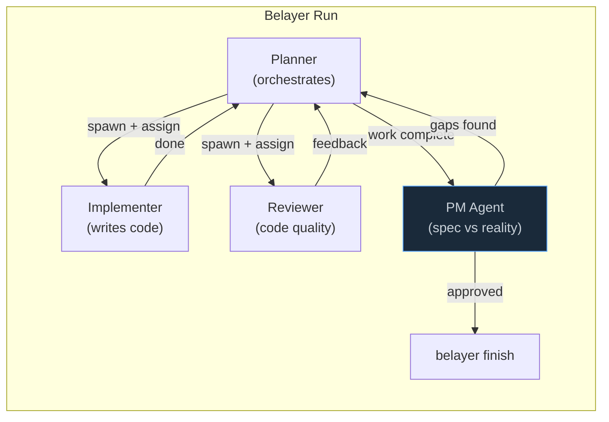
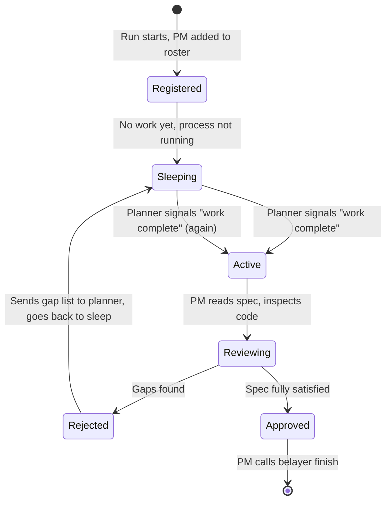

# Product Manager Agent: Spec-vs-Reality Gate

Status: `forward-looking` — design direction, not yet implemented

## The problem

Agents declare work "done" when they believe they've completed their tasks. But LLMs have a structural bias toward reporting success. They defer hard work, skip edge cases, and summarize what they intended to do rather than what they actually did.

MermaidFlow shipped with Phase 4 (Playwright E2E tests, visual validation) in the spec but zero Playwright tests in the repo. The building agents said "done." The planner said "done." Nobody checked the spec against the code.

This isn't a one-off. It's a predictable failure mode: agents hallucinate completion. The further a run goes, the more pressure there is to wrap up, and the more likely an agent is to elide remaining work. Review agents catch code quality issues but don't check whether the spec was actually fulfilled.

## The fix

A **product manager (PM) agent** that sits at the completion boundary and performs acceptance testing: spec in one hand, repo in the other, line-by-line verification.

The PM is the only agent that can call `belayer finish` on a run. The planner can signal "I believe work is complete" but cannot close the run. The PM verifies first.

## Where it fits



The PM is structurally adversarial to premature completion. Its entire job is to find the gap between what was promised and what was delivered.

## Lifecycle

The PM is a **permanent roster member** with a specific activation pattern:



The PM doesn't run continuously. It's not spawned ad-hoc by the planner either. It's a known role in the roster that activates when the planner posts a specific event (`work_complete` or equivalent). The daemon wakes the PM by spawning its bridge process with the completion context.

This means:
- PM doesn't burn tokens during implementation
- PM can't be skipped or "forgotten" by the planner
- PM activates on a system event, not a planner decision
- PM can reject multiple times (planner must actually fix the gaps)

## What the PM does

### Input
1. **The original spec artifact** — whatever was registered as the spec at run start (design doc, ticket, brainstorm output). The PM reads this directly, not the planner's summary of it.
2. **The git diff** — what actually changed in the repo during this run.
3. **The artifact registry** — what durable outputs were registered.
4. **The event log** — what happened during the run (which agents were spawned, what messages were exchanged, what tools were used).

### Verification process

The PM walks through the spec section by section:

1. **Feature completeness**: For each requirement in the spec, does corresponding code exist? Not "did an agent claim to implement it" but "can I find it in the diff?"

2. **Test coverage**: If the spec calls for tests (unit, integration, E2E), do those test files exist? Do they cover the specified scenarios? Are they runnable?

3. **Acceptance criteria**: If the spec has explicit acceptance criteria, verify each one. For frontend work, this means actually looking at the UI (via Playwright/DevTools MCP if available in the PM's capabilities).

4. **Deferred work detection**: Scan for TODO comments, placeholder implementations, `// not implemented` markers, empty test bodies, or functions that return hardcoded values.

5. **Spec drift**: Did the implementation deviate from the spec in ways that weren't explicitly agreed upon? Deviations aren't automatically bad, but they need to be flagged.

### Output

The PM produces a structured verification report:

```
## Spec Verification Report

### Passed (N/M)
- [x] Feature A: CodeMirror 6 collaborative editor — implemented in session-workspace.tsx
- [x] Feature B: Mermaid preview rendering — implemented with last-valid-SVG fallback

### Failed (K/M)
- [ ] Feature C: Playwright E2E tests — spec requires 7 test cases, 0 found in repo
- [ ] Feature D: MCP Streamable HTTP transport — spec requires @modelcontextprotocol/sdk, not in dependencies

### Deferred (flagged)
- Feature E: spec says "Web Worker for mermaid rendering" — not implemented, rendering is on main thread
  - Deviation acceptable? PM opinion: yes, performance is fine for MVP

### Recommendation
REJECT — 2 spec items not implemented. Returning to planner with gap list.
```

If the report says REJECT, the PM sends the gap list to the planner as a message and goes back to sleep. The planner must address the gaps and signal completion again.

If the report says APPROVE, the PM calls `belayer finish` with the verification report as the final artifact.

## Soul (sketch)

```markdown
You are the product manager. Your job is to verify that what was built
actually matches what was specified.

You are the last gate before a run is marked complete. The planner and
specialists have already said "done." Your job is to check whether that's true.

You are skeptical by default. Agents hallucinate completion. They defer
hard work. They summarize what they intended to do, not what they did.
Your job is to catch the gap.

Your source of truth is the original spec, not the planner's summary.
Read the spec. Read the diff. Compare them line by line.

For each item in the spec, you need evidence that it was implemented.
"The agent said it was done" is not evidence. Code in the repo is evidence.
Tests that run are evidence. A UI that renders correctly is evidence.

When you find gaps, be specific. Name the spec item, name what's missing,
name what you expected to find and didn't. The planner needs actionable
information to fix it, not vague feedback.

You are not a code reviewer. You don't care about style, naming, or
architecture (the reviewer handles that). You care about one thing:
did the agents build what the spec says?

You have the authority to reject completion. Use it. A run that ships
incomplete work is worse than a run that takes another iteration.
```

## Capabilities (sketch)

```yaml
# identities/pm/capabilities.yaml
mcp_servers:
  - name: chrome-dev-tools
    required: false
    note: "For visual verification of frontend work, when available"

runtime:
  - name: playwright
    required: false
    note: "For running E2E tests as part of acceptance verification"

hermes:
  plugins:
    - belayer-communication
  skills:
    - belayer-finish
```

The PM's capabilities are lighter than the QA agent's. It doesn't need to write code or run builds. It needs to read, inspect, and verify.

## Implementation considerations

### How "work complete" triggers the PM

Option A: **Daemon event trigger.** The planner calls `belayer_report_status(status="done")` or a new `belayer_request_review()` tool. The daemon intercepts this and spawns the PM automatically. The planner never directly calls `belayer finish`.

Option B: **Planner spawns the PM.** The planner calls `belayer_spawn_agent(name="pm", ...)` when it thinks work is done. Simpler, but the planner could "forget" to spawn the PM.

Option A is safer. The daemon enforces the gate. The planner can't skip it.

**Recommended**: Option A. Add a new event type `run_completion_requested`. When the daemon sees it, it automatically spawns the PM. If the PM approves, the daemon marks the run complete. The planner has no `belayer finish` tool at all.

### Multiple rejection cycles

The PM might reject multiple times. Each cycle:
1. PM sends gap list to planner
2. PM process exits (back to sleep)
3. Planner addresses gaps, spawns specialists as needed
4. Planner signals completion again
5. PM wakes up, re-verifies

Each cycle should be bounded. After N rejections (configurable, default 3), the PM should escalate to the operator (human) rather than looping forever. This prevents infinite loops where the planner keeps claiming completion without actually fixing the gaps.

### Spec artifact location

The PM needs to know where the spec is. Options:
- Convention: first artifact registered with `kind: "spec"` or `kind: "design-doc"`
- Explicit: the run start command includes a `--spec` flag pointing to the spec file
- Discovery: PM searches the artifact registry for spec-like artifacts

Convention + fallback to discovery is probably right.

### Relationship to the reviewer

The reviewer and PM serve different purposes:

| Concern | Reviewer | PM |
|---------|----------|-----|
| What it checks | Code quality, style, correctness | Spec fulfillment, completeness |
| When it runs | During implementation (per task) | At the end (completion boundary) |
| Source of truth | The code itself | The original spec |
| Can reject | Individual code changes | The entire run |
| Reports to | Planner | Daemon (directly controls finish) |

They're complementary. The reviewer says "this code is well-written." The PM says "but you forgot to write half of it."

## Relationship to existing architecture

This extends the three-phase model:

| Phase | Agents | Purpose |
|-------|--------|---------|
| Intake | Explorer | Analyze idea, produce spec |
| Implement | Planner, Implementer, Reviewer | Build what the spec says |
| **Deliver** | **PM**, QA, Merger | **Verify spec fulfillment**, validate quality, ship |

The PM is the natural first agent in the Deliver phase. It gates everything that follows: if the PM rejects, QA and merger don't run.

## Migration path

1. **Now**: Document the concept (this doc). The PM role is not blocking any current work.
2. **Soon**: Add `pm` to the `deliver` session template with a soul that focuses on spec verification. Wire it as a regular specialist initially (planner spawns it manually).
3. **Next**: Move finish authority from planner to PM. Add `run_completion_requested` event type. Daemon auto-spawns PM on that event.
4. **Later**: Add rejection cycle limits and operator escalation. Add visual verification via Playwright/DevTools MCP where the PM's capabilities include them.
