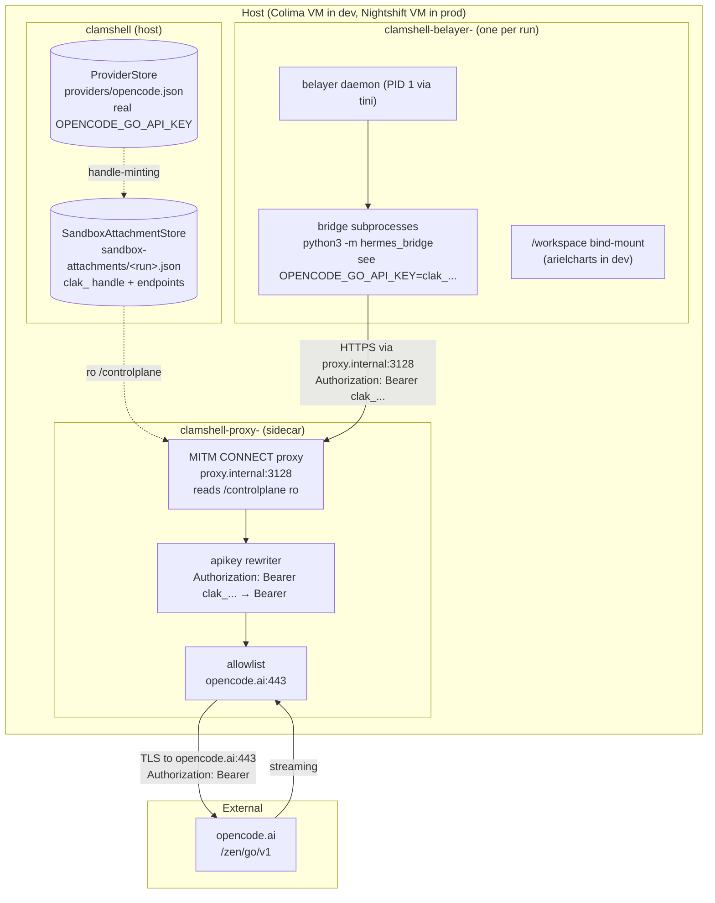

# Belayer-in-clamshell Implementation Plan

> **Status**: Active | **Created**: 2026-04-17 | **Last Updated**: 2026-04-17
> **Design Doc**: `docs/design-docs/2026-04-17-belayer-in-clamshell-design.md`
> **Consulted Learnings**: None
> **For Claude:** Use /harness:orchestrate to execute this plan.
>
> **Note on file paths (2026-04-17):** Deployment artifacts created by Tasks 2-6
> (Dockerfile, entrypoint, build script, host launcher, policy yaml, E2E
> script) have been relocated to `extend-clamshell/integrations/belayer/`
> after initial landing. Paths in the task bodies below describe where the
> files lived during plan execution.

## Decision Log

| Date | Phase | Decision | Rationale |
|------|-------|----------|-----------|
| 2026-04-17 | Design | Trust unit = run, not session, not agent | User: "whole run should have the same permissions/network egress applied, if one agent is compromised the whole run is" |
| 2026-04-17 | Design | Keep apikey provider (upstream at extend-clamshell@feat/apikey-provider, 393fe61) | User: "you should see some WIP changes to add `apikey` support to extend clamshell, which I still think will be useful" |
| 2026-04-17 | Design | Prove E2E on arielcharts with `pnpm run dev`, ports 3000+4000 published from container | User: "do work on arielcharts … able to run the app via pnpm run dev" |
| 2026-04-17 | Design | Pre-install arielcharts `node_modules` on host, bind-mount through for v1 proof | Keeps allowlist tight; avoids `registry.npmjs.org` in v1 policy. Revisit if agents need fresh installs. |
| 2026-04-17 | Design | Prove new path fully before deleting old | Keep `internal/sandbox/clamshell.go` + env-file plumbing until E2E is green, then delete in one commit. |
| 2026-04-17 | Task 1 | Modify `extend-clamshell/images/sandbox-rootfs/Dockerfile` upstream (bump node → 24, enable corepack+pnpm) instead of adding `sandbox create --image` CLI flag | Image is hardcoded at `internal/runtime/docker.py:55`; no config override. Single-image design is simpler than introducing a flag; node 24 hosts codex/claude-code fine; one-line change. See artifacts/2026-04-17-clamshell-cli-notes.md. |
| 2026-04-17 | Task 1 | Ship belayer binary via new upstream `--mount HOST:CONTAINER:ro` flag (preferred) or bake into the image (fallback) | Agents shouldn't see belayer in their `/workspace`. `--mount` is ~20 lines upstream; bake-in is slower iteration but keeps work self-contained. See artifacts/2026-04-17-clamshell-cli-notes.md. |
| 2026-04-17 | Task 1 | Use `clamshell forward start <port> <sandbox>` for port exposure, not `docker -p` | Clamshell has no `--publish` flag; the gateway-side forwarder proxies through the policed gateway, which is strictly better for us (logged egress). |

## Progress

- [x] Task 1: Reconnoiter `clamshell` CLI surface (image, publish, provider flags) — see artifacts/2026-04-17-clamshell-cli-notes.md
- [x] Task 2: Add `belayer-clamshell` Dockerfile + host build script
- [x] Task 3: Write image entrypoint (`tini` → `belayer daemon`) + smoke test
- [x] Task 4: Write host-side launcher `scripts/belayer-host`
- [x] Task 5: Reference allowlist policy for arielcharts
- [x] Task 6: E2E proof script `tests/e2e/belayer-in-clamshell.sh`
- [ ] Task 7: Execute E2E on Colima VM, capture artifacts, record deltas
- [ ] Task 8: Delete `internal/sandbox/clamshell.go` + stub + tests (gated on Task 7 green)
- [ ] Task 9: Shrink `bridge.BuildEnv` (remove HOME rewrite, clamshell-specific branches)
- [ ] Task 10: Rewrite `docs/SANDBOXING.md` around one-container-per-run

## Surprises & Discoveries

**Task 1 (2026-04-17):**
- **Clamshell image is hardcoded, no `--image` flag.** `IMAGE_REPO = 'extend-clamshell-sandbox'` at `internal/runtime/docker.py:55`; built from `images/sandbox-rootfs/Dockerfile` on every create. Any belayer-specific image needs must be merged into that Dockerfile upstream, OR we add an override flag. Chose upstream-Dockerfile modification (one-line node bump) to stay minimal.
- **Clamshell uses gateway-proxied port forwarding, not docker publish.** `clamshell forward start <port> <sandbox>` beats `-p` for our use case — all forwards go through the policed gateway. Plan now uses `clamshell forward start` in the launcher.
- **apikey CLI surface already complete on `feat/apikey-provider` @ 3fe6f7e.** `--type apikey` with `--project/--endpoints/--auth-header/--auth-scheme` all ship. `--from-existing ENV_VAR` works (accepts an env var name to pull the secret without exposing it in argv). Decision Log captured 393fe61 + 3fe6f7e as our upstream consumption point.

## Plan Drift

- **Task 3, Step 2 (expected failure)**: The plan expected the Task 2 stub entrypoint to fail the smoke test. It didn't — the test caller explicitly passes `daemon --socket /tmp/belayer.sock`, which the stub forwards as-is. Rather than fabricate a failing assertion, we proceeded to Step 3 and verified the real entrypoint's default-invocation improvements (bare `docker run` → daemon on `/tmp/belayer/daemon.sock`) out-of-band.
- **Task 4, launcher `--publish` wiring**: The plan passed `--publish` through to `clamshell sandbox create`, but Task 1 recon confirmed clamshell has no `--publish` flag; ports go through `clamshell forward start <local> <sandbox> --remote-port <cont>`. Implementation + test updated to call `clamshell forward start` per publish spec instead. Also switched `provider create` from `--credential` to `--from-existing` (the actual CLI surface confirmed in recon artifact).
- **Task 5, policy format**: The plan's skeleton used a bare `tcp_endpoints` top-level key. Clamshell v5 policy schema actually nests everything under `network:` and uses `custom_endpoints` for ad-hoc host/port allowlists (see `internal/policy/models.py:46-58`). Policy rewritten to match the real schema and validated by round-tripping through `Policy.from_file`.
- **Task 6, `--publish` in E2E**: Same drift as Task 4 — removed the two `--publish` flags from `clamshell sandbox create` and added two `clamshell forward start <port> $RUN_ID --remote-port <port> --background` calls after sandbox create. Forwards come up before Step 6 so `pnpm run dev` only waits on itself.

---

**Goal:** Run belayer daemon + all bridges inside a single `extend-clamshell` container per run, with the `apikey` provider projecting `OPENCODE_GO_API_KEY` as a `clak_` handle, proven E2E by editing and running `pnpm run dev` in `arielcharts`.

**Architecture:** One container per run = trust boundary. Host-side: clamshell control-plane holds real secrets + attachments; thin launcher script invokes `clamshell sandbox create` with `--provider apikey=...`, published ports, policy, workspace. Container-side: belayer daemon is PID 1-ish (via tini), spawns bridges as plain subprocesses, all LLM egress rewritten at the clamshell proxy.

**Tech Stack:** Go (belayer), Python (hermes_bridge, clamshell), Bash (launcher + E2E), Docker (image + sandbox), clamshell CLI (provider/sandbox management), pnpm/node 24 (arielcharts).

---

### Task 1: Reconnoiter `clamshell` CLI surface

Before writing any scripts we must confirm which flags `clamshell sandbox create` actually exposes (image, publish, workspace, policy, provider) on the branch we consume.

**Files:**
- Create: `docs/exec-plans/active/artifacts/2026-04-17-clamshell-cli-notes.md`

- [ ] **Step 1: Inspect upstream CLI surface**

Run on host (macOS):

```bash
cd /Users/donovanyohan/Documents/Programs/work/extend-clamshell
git checkout feat/apikey-provider
python -m clamshell_cli.commands.sandbox --help 2>&1 | tee /tmp/clamshell-sandbox-help.txt
python -m clamshell_cli.commands.provider --help 2>&1 | tee /tmp/clamshell-provider-help.txt
python -m clamshell_cli.commands.gateway --help 2>&1 | tee /tmp/clamshell-gateway-help.txt
```

Expected: `sandbox create` shows `--name`, `--policy`, `--workspace`. `provider create` does not yet show `--type apikey` (the commit message in 393fe61 says "CLI surface lands in a separate commit").

- [ ] **Step 2: Record findings and decide the gap-fill path**

Write `docs/exec-plans/active/artifacts/2026-04-17-clamshell-cli-notes.md` with three sections:

```markdown
# Clamshell CLI reconnoiter (feat/apikey-provider)

## Confirmed flags
sandbox create: [paste --help output]
provider create: [paste --help output]
gateway start:   [paste --help output]

## Gaps
- [ ] `provider create --type apikey …` — present or missing?
- [ ] `sandbox create --provider <type>=<name>` — present or missing?
- [ ] `sandbox create --image <image>` — present or missing?
- [ ] `sandbox create --publish <host>:<container>` — present or missing?

## Gap-fill plan
If any of the above are missing we either (a) call the lower-level
Python APIs (`SandboxAttachmentStore.create_attachment`, etc.) from our
launcher, or (b) add the CLI flags upstream on feat/apikey-provider and
pin belayer's launcher to that tag.
```

- [ ] **Step 3: Decide + commit the recon doc**

If critical flags are missing, update the Decision Log in this plan file with:
- "Upstream CLI gap: X — mitigation: Y"

Commit:

```bash
git add docs/exec-plans/active/artifacts/2026-04-17-clamshell-cli-notes.md docs/exec-plans/active/2026-04-17-belayer-in-clamshell.md
git commit -m "docs(plan): reconnoiter clamshell CLI surface"
```

---

### Task 2: Add `belayer-clamshell` Dockerfile + host build script

**Files:**
- Create: `dockerfiles/belayer-clamshell.Dockerfile`
- Create: `scripts/build-belayer-clamshell-image.sh`
- Modify: `.gitignore` (add `belayer-linux-arm64`, `belayer-linux` — already listed as untracked in status)

- [ ] **Step 1: Write the failing smoke test (image build script)**

Create `tests/scripts/test-build-belayer-clamshell-image.sh`:

```bash
#!/usr/bin/env bash
# Smoke test: the image build script produces a tagged image.
set -euo pipefail
IMAGE_TAG="belayer-clamshell:test-$(date +%s)"
./scripts/build-belayer-clamshell-image.sh "$IMAGE_TAG"
docker image inspect "$IMAGE_TAG" >/dev/null
docker rmi "$IMAGE_TAG" >/dev/null
echo "PASS: image built and is inspectable"
```

Make executable:

```bash
chmod +x tests/scripts/test-build-belayer-clamshell-image.sh
```

- [ ] **Step 2: Run test to verify it fails (no script yet)**

```bash
./tests/scripts/test-build-belayer-clamshell-image.sh
```

Expected: `./scripts/build-belayer-clamshell-image.sh: No such file or directory`

- [ ] **Step 3: Write the Dockerfile**

Create `dockerfiles/belayer-clamshell.Dockerfile`:

```dockerfile
# syntax=docker/dockerfile:1.7
# belayer-clamshell: one-container-per-run image.
# Built by scripts/build-belayer-clamshell-image.sh on the Colima / prod VM.
FROM debian:bookworm-slim

ARG TARGETARCH=arm64

# Base tooling: curl for NodeSource, ca-certificates for HTTPS pulls, git for
# workspace operations, tini as PID 1 for signal/zombie handling.
RUN apt-get update \
 && apt-get install -y --no-install-recommends \
      ca-certificates curl git tini procps \
 && rm -rf /var/lib/apt/lists/*

# Node 24 via NodeSource, then corepack-enabled pnpm 10.15.0 (pinned to
# arielcharts' packageManager). Node is required inside the container only
# because agents run pnpm commands.
RUN curl -fsSL https://deb.nodesource.com/setup_24.x | bash - \
 && apt-get install -y --no-install-recommends nodejs \
 && corepack enable \
 && corepack prepare pnpm@10.15.0 --activate \
 && rm -rf /var/lib/apt/lists/*

# Python 3 + hermes-bridge deps (the bridge is a subprocess; its venv is
# created on first boot by the daemon if missing — see hermes_bridge docs).
RUN apt-get update \
 && apt-get install -y --no-install-recommends \
      python3 python3-venv python3-pip \
 && rm -rf /var/lib/apt/lists/*

# Belayer binary — built on host, copied in.
ARG BELAYER_BINARY=belayer-linux-${TARGETARCH}
COPY ${BELAYER_BINARY} /usr/local/bin/belayer
RUN chmod +x /usr/local/bin/belayer

# Non-root agent user. Clamshell's sandbox driver uses `-u sandbox` today;
# we mirror the uid/gid so existing bind-mounted workspaces keep their perms.
RUN groupadd -g 1000 sandbox && useradd -m -u 1000 -g 1000 -s /bin/bash sandbox

# Entrypoint.
COPY dockerfiles/belayer-clamshell-entrypoint.sh /usr/local/bin/entrypoint.sh
RUN chmod +x /usr/local/bin/entrypoint.sh

USER sandbox
WORKDIR /workspace

# tini -g reaps child processes; exec-form so signals reach belayer daemon.
ENTRYPOINT ["/usr/bin/tini", "-g", "--", "/usr/local/bin/entrypoint.sh"]
```

- [ ] **Step 4: Write the host-side build script**

Create `scripts/build-belayer-clamshell-image.sh`:

```bash
#!/usr/bin/env bash
# Build belayer-clamshell:<tag>. Must run on a Linux host (or Colima VM)
# because clamshell sandbox policy (iptables REDIRECT) requires Linux.
set -euo pipefail

TAG="${1:-belayer-clamshell:dev}"
REPO_ROOT="$(cd "$(dirname "${BASH_SOURCE[0]}")/.." && pwd)"

ARCH="$(uname -m)"
case "$ARCH" in
  arm64|aarch64) GOARCH=arm64 BINSUFFIX=arm64 ;;
  x86_64)        GOARCH=amd64 BINSUFFIX=amd64 ;;
  *) echo "unsupported arch: $ARCH" >&2; exit 1 ;;
esac

BIN="belayer-linux-${BINSUFFIX}"

echo "==> Cross-compiling $BIN"
( cd "$REPO_ROOT" \
  && GOOS=linux GOARCH="$GOARCH" go build -tags '' -o "$BIN" ./cmd/belayer )
# Note: no -tags clamshell. Under the new model the daemon runs in-container
# and does not spawn sibling containers, so the sandbox driver is not compiled.

echo "==> Writing entrypoint into build context"
# Entrypoint is created by Task 3 at dockerfiles/belayer-clamshell-entrypoint.sh.
test -f "$REPO_ROOT/dockerfiles/belayer-clamshell-entrypoint.sh" \
  || { echo "entrypoint missing — run Task 3 first" >&2; exit 1; }

echo "==> Building image $TAG"
docker build \
  --file "$REPO_ROOT/dockerfiles/belayer-clamshell.Dockerfile" \
  --build-arg "TARGETARCH=${BINSUFFIX}" \
  --build-arg "BELAYER_BINARY=${BIN}" \
  --tag "$TAG" \
  "$REPO_ROOT"

echo "==> Built $TAG"
```

Make executable:

```bash
chmod +x scripts/build-belayer-clamshell-image.sh
```

- [ ] **Step 5: Run test to verify it passes (after Task 3 ships the entrypoint)**

Since the Dockerfile references a not-yet-created entrypoint from Task 3, the smoke test will still fail with "entrypoint missing". That's expected — the assertion moves to Task 3.

Temporarily stub the entrypoint so Task 2 can green independently:

```bash
printf '#!/bin/sh\nexec belayer "$@"\n' > dockerfiles/belayer-clamshell-entrypoint.sh
chmod +x dockerfiles/belayer-clamshell-entrypoint.sh
./tests/scripts/test-build-belayer-clamshell-image.sh
```

Expected: `PASS: image built and is inspectable`.

- [ ] **Step 6: Commit**

```bash
git add dockerfiles/belayer-clamshell.Dockerfile \
        scripts/build-belayer-clamshell-image.sh \
        tests/scripts/test-build-belayer-clamshell-image.sh \
        dockerfiles/belayer-clamshell-entrypoint.sh
git commit -m "feat(clamshell): add belayer-clamshell image + host build script

Base image: debian:bookworm-slim + node 24 + pnpm 10.15.0 + tini + python3.
Binary compiled without -tags clamshell (no per-session sandbox driver).
Entrypoint is a temporary stub; Task 3 replaces it."
```

---

### Task 3: Write image entrypoint + smoke test

**Files:**
- Modify: `dockerfiles/belayer-clamshell-entrypoint.sh` (replace Task 2 stub)
- Create: `tests/scripts/test-entrypoint-smoke.sh`

- [ ] **Step 1: Write the failing test**

`tests/scripts/test-entrypoint-smoke.sh`:

```bash
#!/usr/bin/env bash
# Smoke test: entrypoint starts a daemon that responds to `belayer status`.
set -euo pipefail

IMAGE_TAG="${1:-belayer-clamshell:dev}"
CONTAINER="belayer-clamshell-entrypoint-smoke-$$"

cleanup() { docker rm -f "$CONTAINER" >/dev/null 2>&1 || true; }
trap cleanup EXIT

docker run -d --rm --name "$CONTAINER" "$IMAGE_TAG" daemon --socket /tmp/belayer.sock
# Give daemon 3s to bind the socket.
for i in $(seq 1 15); do
  if docker exec "$CONTAINER" test -S /tmp/belayer.sock; then break; fi
  sleep 0.2
done
docker exec "$CONTAINER" test -S /tmp/belayer.sock
docker exec "$CONTAINER" belayer --socket /tmp/belayer.sock status >/dev/null
echo "PASS: daemon started and socket is bound"
```

```bash
chmod +x tests/scripts/test-entrypoint-smoke.sh
```

- [ ] **Step 2: Run test to verify it fails**

```bash
./scripts/build-belayer-clamshell-image.sh belayer-clamshell:dev
./tests/scripts/test-entrypoint-smoke.sh belayer-clamshell:dev
```

Expected: failure — the Task 2 stub just `exec belayer "$@"` without handling the `daemon` case or creating the socket dir.

- [ ] **Step 3: Write the real entrypoint**

Overwrite `dockerfiles/belayer-clamshell-entrypoint.sh`:

```bash
#!/usr/bin/env bash
# belayer-clamshell entrypoint.
# Ensures a writable runtime dir for the daemon socket and exec's belayer
# with the caller-supplied subcommand. tini (from ENTRYPOINT) handles signal
# forwarding + zombie reaping so we can stay a well-behaved PID 1 child.
set -euo pipefail

mkdir -p /tmp/belayer

# If the caller passed nothing, default to `daemon --socket /tmp/belayer/daemon.sock`
# so a bare `docker run belayer-clamshell` produces a usable session bus.
if [ "$#" -eq 0 ]; then
  set -- daemon --socket /tmp/belayer/daemon.sock
fi

# Normalize `daemon` without an explicit socket — inject our default.
if [ "${1:-}" = "daemon" ] && ! printf '%s\n' "$@" | grep -q -- '--socket'; then
  cmd_rest=("${@:2}")
  set -- daemon --socket /tmp/belayer/daemon.sock "${cmd_rest[@]}"
fi

exec belayer "$@"
```

- [ ] **Step 4: Rebuild and run the test**

```bash
./scripts/build-belayer-clamshell-image.sh belayer-clamshell:dev
./tests/scripts/test-entrypoint-smoke.sh belayer-clamshell:dev
```

Expected: `PASS: daemon started and socket is bound`.

- [ ] **Step 5: Commit**

```bash
git add dockerfiles/belayer-clamshell-entrypoint.sh tests/scripts/test-entrypoint-smoke.sh
git commit -m "feat(clamshell): real entrypoint with socket bootstrap + smoke test"
```

---

### Task 4: Write host-side launcher `scripts/belayer-host`

The launcher is a thin bash wrapper over `clamshell provider create`, `clamshell gateway start`, `clamshell sandbox create`, and `docker exec`. It lives outside the container (macOS / Colima VM host).

**Files:**
- Create: `scripts/belayer-host`
- Create: `tests/scripts/test-belayer-host-dry-run.sh`

- [ ] **Step 1: Write the failing dry-run test**

`tests/scripts/test-belayer-host-dry-run.sh`:

```bash
#!/usr/bin/env bash
# Dry-run: scripts/belayer-host run --dry-run prints the expected clamshell
# invocations without actually touching docker/clamshell.
set -euo pipefail

OUTPUT="$(./scripts/belayer-host run \
  --dry-run \
  --workspace /tmp/fake-workspace \
  --task 'test task' \
  --image belayer-clamshell:dev \
  --policy policies/belayer-in-clamshell-arielcharts.yaml \
  --publish 3000:3000 \
  --publish 4000:4000 \
  --provider apikey=opencode)"

echo "$OUTPUT" | grep -q 'clamshell gateway start'
echo "$OUTPUT" | grep -q 'clamshell sandbox create '
echo "$OUTPUT" | grep -q -- '--provider apikey=opencode'
echo "$OUTPUT" | grep -q -- '--publish 3000:3000'
echo "$OUTPUT" | grep -q -- '--publish 4000:4000'
echo "$OUTPUT" | grep -q 'docker exec .* belayer run start --task'
echo "PASS: dry-run emits all expected CLI invocations"
```

```bash
chmod +x tests/scripts/test-belayer-host-dry-run.sh
```

- [ ] **Step 2: Run to verify it fails**

```bash
./tests/scripts/test-belayer-host-dry-run.sh
```

Expected: `./scripts/belayer-host: No such file or directory`.

- [ ] **Step 3: Write the launcher**

`scripts/belayer-host`:

```bash
#!/usr/bin/env bash
# belayer-host: host-side launcher for one-container-per-run belayer.
#
# Subcommands:
#   setup              — idempotent clamshell provider registration
#   run                — start a run: gateway + sandbox + kick off belayer run start
#
# Not a replacement for `belayer` (which lives inside the container). This
# script only owns the outer wiring: provider records, container spawn,
# and the initial `belayer run start` invocation.
set -euo pipefail

DRY_RUN=0
CLAMSHELL="${CLAMSHELL:-clamshell}"
DOCKER="${DOCKER:-docker}"

emit() { if [ "$DRY_RUN" = "1" ]; then echo "$*"; else eval "$*"; fi; }

usage() {
  cat <<'EOF'
Usage:
  belayer-host setup  [--provider-name NAME] [--credential-env VAR] [--project VAR] [--endpoint HOST]
  belayer-host run    --workspace DIR --task STR [--image IMG] [--policy PATH]
                      [--publish HOST:CONT ...] [--provider TYPE=NAME ...] [--dry-run]
EOF
}

cmd_setup() {
  local provider_name="opencode"
  local credential_env="OPENCODE_GO_API_KEY"
  local project_key="OPENCODE_GO_API_KEY"
  local endpoint="opencode.ai"
  while [ $# -gt 0 ]; do
    case "$1" in
      --provider-name)  provider_name="$2"; shift 2 ;;
      --credential-env) credential_env="$2"; shift 2 ;;
      --project)        project_key="$2"; shift 2 ;;
      --endpoint)       endpoint="$2"; shift 2 ;;
      --dry-run)        DRY_RUN=1; shift ;;
      *) echo "unknown flag: $1" >&2; exit 2 ;;
    esac
  done
  # provider create is idempotent: existing providers surface a clear error,
  # which we treat as success for `setup` (hence `|| true` after a grep).
  emit "$CLAMSHELL provider create \
    --type apikey \
    --name $provider_name \
    --credential $credential_env \
    --project $project_key \
    --endpoints $endpoint 2>&1 | tee /tmp/belayer-host-provider-create.log \
  || grep -q 'already exists' /tmp/belayer-host-provider-create.log"
}

cmd_run() {
  local workspace="" task="" image="belayer-clamshell:dev" policy=""
  local -a publish=() provider=()
  while [ $# -gt 0 ]; do
    case "$1" in
      --workspace) workspace="$2"; shift 2 ;;
      --task)      task="$2"; shift 2 ;;
      --image)     image="$2"; shift 2 ;;
      --policy)    policy="$2"; shift 2 ;;
      --publish)   publish+=("--publish" "$2"); shift 2 ;;
      --provider)  provider+=("--provider" "$2"); shift 2 ;;
      --dry-run)   DRY_RUN=1; shift ;;
      *) echo "unknown flag: $1" >&2; exit 2 ;;
    esac
  done
  [ -n "$workspace" ] || { echo "--workspace required" >&2; exit 2; }
  [ -n "$task" ]      || { echo "--task required" >&2; exit 2; }

  local run_id="belayer-run-$(date +%Y%m%d-%H%M%S)-$$"

  emit "$CLAMSHELL gateway start"

  local create_args="sandbox create --name $run_id --workspace $workspace --image $image"
  [ -n "$policy" ] && create_args="$create_args --policy $policy"
  create_args="$create_args ${publish[*]-} ${provider[*]-}"
  emit "$CLAMSHELL $create_args"

  # Kick off `belayer run start` inside the freshly booted sandbox. The
  # container entrypoint is already `belayer daemon`; this is a sibling exec.
  emit "$DOCKER exec -i clamshell-$run_id belayer run start --task $(printf %q "$task")"

  echo "run id: $run_id"
}

main() {
  [ $# -gt 0 ] || { usage; exit 2; }
  local sub="$1"; shift || true
  case "$sub" in
    setup) cmd_setup "$@" ;;
    run)   cmd_run "$@" ;;
    -h|--help|help) usage ;;
    *) usage; exit 2 ;;
  esac
}
main "$@"
```

Make executable:

```bash
chmod +x scripts/belayer-host
```

- [ ] **Step 4: Run the test**

```bash
./tests/scripts/test-belayer-host-dry-run.sh
```

Expected: `PASS: dry-run emits all expected CLI invocations`.

- [ ] **Step 5: Commit**

```bash
git add scripts/belayer-host tests/scripts/test-belayer-host-dry-run.sh
git commit -m "feat(clamshell): host-side launcher scripts/belayer-host

Thin bash wrapper over clamshell provider/gateway/sandbox + docker exec.
Includes dry-run mode for test coverage; real invocation path exercised
by the E2E script in Task 6."
```

---

### Task 5: Reference allowlist policy for arielcharts

**Files:**
- Create: `policies/belayer-in-clamshell-arielcharts.yaml`

- [ ] **Step 1: Write the policy**

`policies/belayer-in-clamshell-arielcharts.yaml`:

```yaml
# Belayer-in-clamshell allowlist for arielcharts E2E.
# Union of egress endpoints the run may need. Real credentials are
# projected as clak_ handles by the apikey provider; the MITM proxy
# rewrites Authorization headers at egress for declared hosts.
tcp_endpoints:
  - name: opencode
    host: opencode.ai
    port: 443
  # registry.npmjs.org deliberately NOT in v1 allowlist: pre-install
  # node_modules on host, bind-mount through. Uncomment if the agent
  # needs fresh installs mid-run.
  # - name: npmjs
  #   host: registry.npmjs.org
  #   port: 443
  # github.com for git push / PR flows — enable per-run when agents
  # need it; arielcharts pnpm run dev does not.
  # - name: github
  #   host: github.com
  #   port: 443
```

- [ ] **Step 2: Validate with clamshell**

```bash
clamshell policy validate policies/belayer-in-clamshell-arielcharts.yaml
```

Expected: no errors. If `policy validate` isn't a real subcommand, fall back to a dry sandbox-create against this policy (Task 6 covers this anyway).

- [ ] **Step 3: Commit**

```bash
git add policies/belayer-in-clamshell-arielcharts.yaml
git commit -m "feat(clamshell): reference allowlist policy for arielcharts E2E"
```

---

### Task 6: E2E proof script

`tests/e2e/belayer-in-clamshell.sh` codifies the six acceptance steps from the design doc so anyone (human or CI) can re-run them.

**Files:**
- Create: `tests/e2e/belayer-in-clamshell.sh`

- [ ] **Step 1: Write the script**

```bash
#!/usr/bin/env bash
# tests/e2e/belayer-in-clamshell.sh
#
# Six-step acceptance proof for the one-container-per-run topology.
# Run on a Linux host (Colima VM in dev, Nightshift VM in prod).
#
# Preconditions:
#   - $OPENCODE_GO_API_KEY is set in the environment (or in ~/.belayer.env
#     sourced beforehand).
#   - arielcharts is checked out at $ARIELCHARTS_DIR with node_modules
#     pre-installed (pnpm install -r) so we don't need registry.npmjs.org
#     in the allowlist for v1.
#   - `clamshell` and `docker` are on PATH.
#
# Each step emits PASS or FAIL on its own line and appends to $ARTIFACT_DIR.
set -euo pipefail

ARIELCHARTS_DIR="${ARIELCHARTS_DIR:-$HOME/Documents/Programs/personal/arielcharts}"
IMAGE_TAG="${IMAGE_TAG:-belayer-clamshell:e2e}"
POLICY="${POLICY:-$(pwd)/policies/belayer-in-clamshell-arielcharts.yaml}"
ARTIFACT_DIR="${ARTIFACT_DIR:-/tmp/belayer-in-clamshell-e2e/$(date +%s)}"
mkdir -p "$ARTIFACT_DIR"

pass() { echo "PASS: $*" | tee -a "$ARTIFACT_DIR/result.log"; }
fail() { echo "FAIL: $*" | tee -a "$ARTIFACT_DIR/result.log" >&2; exit 1; }

# --- Step 1: image builds ---
./scripts/build-belayer-clamshell-image.sh "$IMAGE_TAG" \
  > "$ARTIFACT_DIR/step1-build.log" 2>&1 \
  || fail "step 1: image build"
docker image inspect "$IMAGE_TAG" >/dev/null || fail "step 1: image not inspectable"
pass "step 1: image built ($IMAGE_TAG)"

# --- Step 2: provider registration persists ---
./scripts/belayer-host setup \
  --provider-name opencode \
  --credential-env OPENCODE_GO_API_KEY \
  --project OPENCODE_GO_API_KEY \
  --endpoint opencode.ai \
  > "$ARTIFACT_DIR/step2-setup.log" 2>&1 \
  || fail "step 2: provider setup"
clamshell provider list | grep -q '^opencode\s*apikey' \
  || fail "step 2: provider opencode not listed as apikey"
pass "step 2: provider opencode (apikey) registered"

# --- Step 3: sandbox boots, handle projected ---
RUN_ID="belayer-e2e-$(date +%s)"
clamshell gateway start > "$ARTIFACT_DIR/step3-gateway.log" 2>&1
clamshell sandbox create \
  --name "$RUN_ID" \
  --image "$IMAGE_TAG" \
  --workspace "$ARIELCHARTS_DIR" \
  --policy "$POLICY" \
  --provider apikey=opencode \
  --publish 3000:3000 \
  --publish 4000:4000 \
  > "$ARTIFACT_DIR/step3-create.log" 2>&1 \
  || fail "step 3: sandbox create"
trap 'clamshell sandbox stop "$RUN_ID" >/dev/null 2>&1 || true' EXIT

CONTAINER="clamshell-$RUN_ID"
docker exec "$CONTAINER" env | tee "$ARTIFACT_DIR/step3-env.txt" \
  | grep -E '^OPENCODE_GO_API_KEY=clak_' \
  || fail "step 3: OPENCODE_GO_API_KEY not projected as clak_ handle"
# Defense-in-depth: real key must NOT appear in container env.
if docker exec "$CONTAINER" env | grep -Fq "$OPENCODE_GO_API_KEY"; then
  fail "step 3: SECURITY REGRESSION — real OPENCODE_GO_API_KEY present in container env"
fi
pass "step 3: sandbox up, handle projected, real key absent"

# --- Step 4: daemon reaches bridge idle ---
docker exec "$CONTAINER" belayer run start --task "say hi and finish" \
  > "$ARTIFACT_DIR/step4-run.log" 2>&1 &
RUN_PID=$!
# Poll `belayer status` up to 60s for a session to report bridge:idle or finished.
for i in $(seq 1 60); do
  if docker exec "$CONTAINER" belayer status 2>/dev/null \
       | grep -qE 'bridge:idle|finished'; then
    break
  fi
  sleep 1
done
wait "$RUN_PID" || true
docker exec "$CONTAINER" belayer status \
  | tee "$ARTIFACT_DIR/step4-status.txt" \
  | grep -qE 'bridge:idle|finished' \
  || fail "step 4: session did not reach bridge:idle within 60s"
pass "step 4: daemon reached bridge:idle"

# --- Step 5: agent edits arielcharts ---
BEFORE="$(md5sum "$ARIELCHARTS_DIR/apps/web/src/main.tsx" | awk '{print $1}')"
docker exec "$CONTAINER" belayer run start \
  --task "add a single-line /** entry-point */ comment at the top of apps/web/src/main.tsx, nothing else" \
  > "$ARTIFACT_DIR/step5-edit.log" 2>&1
AFTER="$(md5sum "$ARIELCHARTS_DIR/apps/web/src/main.tsx" | awk '{print $1}')"
[ "$BEFORE" != "$AFTER" ] || fail "step 5: main.tsx unchanged"
pass "step 5: agent edited arielcharts/apps/web/src/main.tsx"

# --- Step 6: dev server reachable from host ---
docker exec -d "$CONTAINER" bash -lc \
  'cd /workspace && pnpm run dev > /tmp/pnpm-dev.log 2>&1 &'
# Give pnpm run dev 30s to bind :3000.
for i in $(seq 1 30); do
  if curl -sSf http://localhost:3000 >/dev/null 2>&1; then break; fi
  sleep 1
done
curl -sSf http://localhost:3000 -o "$ARTIFACT_DIR/step6-web.html" \
  || fail "step 6: localhost:3000 did not respond within 30s"
pass "step 6: web dev server reachable at http://localhost:3000"

echo ""
echo "==== E2E PASS ===="
echo "Artifacts: $ARTIFACT_DIR"
```

```bash
chmod +x tests/e2e/belayer-in-clamshell.sh
```

- [ ] **Step 2: Commit (execution happens in Task 7)**

```bash
git add tests/e2e/belayer-in-clamshell.sh
git commit -m "test(e2e): belayer-in-clamshell six-step acceptance proof

Runs on Colima/Linux VM. Requires OPENCODE_GO_API_KEY env, arielcharts
checked out with pre-installed node_modules, clamshell CLI on PATH."
```

---

### Task 7: Execute E2E on Colima VM

No new code — we actually run the script, capture artifacts, and record deltas in the plan.

**Files:**
- Modify: `docs/exec-plans/active/2026-04-17-belayer-in-clamshell.md` (Surprises section)

- [ ] **Step 1: Pre-flight**

On the Colima VM:

```bash
# Confirm toolchain + repo state
colima ssh -- '
  set -e
  which clamshell docker go node pnpm tini 2>&1
  cat ~/.belayer.env | grep -c OPENCODE_GO_API_KEY
  ls ~/Documents/Programs/personal/arielcharts/node_modules >/dev/null && echo "node_modules present" || echo "MISSING node_modules — run pnpm install first"
'
```

If `node_modules` is missing, run `pnpm install -r` inside `arielcharts` on the VM before proceeding.

- [ ] **Step 2: Execute the E2E script**

```bash
colima ssh -- '
  cd ~/belayer &&          # or wherever the worktree lives on the VM
  set -a && source ~/.belayer.env && set +a &&
  ./tests/e2e/belayer-in-clamshell.sh
'
```

Expected: six `PASS:` lines, then `==== E2E PASS ====`.

- [ ] **Step 3: On any failure, record in Surprises + Plan Drift**

If a step fails, append an entry to the `## Surprises & Discoveries` section of this plan:

```markdown
- 2026-04-17: Step N failed with [symptom]. Root cause: [what]. Resolution: [code change or plan change].
```

If the failure requires plan-shape change (e.g., upstream CLI doesn't support a flag, need to add registry.npmjs.org to allowlist), also append to `## Plan Drift` and make the code change. Re-run Step 2.

- [ ] **Step 4: On green, commit the artifacts snippet and proceed**

Copy `result.log` and a trimmed `step3-env.txt` into `docs/exec-plans/active/artifacts/2026-04-17-e2e-run-log.md`, then:

```bash
git add docs/exec-plans/active/artifacts/2026-04-17-e2e-run-log.md \
        docs/exec-plans/active/2026-04-17-belayer-in-clamshell.md
git commit -m "test(e2e): belayer-in-clamshell acceptance GREEN"
```

---

### Task 8: Delete `internal/sandbox/clamshell.go` + stub + tests

**Only run this after Task 7 is green.** The old path is our safety net.

**Files:**
- Delete: `internal/sandbox/clamshell.go`
- Delete: `internal/sandbox/clamshell_stub.go`
- Delete: `internal/sandbox/clamshell_test.go`
- Delete: `internal/sandbox/clamshell_stub_test.go`
- Modify: any caller that imports the deleted package (likely `internal/daemon/*.go`)

- [ ] **Step 1: Confirm no unique non-clamshell consumers**

```bash
grep -RIn 'sandbox\.Clamshell\|sandbox\.Register("clamshell"' --include='*.go' .
```

Expected: the only hits are inside `internal/sandbox/clamshell*.go` themselves.

If any external caller references `sandbox.Clamshell{}` or reads `sandbox.mode: clamshell` from config and dispatches to a driver, capture its path here and update it in a follow-up step.

- [ ] **Step 2: Delete the files**

```bash
git rm internal/sandbox/clamshell.go \
       internal/sandbox/clamshell_stub.go \
       internal/sandbox/clamshell_test.go \
       internal/sandbox/clamshell_stub_test.go
```

- [ ] **Step 3: Build + test**

```bash
go build ./cmd/belayer
go test ./...
```

Expected: both green. If a config path like `sandbox.mode: clamshell` remains a valid option, either remove it or make it error with a clear "deprecated under belayer-in-clamshell topology — remove from config" message.

- [ ] **Step 4: Commit**

```bash
git commit -m "refactor(sandbox): remove per-session clamshell driver

Under the one-container-per-run model the belayer daemon runs inside a
clamshell container rather than spawning sibling containers via docker
exec. The clamshell sandbox driver is no longer called — its public
surface and tests are removed.

SANDBOXING.md §1 and §2 (raw-cred leak via env-file) are architecturally
impossible under the new model since there is no host-to-container
creds handoff: apikey handles live in container env, real keys stay in
clamshell ProviderStore on the host."
```

---

### Task 9: Shrink `bridge.BuildEnv`

Bridge subprocesses are now plain children of the in-container daemon. No docker-exec, no env-file, no host/container home split.

**Files:**
- Modify: `internal/bridge/bridge.go`
- Modify: `internal/bridge/bridge_test.go` (or `*_buildenv_test.go` — pick whichever already exists)

- [ ] **Step 1: Write the failing test**

In `internal/bridge/bridge_test.go`, add or update:

```go
func TestBuildEnv_NoHomeRewriteInContainer(t *testing.T) {
    // Under the in-container daemon model the bridge inherits HOME from
    // the parent process; we must not override it.
    cfg := Config{SessionID: "s1", AgentID: "a1", SocketPath: "/run/belayer/daemon.sock"}
    env := BuildEnv(cfg)
    var homeCount int
    for _, e := range env {
        if strings.HasPrefix(e, "HOME=") {
            homeCount++
        }
    }
    if homeCount > 1 {
        t.Fatalf("BuildEnv wrote HOME %d times; want at most 1 (the inherited one)", homeCount)
    }
}

func TestBuildEnv_NoBelayerAPIKeyOverride(t *testing.T) {
    // The daemon reads OPENCODE_GO_API_KEY (a clak_ handle) from its env
    // and no longer injects a separate BELAYER_API_KEY override.
    cfg := Config{APIKey: "should-not-be-emitted"}
    env := BuildEnv(cfg)
    for _, e := range env {
        if strings.HasPrefix(e, "BELAYER_API_KEY=") {
            t.Fatalf("BuildEnv still emits BELAYER_API_KEY (cfg.APIKey=%q)", cfg.APIKey)
        }
    }
}
```

- [ ] **Step 2: Run to verify failures**

```bash
go test ./internal/bridge/ -run 'TestBuildEnv_NoHomeRewrite|TestBuildEnv_NoBelayerAPIKeyOverride'
```

Expected: both fail — current `BuildEnv` still injects HOME and (optionally) BELAYER_API_KEY.

- [ ] **Step 3: Shrink `BuildEnv`**

In `internal/bridge/bridge.go`:

1. Delete the HOME-rewriting logic that lives in `internal/sandbox/clamshell.go` `Exec` (already deleted in Task 8; no change here).

2. Inside `BuildEnv`, remove the `cfg.APIKey` block (lines ~129-131 today):

```go
// DELETE:
if cfg.APIKey != "" {
    env = appendEnv(env, "BELAYER_API_KEY", cfg.APIKey)
}
```

3. Consider removing the `APIKey` field from `Config` entirely if no caller still passes it. Check with:

```bash
grep -RIn 'bridge\.Config{' --include='*.go' . | grep -v '_test.go' | grep APIKey
```

If nothing uses it, drop the field.

- [ ] **Step 4: Run tests**

```bash
go test ./internal/bridge/... ./internal/daemon/...
```

Expected: green. If another test asserts `BELAYER_API_KEY` is set, either update the test (legitimate drift) or revert the field removal (the caller still needs it — investigate).

- [ ] **Step 5: Commit**

```bash
git add internal/bridge/bridge.go internal/bridge/bridge_test.go
git commit -m "refactor(bridge): drop HOME rewrite + BELAYER_API_KEY override

Under belayer-in-clamshell, bridges are plain subprocesses of the
in-container daemon. They inherit HOME from the daemon and read
OPENCODE_GO_API_KEY (a clak_ handle) from env directly — no separate
BELAYER_API_KEY override, no host/container HOME split."
```

---

### Task 10: Rewrite `docs/SANDBOXING.md`

**Files:**
- Modify: `docs/SANDBOXING.md`

- [ ] **Step 1: Replace the Mermaid diagram**

Delete the existing `graph TD` block and replace with a diagram that shows:

- Single Colima VM host.
- One `clamshell-belayer-<id>` container with daemon + bridges inside.
- One `clamshell-proxy-<id>` sidecar.
- Host-side clamshell `ProviderStore` writing attachment records.
- Real secret *never* crossing the container boundary — only `clak_` handle does.

Full replacement (drop the "⚠ docker exec --env-file" annotation entirely):



- [ ] **Step 2: Replace the "Credential chain" section**

Old section asserted "this chain today hands the real API key to the bridge process inside the container." Under the new model the real key never reaches the container. Replacement text:

```markdown
## Credential chain

Provider credentials (e.g. `OPENCODE_GO_API_KEY`) live on the host in
clamshell's `ProviderStore`. They are registered once via:

    clamshell provider create \
      --type apikey --name opencode \
      --credential OPENCODE_GO_API_KEY \
      --project OPENCODE_GO_API_KEY \
      --endpoints opencode.ai

At run start, `clamshell sandbox create --provider apikey=opencode` mints a
per-run `clak_<handle>` and records it in `SandboxAttachmentStore`. The
container is launched with `OPENCODE_GO_API_KEY=clak_<handle>` in env;
every process inside (belayer daemon, bridge subprocesses) sees only the
handle.

The MITM proxy sidecar reads attachment records via a read-only
`/controlplane` mount and rewrites `Authorization: Bearer clak_<handle>`
to `Authorization: Bearer <real>` for declared endpoints at egress time.

Real credentials never enter the container's env, process table, or
filesystem. A compromised agent reading `/proc/self/environ` sees only
the handle, which is useless off-host and is revoked when the run's
sandbox stops.
```

- [ ] **Step 3: Delete Known Security Gaps section**

The `## Known security gaps` section (with §1 and §2) no longer applies. Replace with:

```markdown
## Trust model

The **run** is the trust unit. One compromised agent inside a run implies
the entire run is compromised. The sandbox prevents the run from reaching
unauthorized external services (allowlist) and prevents it from obtaining
a usable copy of the real provider credential (apikey handle + proxy
rewrite). It does **not** prevent one agent from observing another
agent's workspace writes or env — per-agent isolation is not a goal at
this layer.

Blast radius of a compromised run:
- Network: only allowlisted endpoints, and only with a handle that
  becomes invalid when the run's sandbox stops.
- Filesystem: the run's bind-mounted workspace and its container root
  (ephemeral).
- Creds: limited to whatever the allowlisted endpoints authorize for
  the real key during the run window. Rotate per-run at the
  Nightshift VM layer to bound this.
```

- [ ] **Step 4: Replace the Deployment topologies section**

The old section described "belayer on host, container per session." Replace with the one-container-per-run flow documented in the design doc (ideal prod topology + Colima dev tax). Keep the two subsections; update their contents to the new `belayer-host` launcher + image build flow.

- [ ] **Step 5: Diff review**

```bash
git diff docs/SANDBOXING.md | wc -l
```

- [ ] **Step 6: Commit**

```bash
git add docs/SANDBOXING.md
git commit -m "docs(sandboxing): rewrite around one-container-per-run topology

Removes SANDBOXING §1 (bridge exec bypasses clamshell CLI) and §2
(agent sees raw creds) — both architecturally impossible under the new
model. Replaces with an explicit 'trust model' section that documents
the run-as-trust-unit decision."
```

---

## Self-Review

**Spec coverage (design doc sections vs tasks):**
- Topology → Tasks 2, 4, 5 (image, launcher, policy)
- Credential chain → Task 4 `setup` path + Task 6 step 3 security assertion
- Allowlist → Task 5
- Workspace + dev servers → Task 6 step 6
- Container image → Tasks 2, 3
- Launcher UX → Task 4
- What we get rid of → Tasks 8, 9, 10
- E2E proof (6 steps) → Task 6 + execution Task 7
- Open questions → Surfaced in Task 1 (CLI recon), Task 6 preconditions (node_modules pre-install), Task 3 (tini)
- Security regression test → Task 6 step 3

**Placeholder scan:** No TBD / TODO / "appropriate" / "similar to". Every code block is complete.

**Type consistency:** `scripts/belayer-host` interface matches Task 6 invocations. `--provider apikey=opencode`, `--publish 3000:3000`, `--workspace` consistent across all tasks. Container name convention `clamshell-<run-id>` consistent between Tasks 4 and 6 (matches upstream clamshell convention).

---

## Outcomes & Retrospective

_Filled by /harness:complete when work is done._

**What worked:**
-

**What didn't:**
-

**Learnings to codify:**
-
